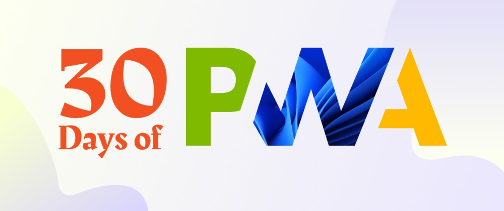

# Hello, #30DaysOfPWA!

## What is this project?

Join us for #30Days of strucutured content and resources to help you explore the fascinating world of Progressive Web Apps (PWA). 
* `Core Concepts`: Learn the fundamental concepts and components of a PWA.
* `Advanced Capabilities`: Explore web capabilities APIs, status, and examples of use.
* `Developer Tools`: Learn about key authoring, debugging, auditing, testing and packaging tools for PWA.
* `Platforms & Practices`: Learn good practices and platform-specific support for PWA.

---

## How is this structured?

The series launches off with a [kickoff](kickoff.md) post, followed by 4 weeks of structured content, each focused on one of the above top-level topics. The series concludes with a [summary](summary.md) post that reviews the materials and provides additional resources to continue your learning journey!

---

## Who are we?

This is a multi-team effort from Microsoft Edge, Windows, and Developer Relations teams. We also hope to encourage and solicit contributions from the broader community over time. Here are some of the people currently involved - in alphabetical order:

 * Aaron Gustafson | ([@aarongustafson](https://twitter.com/AaronGustafson)) - _Microsoft Edge Dev_
 * Beth Pan | [@beth_panx](https://twitter.com/beth_panx) - _Microsoft Windows_
 * Justin Willis | [@JustinWillis96](https://twitter.com/Justinwillis96) - _PWA Builder_
 * Maxim Salnikov | ([@webmaxru](https://twitter.com/webmaxru)) - _Microsoft Norway Developer Relations_
 * Nitya Narasimhan | [@nitya](https://twitter.com/nitya) - _Microsoft Cloud Advocacy / DevRel_
 * Patrick Brosset | ([@patrickbrosset](https://twitter.com/patrickbrosset)) - _Microsoft Edge Dev_
 * Zachary Teutsch | ([@devteutsch](https://twitter.com/devteutsch)) - _Microsoft Windows_

 ---

 ## How can I contribute?

 Read our [Contributing](CONTRIBUTING.md) guide for general guidance. Stay tuned for updates if you would like to request specific content, provide feedback, or collaborate on future contribution opportunities. For now, here are a few actions you can take:

  * Watch this repo (give us a 🌟 if you like this content!)
  * Follow [@pwabuilder](https://twitter.com/pwabuilder) and the [#30DaysOfPWA](https://twitter.com/search?q=%2330DaysOfPWA&src=typed_query) topic on Twitter for updates
  * Follow [@Azure](https://dev.to/azure) on dev.to for updates on series launch and posts!
 
---

## How can I provide feedback?

 * Found a bug or typo? [File an issue](https://github.com/microsoft/win-student-devs/issues/new).
 * Have feedback on content or code? `Stay Tuned` for a feedback form.
 * Want to share this content? `Tag your tweet with #30DaysOfPWA`
 * Want to discuss a specific post? `Leave a comment on the related post` in [Discussion](https://github.com/microsoft/win-student-devs/discussions)!

---
