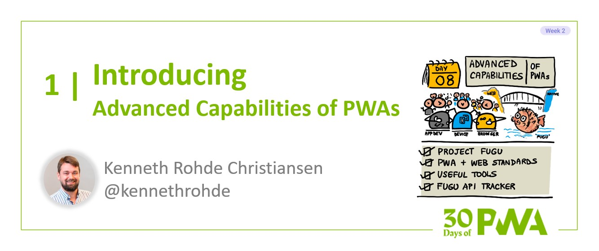

# 2.1: Introducing the advanced capabilities of Progressive Web Apps

**Author: Kenneth Rohde Christiansen [@kennethrohde](https://twitter.com/kennethrohde)**

Welcome to day 8 of the [30 Days of PWA](https://aka.ms/learn-pwa/30Days-blog) series! This week we are going to cover some of the new exciting capabilities available to modern Progressive Web Apps, ranging from sending a push notification to accessing a local file on the file system. Before we get into that, however, let’s talk a little more broadly about these new capabilities.

The web provides many core APIs that are used across most sites and enable experiences ranging from e-commerce sites to online games, but some sites need APIs that are core to their experience but might not be commonly used by most sites. For instance, a video conferencing site needs access to the camera and an IDE needs access to the file system.

Browsers and standards bodies have, since the early days, mostly focused on adding APIs and capabilities that benefited the web as a whole and focused less on peripheral APIs only needed by a few sites. On top of this, some of these capabilities are challenging to add to the platform because they are powerful in the sense that, if abused, consequences can be severe.

If we want the web to truly succeed as an application development platform, developers will need access to most of the same capabilities that are available to native developers.

## Differentiation

The good news is that this is rapidly changing, with browser companies focusing on meeting developer needs and ensuring that the web can cater for all kinds of experiences, like native apps, but in a much safer and privacy-preserving manner.

Contributors to the Chromium Project — which is the base of browsers such as Google Chrome, Microsoft Edge, and others — are collaborating on adding these powerful capabilities to the web as part of the “Project Fugu” effort. This has led to many new APIs being standardized, in collaboration with app developers.

The web has many core features that native applications lack, such as being based on standards and working across many different form factors. In addition, web applications don't need to be installed and can be instantly accessed. Also, given that they are based on URLs, it’s as easy to share apps as it is to share a link to an interesting tweet.

“Project Fugu” aims to bring the best of native to the web, while still retaining the advantages that that the web has over native.

Here is a compressed overview of some of the newly added capabilities, which can be found on the [Fugu API Tracker](https://aka.ms/learn-PWA/30Days-2.1/fugu-tracker.web.app):

* Files and protocols
  * URL protocol handler
  * File System Access (Local file system)
  * Origin Private File System
  * Expanded Storage Quota
* Device Access
  * USB
  * Bluetooth
  * NFC
  * Human Interface Device, HID (USB)
  * Serial (USB)
* Streaming and video conferencing
  * Pan, tilt, zoom camera support
  * WebCodec
  * Streams (incl. transferable streams)
  * Compression streams
* Desktop support
  * Run PWA on login
  * Share and receive shared data and files (Web Share)
  * Idle detection
  * Shortcut menu
  * Notification badges
  * Async clipboard with support for images and Ctrl+V

With the above new features, it is possible to create many advanced app experiences that work right in the browser. An example is the newly launched Microsoft Visual Studio Code PWA which can be accessed right from [vscode.dev](https://aka.ms/learn-PWA/30Days-2.1/vscode.dev). Just a few years ago it would have been impossible to create such a full-featured web app due to the lack of access to the local file system.

Furthermore, the user is met with two permission prompts — at the right time — that makes the user aware of what they are granting access to. Once, when trying to open a local file or directory, and then again when making changes to files. It’s a much safer approach than we have for native apps because the file system access is limited to the directory the app was granted access to (and its sub directories) and nothing more. Beyond this, the web has already deployed many technologies and ideas to strengthen it against attacks, such as [sandboxing](https://aka.ms/learn-PWA/30Days-2.1/web.dev/browser-sandbox).

## Adoption

New web APIs are standardized in the open in one of the standard organizations covering the Web Platform, such as the W3C, WHATWG, IETF or ECMA TC39 - and “Project Fugu” features are no different.

The “Project Fugu” effort is a collaborative effort between Microsoft, Google, Intel and others. It focuses heavily on partner engagement to make sure that the APIs are of the highest quality and that they solve actual developer needs. This means that at least one partner website will be heavily involved in giving constructive feedback, with a plan to deploy the feature.

User needs and use-cases are described in an [“explainer” document](https://aka.ms/learn-PWA/30Days-2.1/tag.w3.org/explainers) that is circulated among stakeholders such as the web community, security teams, and the like. The Explainer serves as the basis for early review and exploration. Eventually, after many iterations, the feature matures and we end up with a Draft Specification and an implementation that can be tested by developers, often deployed via an [Origin Trial](https://aka.ms/learn-PWA/30Days-2.1/developer.chrome.com/blog/origin-trials).

If everything turns out well, the feature will most likely end up being shipped in browsers, but might look very different than initially envisioned.

## Exercise

Check out what features your browser supports and play around with then on the [https://whatpwacando.today/](https://aka.ms/learn-PWA/30Days-2.1/whatpwacando.today) web site.

If there is anything you need the web to do that is not possible today, you can [file a suggestion to Project Fugu](https://aka.ms/learn-PWA/30Days-2.1/web.dev/fugu-status#suggest-new).

## Summary

The web platform needs a broad set of APIs to accommodate a wide variety of different applications. An API that might seem niche can be the missing piece that unlocks a certain set of experiences, turning the web into a proper application development framework.

Allowing access to certain platform and hardware features can be challenging, given the potential security and privacy implications, but the web is well-equipped to deal with that due to being highly sandboxed, with a strong focus on security and privacy as part of the standardization and shipping process.

Many advanced features and APIs have been brought to the web platform over the last couple of years as part of the “Project Fugu” effort, enabling a whole new class of applications to be built on top of the web, which is the focus of this week's material.

Tune in for the [next post](Retro link once next day is published) in the [series](https://aka.ms/learn-pwa/30Days-blog) tomorrow where we will cover application shortcuts.

## Resources

- [https://fugu-tracker.web.app/](https://aka.ms/learn-PWA/30Days-2.1/fugu-tracker.web.app)
- [https://web.dev/browser-sandbox/](https://aka.ms/learn-PWA/30Days-2.1/web.dev/browser-sandbox)
- [https://tag.w3.org/explainers/](https://aka.ms/learn-PWA/30Days-2.1/tag.w3.org/explainers)
- [https://developer.chrome.com/blog/origin-trials/](https://aka.ms/learn-PWA/30Days-2.1/developer.chrome.com/blog/origin-trials)
- [https://web.dev/fugu-status/](https://aka.ms/learn-PWA/30Days-2.1/web.dev/fugu-status)
- [https://web.dev/fugu-status/#suggest-new](https://aka.ms/learn-PWA/30Days-2.1/web.dev/fugu-status#suggest-new)
- [https://web.dev/tags/capabilities/](https://aka.ms/learn-PWA/30Days-2.1/web.dev/tags/capabilities)
- [https://www.chromium.org/teams/web-capabilities-fugu/](https://aka.ms/learn-PWA/30Days-2.1/www.chromium.org/teams/web-capabilities-fugu)
- https://www.w3.org/2019/Talks/TPAC/tpac_pwa+fugu.pdf
