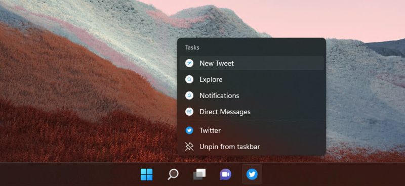

# 2.2: Creating application shortcuts


Welcome to week 2 day 2 of the [30 Days of PWA](https://aka.ms/learn-pwa/30Days-blog) series! Today's blog post will walk you through how to make it easy for your users to jump immediately to common task pages within your app using Shortcuts.

You’re likely already familiar with the concept of shortcuts. If you’ve ever opened the context menu on an app icon, you’ve seen something like this:



Here you can see the Twitter PWA providing quick access to compose a new Tweet, search, and access both mentions and direct messages. But how did they do that? It’s actually a pretty straightforward process in the Web App Manifest:

```json
{
  "name": "My App",
  "shortcuts": [
    /* One or more ShortcutItem objects */
  ]
}
```

The `shortcuts` member allows you to define an array of shortcut items. Each shortcut item is an object:

```json
{
  "name": "Today's agenda",
  "url": "/today",
  "description": "List of events planned for today"
}
```

This is a simple example that defines the `name` of the shortcut (the visible text), where it should navigate the PWA too (`url`), and some descriptive text that may be provided to assistive technologies by the host operating system. You can also define a `short_name` if you really need it.

To customize things a bit more, you also have the option of defining a set of `icons` for each shortcut item:

```json
{
  "name": "Today's agenda",
  "url": "/today",
  "description": "List of events planned for today",
  "icons": [
    /* One or more ImageResource objects */
  ]
}
```

Defining these is exactly the same as defining an app icon using the `icons` member, which we covered on [Day X](#).

## Putting it all together

As a real-world example, here’s how I’ve implemented shortcuts on my own site:

```json
{
  /* other stuff */
  "shortcuts": [
    {
      "name": "Notebook",
      "url": "/notebook/",
      "icons": [
        {
          "src": "/i/icons/notebook.svg",
          "type": "image/svg+xml",
          "purpose": "any monochrome"
        },
        {
          "src": "/i/icons/notebook.png",
          "type": "image/png",
          "sizes": "120x120",
          "purpose": "any monochrome"
        }
      ]
    },
    {
      "name": "Speaking",
      "url": "/speaking-engagements/",
      "icons": [
        {
          "src": "/i/icons/mic.svg",
          "type": "image/svg+xml",
          "purpose": "any monochrome"
        },
        {
          "src": "/i/icons/mic.png",
          "type": "image/png",
          "sizes": "120x120",
          "purpose": "any monochrome"
        }
      ]
    },
    {
      "name": "Publications",
      "url": "/publications/",
      "icons": [
        {
          "src": "/i/icons/books.svg",
          "type": "image/svg+xml",
          "purpose": "any monochrome"
        },
        {
          "src": "/i/icons/books.png",
          "type": "image/png",
          "sizes": "120x120",
          "purpose": "any monochrome"
        }
      ]
    },
    {
      "name": "Interviews",
      "url": "/interviews/",
      "icons": [
        {
          "src": "/i/icons/chat.svg",
          "type": "image/svg+xml",
          "purpose": "any monochrome"
        },
        {
          "src": "/i/icons/chat.png",
          "type": "image/png",
          "sizes": "120x120",
          "purpose": "any monochrome"
        }
      ]
    }
  ]
}
```

In this code I’ve defined 4 shortcuts: "Notebook," "Speaking," "Publications," and "Interviews." As the `name` values are brief and straightforward, I didn’t add a `short_name` or `description` for any of them. Each has an associated `url` and I’ve defined two icon options for each: one is crisp, vector SVG and the other is a bitmap PNG. I’ve also let the host operating system know they are monochrome (via `purpose`) in case it wants to toggle the color to match its own light/dark theme.

## A few final notes

As of the time I’m writing this, shortcuts are supported on Android PWAs installed by Chrome and on desktop OSes (macOS, Windows, and some Linux flavors) for PWAs installed through Chromium-based browsers like Chrome and Edge. PWAs distributed through the Play Store and Microsoft Store can also use shortcuts on Android and Windows, respectively.

On the topic of operating systems, it’s worth noting that each OS is different and will have its own constraints on the number of shortcuts it will render. For this reason, you should be selective about how many shortcuts you list and their order. If you include too many, they may not all be shown. Organize your shortcuts in order of priority, from most important to least important. Browsers are instructed to pay attention to this order and will drop shortcuts from the end of the list first, if it comes to that.

Also, since you have full control over the URL for shortcuts, you might consider adding a query parameter that enables you to track usage of the Shortcuts feature. For example:

```json
{
  "name": "Today's agenda",
  "url": "/today?utm_source=shortcut",
  "description": "List of events planned for today",
  "icons": [ /* One or more ImageResource objects */ ]
}

```

And that’s really it. Shortcuts is a relatively simple, but powerful tool when it comes to providing convenience for your users. You should definitely take advantage of it.

Tune in for the [next post](Retro link once next day is published) in the [series](https://aka.ms/learn-pwa/30Days-blog) tomorrow where we will cover how to share data to and from your PWA.

## Resources

You can find out more about Shortcuts here:

* [Microsoft Edge Developer Docs: Define app shortcuts](https://docs.microsoft.com/en-us/microsoft-edge/progressive-web-apps-chromium/how-to/shortcuts)
* [MDN Web Docs: Shortcuts](https://developer.mozilla.org/en-US/docs/Web/Manifest/shortcuts)