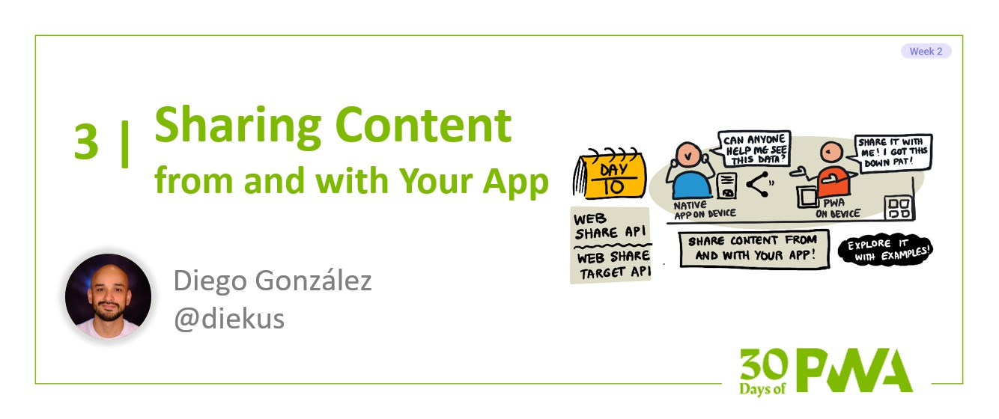

# 2.3: Sharing content from and with your app

**Author: Diego González [@diekus](https://twitter.com/diekus)**



### WHAT WE'LL COVER TODAY

| Section | Description |
| ------- | ----------- |
| **Definition** | What does it mean to share content between apps? What kind of content are we talking about? |
| **Sharing *from* your application** | Learn how to share content directly from your PWA. |
| **Sharing *to* your application** |Prepare your PWA to receive shared content. |
| **Related** | Look for other OS integrations throughout [Week 2: Advanced Capabilities](../advanced-capabilities/). |

---

## Definition

Hola! For today’s post on the [30 Days of PWA](https://aka.ms/learn-pwa/30Days-blog) series, we will cover sharing! You know, “sharing is caring.” This is a saying that we probably hear often… and with good reason. We are social beings and communicating things with those we care about is natural. Whether it be important news or a funny meme, the ability to distribute information plays a significant role in our lives and impacts how we discover, interact, and even make decisions. It is not surprising that with the vast amount of information on the web, the ability to share content becomes increasingly relevant and will often form the basis for a good user experience. For this reason, modern web browsers make it easy to share content, generally offering options in their context menus or settings to facilitate this. The next screenshot shows the context menu of Microsoft Edge with a Share option highlighted, as an example.


Sharing information through a web browser usually involves a sharing dialog box that is native to the operating system being used. The dialog provides options of whom and where to share with, which might vary depending on the type of content. In the example mentioned above, where we are sharing a web page (or a URL), then any application that handles text or links can act as a target that can receive the shared content. It may be that you wish to share this page with a friend via instant messaging, or email the link to a co-worker; these are just two of many different options that we use on a daily basis. This is how sharing looks on Android:


And this is how it looks on macOS:


As shown in the images above, the action of sharing invokes the operating system's share dialog. This creates a seamless, integrated experience, independent of where you are sharing from, allowing the user to send information between applications. Now, here is where it gets really interesting.

Now that I have laid out the concept of sharing between apps, let's bring PWAs into the mix. We can use the `Web Share API` and `Web Share Target API` to invoke this sharing dialog and share specific content, allowing your web app to behave like any other installed app.

## Our demo PWA
To demonstrate how the `Web Share API` works, I will use the PWinter PWA, available [here](https://aka.ms/learn-PWA/30Days-2.3/github.com/diekus/pwinter). This PWA allows a user to create custom themed PWA logos. These logos can then be saved as SVG files to be shared.


## Sharing _from_ your application
Let’s start by looking at how to share from your web application. We want to be able to share data from the PWA to another app that can handle the type of data being shared. As is the case for many things web, “there’s an API for that." For this specific scenario, the Web Share API comes to the rescue, and we can use the `navigator.share()` method, which takes as a parameter the data we want to share. This data can be composed of a url, text, title, and even an array of files, if the system supports it. This will return a [Promise](https://developer.mozilla.org/docs/Web/JavaScript/Guide/Using_promises) that resolves if the data is shared. As is the case with advanced powerful APIs, you need to be [running under HTTPS](https://microsoft.github.io/win-student-devs/#/30DaysOfPWA/core-concepts/02?id=_1-https) to use the `Web Share API`.

### Sharing a link
The PWinter app can share its URL, making it easy to distribute the address to the app with another user. In order to do so, it displays an icon on the lower right corner that when clicked, invokes the Web Share API. The following code shares a title, text and url via the operating system’s share dialog.

```javascript
// Shares a link with the Web Share API
async function sharePWinter() {
    const shareData = {
        title: 'PWinter',
        text: 'Design your own PWA Logo.',
        url: 'https://diek.us/pwinter',
    };
    try {
        await navigator.share(shareData);
        console.log('PWinter shared!');
    } catch (e) {
        console.error(e);
    }
}
```

### Sharing files
The Web Share API also allows you to share files. This capability works with images, PDFs, audio, text documents, and video. The [full list of supported file types is here](https://aka.ms/learn-PWA/30Days-2.3/developer.mozilla.org/en-US/docs/Web/API/Navigator/share#shareable_file_types), but you should always test to ensure the sharing action works with the type of file you want to share. 

To do that, you can use the `navigator.canShare()` method, which returns `true` if the sharing would succeed. The method returns `false` if the data can’t be validated. This might happen due to badly formatted URLs, missing data parameters, for security reasons, or even because the implementation does not support that specific file type.
Once you know that your sharing would succeed, you can specify the files to share in an array that you pass as an option to the share method. The following code from the demo PWA PWinter shares a logo created by the user in SVG format.  

```javascript
// Shares a file with the Web Share API
async function shareLogo() {
    let fileToShare = createFileForSharing(preparePWALogoforSVG());
    let filesArray = [];
    filesArray[0] = fileToShare;
    if (navigator.canShare && navigator.canShare({ files: filesArray })) {
        try {
            await navigator.share({
                files: filesArray,
                title: 'My PWA Logo',
                text: 'Custom PWA logo from The PWinter.'
            });
            console.log('Share was successful.');
        } catch (error) {
            console.log('Sharing failed', error);
        }
    } else {
        console.log(`System doesn't support sharing.`);
    }
};
```


## Sharing _to_ your application
Last, but definitely not least, you can share information from other applications to your PWA. Using the Web Share Target API, you can register your PWA to be on the receiving end of a share, allowing it to integrate with the OS’s share dialog. In the previous image, you can spot that the SVG file created by the user can be shared with a set of apps listed in the bottom part of the OS’s share dialog; notably, SimpleEdit and The PWinter, are both PWAs that can handle image files.

You can register a PWA as a share target by adding the `share_target` member to the app's web Manifest file. In order to accept simple data, such as a link or text, the code would look like this:

```json
"share_target": {
      "action": "index.html?shared-color",
      "method": "GET",
      "enctype": "application/x-www-form-urlencoded",
      "params": {
        "title": "title",
        "text": "text",
        "url": "url"
      }
    }
```
Something important to note is that the `action` property defines which part of the PWA will handle the incoming data. For the demo PWA, this addition to the manifest file indicates that a link will be received and processed by the `index.html?shared-color` url. This file has code in place that knows that when this url is called, it will try to parse the incoming link to detect any hex color code; this will set the letters of the PWA logo to that specific color.


If the target PWA changes as a result of the information it will receive, then you must set the method key value to `POST` and the `enctype` field to `multipart/form-data`. If you are also expecting the PWA to receive files, then be sure to set the `files` property to an array with those files. When the user shares to a PWA, the browser will open up the app on the action url and process the data accordingly.

## Summary
I have explained the two parts of sharing with PWAs. Sharing from the app is achieved by the Web Share API. You can share a variety of information with it. You can share to the app by registering it as a share target, with the Web Share Target API. This is done through an entry in the manifest file. These two advanced capabilities help your PWA integrate seamlessly with your platform, and create a smooth, unified sharing experience.
The Web Share API is currently supported on Windows, macOS, Linux, Android and iOS. There are some engines that do not have support, so be ready to check and accommodate your app accordingly. Web Share Target API relies on the Manifest and installation of a PWA which means it is supported on Chromium-based browsers.

Now you are ready to share and continue with tomorrow's post in the [series](https://aka.ms/learn-pwa/30Days-blog) where you'll learn about display modes! 


## Resources
* [Web Share API](https://aka.ms/learn-PWA/30Days-2.3/developer.mozilla.org/en-US/docs/Web/API/Web_Share_API) at MDN Web Docs
* [Share content with other apps](https://aka.ms/learn-PWA/30Days-2.3/docs.microsoft.com/en-us/microsoft-edge/progressive-web-apps-chromium/how-to/share) at Microsoft Edge docs.
