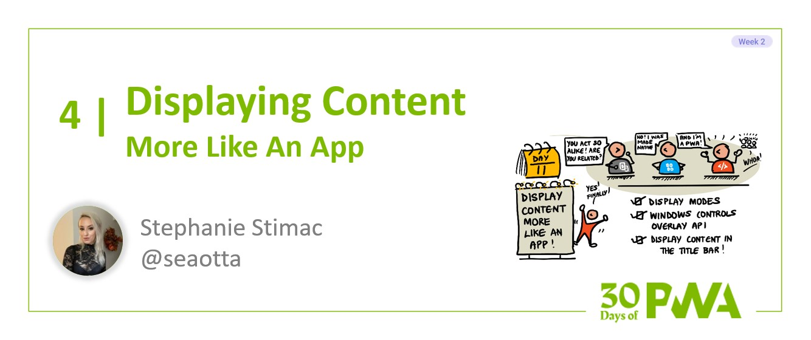

# 2.4: Displaying content more like an app

**Author: Stephanie Stimac [@seaotta](https://twitter.com/seaotta)**



Welcome to **Week 2 Day 4** of the [30 Days of PWA](<https://aka.ms/learn-pwa/30Days-blog>) series! Today’s blog post will walk you through the different display modes you can set for your website, and the experimental Window Controls Overlay feature which allows the customization of the title bar of your PWA.

## Display Modes 
There are four different display modes available to choose from and each provides a different browser UI experience that you’ll want to consider when deciding which display mode is right for your progressive web application. 

You set your preferred display mode via the web app manifest’s `display` property with one of the following values: "fullscreen," "standalone," "minimal-ui," or "browser":

```
{

“display”: “standalone”

}
```

In the event a browser doesn’t support a display mode, which is possible since they’re not required or support all the display mode options, the display mode will [fall back to a supported one](https://www.w3.org/TR/appmanifest/#dfn-fallback-chain) in this order: 

> fullscreen > standalone > minimal-ui > browser

### Standalone display mode 
The "standalone" display mode makes your PWA look and behave the most like a native application. It opens in a different window from the browser and hides all the browser UI elements like the address bar. It keeps standard system UI elements like a back button or a close window button. In this mode, your application can also have its own icon in the application launcher.  If standalone isn’t available, it will fall back to the "minimal-ui" display mode. Twitter uses "standalone" for their PWA.

<!--  -->


### Fullscreen display mode
The "fullscreen" display mode takes up the entirety of the display area available and hides all of the browser UI elements. If "fullscreen" isn’t available, it will fall back to "standalone." Here's an example of a game that uses the "fullscreen" display mode.

<!--  -->


### Minimal-UI display mode 
The minimal UI display mode gives your PWA a similar experience to the standalone display mode. It opens in its own window, but the application retains a minimal set of the browser UI, and the UI that is retained varies between browsers. The OneDrive PWA uses the `minimal-ui` display mode.

 

### Browser display mode
The browser display mode retains the browser experience with all the browser UI and your web app will not be installable. It will open in a normal browser window or tab. If Twitter were not using standalone mode, it would display in the browser like a normal tab. 


### Targeting different display modes with the `display-mode` media feature
Depending on the display mode you choose for your PWA there may be elements you want to hide when the web app is open in the browser tab, especially if you’re launching in a mode like standalone or fullscreen that hides the browser UI button. You need to ensure there’s a way for people to go back if there’s no back button. Or maybe you want to modify your site styles slightly to display better when the app is in fullscreen mode. 

You can do this by targeting certain display modes with the `display-mode` media feature. 

```
.app-button {

    display: none;

}

@media (display-mode: standalone) {

.app-button {

    display: block;

    }

}
```

In this example, the button with the class .app-button would only be shown when the PWA is in standalone mode. You can go even further to combine media queries to change how things are displayed on smaller screens versus a desktop when a user in standalone mode to tailor the experience.

## Customizing display options further with Window Controls Overlay 
The previous display modes I mentioned currently only offer customization of the display below the title bar when in standalone mode. Window Controls Overlay is an experimental display option that will allow you to customize the title bar of your PWA with CSS and JavaScript. It provides access to the space next to the controls that minimize, maximize, or close the app’s window. 

Because this feature is experimental and in development, the way it currently works is subject to change. You can turn this feature on in Chrome and Edge by going to `about://flags` and enabling the `Desktop PWA Window Controls Overlay` flag.


*This example from the [specification draft](https://aka.ms/learn-PWA/30Days-2.4/wicg.github.io/window-controls-overlay) shows how the title bar area becomes available when WCO is enabled.* 

### Using Window Controls Overlay 
In order to use this feature we need to add “display_override” to our web app manifest file. 

```
{

“display_override”: [“window-controls-overlay”]

}
```

The customized title bar will only show when in a separate PWA window on a desktop operating system. After our `display_override`, we would then follow up with our preferred display mode when window controls overlay isn’t available. 

```
{

“display_override”: [“window-controls-overlay”],

“display”: “standalone”,

}
```

Now that we’ve stated via the manifest we would like to use window controls overlay, we need to add some CSS to position the content in our title bar area. We can do that with the following CSS environment variables: 

- **`titlebar-area-x`**
- **`titlebar-area-y`**
- **`titlebar-area-width`**
- **`titlebar-area-height`**

Using these environment variables would look something like this: 

```
.titleBar {
    position: fixed;
    left: env(titlebar-area-x, 0);
    top: env(titlebar-area-y, 0);
    width: env(titlebar-area-width, 100%);
    height: env(titlebar-area-height, 40px);
}
```

The `titlebar-area-x` variable gives us the distance from the left of the viewport to where the titlebar appears, with a fallback integer. The `titlebar-area-y` variable gives us the distance from the top. And titlebar-area-width and titlebar-area-height set the width and height respectively, with fallback values. 

### Keeping the title bar draggable
Once you’ve positioned and styled your title bar, there’s one more step left. The window is no longer draggable if you’ve turned on window control overlay, so we need to fix this with the `app-region` CSS property. 

```
.titleBar {
    position: fixed;
    left: env(titlebar-area-x, 0);
    top: env(titlebar-area-y, 0);
    width: env(titlebar-area-width, 100%);
    height: env(titlebar-area-height, 40px);
    -webkit-app-region: drag;
    app-region: drag;
}
```

This CSS property is also experimental and not standardized so -webkit-app-region is needed for it to work in the browser, and with this prefix it only works in Chromium based browsers. 

## Resources 
[MDN `display-mode`](https://aka.ms/learn-PWA/30Days-2.4/developer.mozilla.org/en-US/docs/Web/CSS/display-mode)
[App Design: Display Modes](https://aka.ms/learn-PWA/30Days-2.4/web.dev/learn/pwa/app-design#display-modes)
[WCO: Breaking Out of the Box](https://aka.ms/learn-PWA/30Days-2.4/alistapart.com/article/breaking-out-of-the-box)

## Summary
Display modes are an easy way to make your PWA feel like a native app and are set via the web app manifest ‘display’ property. The ability to further customize the title bar area for an even greater native app feel when your PWA is displayed in a separate window is available via the experimental window control overlay setting available in Chrome and Edge. 

Tune in for the [next post](./05.md) in the [series](https://aka.ms/learn-pwa/30Days-blog) tomorrow where we will cover caching. 

## Exercise 

Pick a [sample app](https://aka.ms/learn-PWA/30Days-2.4/docs.microsoft.com/en-us/microsoft-edge/progressive-web-apps-chromium/demo-pwas) and change the display modes in the manifest to see how each presents when opened. What features are missing or added in each display mode? How does the UI change?