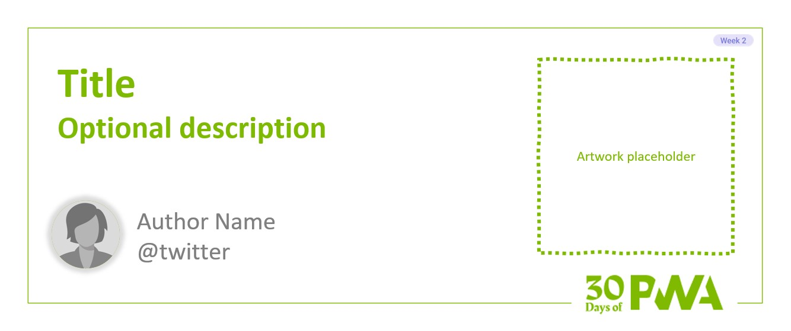

# 2.5: Caching your app’s data



Welcome to day 12 of the [30 Days of PWA](https://aka.ms/learn-pwa/30Days-blog) series! Today's blog post will walk you through how to be more effective and organized when it comes to caching.

We’ll start with a quick recap of caching in a PWA, which [Nitya introduced on day 4](../core-concepts/04.md)…

## Caching basics

Progressive Web Apps have a lot of control over how they manage resource loading. Much of this power stems from Service Workers, which have the ability to intercept, manipulate, and respond directly to network requests. As a compliment to that, the [Cache API](https://developer.mozilla.org/docs/Web/API/Cache) enables a Service Worker to store and retrieve previously-obtained (or created) Response objects, making it possible to avoid having to go to the network to retrieve long-lived resources like stylesheets and images.

Before we tuck in, I want to note that the Cache API is available everywhere, not just within a Service Worker. If you’re only using it within the context of a Service Worker, it’s guaranteed to be available, but if you’re using it elsewhere, you’ll want to test to ensure the feature is available:

```js
if ( "caches" in this ) {
  // Yay! The Cache API is accessible as caches.
}
```

Here’s a quick run-down on how the Cache API works. Keep in mind that it’s Promise-based. Let’s start with creating/opening a cache:

```js
const app_cache = await caches.open("app");
```

This will create a cache "app" if it doesn’t exist already and then open it. You can then add items to the cache using the `add()`, `addAll()`, or `put()`. Here’s a quick run-down of how these work:

```js
// Add a single Request
app_cache.add("/path/to/resource.ext"); 
  // requests the resource and adds it to the cache
app_cache.add(new Request("/path/to/resource.ext"));
  // does the same thing
app_cache.put("/path/to/resource.ext");
  // same again, but using put()

// Add a bunch of Requests
const app_files = [
  "/path/to/resource-1.ext",
  "/path/to/resource-2.ext"
];
app_cache.addAll( app_files );
  // requests & caches all of them

// generates a new synthetic response & 
// caches it as though it was 
// "/path/to/generated.json"
app_cache.put(
  "/path/to/generated.json",
  new Response('{ "generated_by": "my service worker" }')
);

// Store a non-CORS/3rd party Request
app_cache.put("https://another.tld/resource.ext");
```

Pretty cool, right? Now once you have items in the cache, you can pluck them out, using `match()`: 

```js
const response = await app_cache.match("/path/to/generated.json");
```

Usually this is done in the context of a `Fetch` event within a Service Worker, but you can also use this in the main thread to do things like [populate your offline page with a list of pages currently in the cache](https://remysharp.com/2019/09/05/offline-listings). Pretty cool stuff.

Finally, just to wrap things up, you can delete items from the cache just as easily as you can add them:

```js
cache.delete("/path/to/generated.json");
```

With the preliminaries out of the way, let’s take a look at how to manage your cached data.

## Getting organized

You can store a lot of data in the browser cache—gigabytes worth in some cases. Just because we can doesn’t mean we should though. After all, at at a certain point browser will evict an entire site from memory when space gets tight. Better to not be the resource hog when they come looking to clean up space 😉.

Before we can get more intentional about the amount of data we are caching, it helps to begin categorizing that data. For instance, your PWA will have longer-lived content, such as your CSS, JavaScript, site logo, and maybe your offline page. I like to think of those as *assets* and will create a specific cache for those. Similarly, you’re likely going to be caching Requests for other categories of content like pages, images, and so on. I like to define those categories as individual caches so I can add items to and remove items from them in a more intentional way. I define them up at the top of my Service Worker:

```js
const version = "v1:";
const sw_caches = {
  assets: {
    name: `${version}assets`
  },
  images: {
    name: `${version}images`
  },
  pages: {
    name: `${version}pages`
  }
};
```

Here you can see I am using a variable to track my cache <var>version</var> (more on that later) and then I set up an object to define the caches I will be working with: assets, images, and pages. Making each an object may seem like overkill, but there’s a reason for it, which I will get to shortly.

With this setup in place, I can use the `install` event to cache my assets:

```js
const offline_page = "/offline/";
const preinstall = [
  "/favicon.png",
  "/c/default.min.css",
  "/c/advanced.min.css",
  "/j/main.min.js",
  offline_page
];

self.addEventListener( "install", function( event ){
  event.waitUntil(
    caches.open( sw_caches.assets.name )
      .then(function( cache ){
        return cache.addAll( preinstall );
      })
  );
});
```

Here I’ve defined my offline page’s URL (<var>offline_page</var>) separately because I reference that string elsewhere in the Service Worker. Then I’ve included that URL alongside my PWA’s favicon, and its core CSS and JavaScript as <var>preinstall</var> which, in turn, gets fed into `cache.addAll()` as part of the the [Service Worker’s `install` event](../core-concepts/04.md). As the Cache API is Promise-based, you can see that the `install` event (<var>event</var>) is asked to wait for the appropriate cache to be open (in this case <var>sw_caches.assets.name</var>) and for the `addAll()` operation to complete.

We can use this organization in the `fetch` event as well. I typically use different cache/network recipes for different asset types. Similarly, I can store any of these assets in the mose appropriate cache. Here’s an abbreviated example:

```js
self.addEventListener( "fetch", event => {
  // Destination gives us a clue as to the type of resource
  const destination = event.request.destination;
  switch ( destination )
  {
    case "image":
      event.respondWith(
        // check the cache first,
        // fall back to the network
          // and store a copy in 
          // sw_caches.images.name
      );
      break;
    case "document":
      event.respondWith(
        // check the network first
          // and store a copy in
          // sw_caches.pages.name,
        // fall back to the cache
      );
    default:
      event.respondWith(
        // network only
      );
  }
});
```

This is a very simplified example, but you can see how we can what we know about the Request to make decisions about whether we go to the cache or the network first and where we store copies of the Request for later.

Now it’s true that you *can* search for a match across all of your PWA’s caches at once, using `caches.match()` as opposed to opening and searching a specific, named cache. So you might be wondering why I’m recommending going through the trouble of maintaining distinct caches. Here’s why: It empowers us to be more intentional about how we clean up cached resources.

## Cleaning up after yourself

When Nitya talked about [the Service Worker lifecycle in week one](../core-concepts/04.md), she mentioned the `activate` event. Activation is a great time to clean up stale caches. Usually this is discussed in the context of expiring older cached content by seeing if the cache names don’t match the current value of <var>version</var>:

```js
self.addEventListener( "activate", event => {
  event.waitUntil(
    caches.keys()
      .then( keys => {
        return Promise.all(
          keys
            .filter( key => {
              return ! key.startsWith( version );
            })
            .map( key => {
              return caches.delete( key );
            })
        );
      })
      .then( () => clients.claim() )
  );
});
```

This code collects all of the cache keys (names) you’ve created within your PWA. It then filters those down to only the ones that don’t begin with the current <var>version</var> value and then deletes them. This is a very heavy-handed way of removing cached resources, but it’s great for when you want to purge everything because you wanted a fresh start (which is what changing the <var>version</var> indicates).

When you begin to subdivide your caches a bit more, you can also set limits for how many resources you want to keep on hand. Some caches, like your assets, you probably want to keep around for a long time. Other caches you may want to limit to a certain number of resources. Let’s tweak <var>sw_caches</var> to set this up:

```js
const sw_caches = {
  assets: {
    name: `${version}assets`
  },
  images: {
    name: `${version}images`,
    limit: 50
  },
  pages: {
    name: `${version}pages`,
    limit: 10
  }
};
```

Here I’ve set up hard limits for how many items I want in the image and page caches (50 and 10, respectively). With that in place, we can create a much more methodical cache trimming utility:

```js
function trimCache( cache_name, limit ) {
  caches.open( cache_name )
    .then( cache => {
      cache.keys()
        .then( items => {
          if ( items.length > limit ) {
            (async function(){
              let i = 0,
                  end = items.length - limit;
              while ( i < end ) {
                console.log('deleting item', i, items[i]);
                cache.delete( items[i++] );
              }
            })();
          }
        });
    });
}
```

This function takes two arguments: the name of the cache (<var>cache_name</var>) and the max number of items we want the cache to hold (<var>limit</var>). Here’s what it does:

1. Open the named cache (`caches.open()`), then
2. Get the items in the cache (`cache.keys()`), then
3. Check to see if the number of items exceeds the limit,
4. If it does, figure out how many to remove, and (finally)
5. Delete the surplus, starting with the first (oldest) item.

This function could be called at any time, but I often run it on page load by triggering it from the main thread:

```js
// main.js
// After my code to register the service worker…
if ( navigator.serviceWorker.controller ) {
  window.addEventListener( "load", function(){
    navigator.serviceWorker.controller.postMessage( "clean up" );
  });
}

// serviceworker.js
self.addEventListener("message", messageEvent => {
  if (messageEvent.data == "clean up") {
    for ( let key in sw_caches ) {
      if ( sw_caches[key].limit != undefined ) {
        trimCache( sw_caches[key].name, sw_caches[key].limit );
      }
    }
  }
});
```

The first block in this snippet exists in my main JavaScript file, just after I register the Service Worker. It checks to make sure the Service Worker controller exists and, if it does, sends the "clean up" command to it via `postMessage()`. The second block shown here is in the Service Worker file and it listens for any inbound messages. When it receives the "clean up" message, it loops through the list of caches I’ve defined and runs `trimCache()` against any that have a `limit`.

## Try it out

The Cache API is an incredibly powerful tool and this post just scratches the surface of what it makes possible. Play around with it and find the approaches that work best for you. Keep in mind, they will likely vary from project to project and resource to resource. Stay flexible and think through what caching strategies make the most sense. Also don’t be afraid to change your mind; you can always revise the <var>version</var> and start again from scratch.

Tune in for the [next post](Retro link once next day is published) in the [series](https://aka.ms/learn-pwa/30Days-blog) tomorrow where we will cover how the many options for synchronizing data using a Service Worker.
