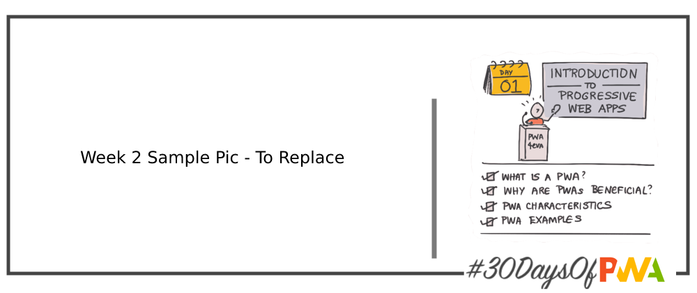
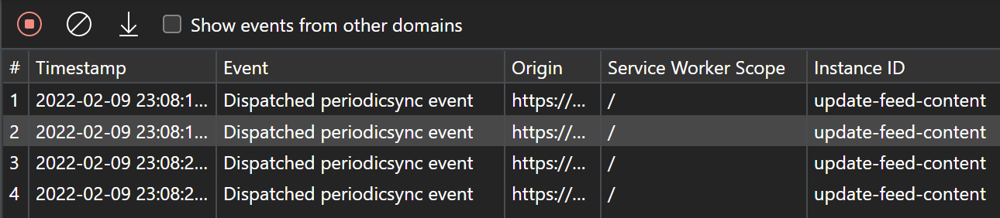

# 2.6: Synchronizing app in the background



Welcome to day 14 of the [30 Days of PWA](https://aka.ms/learn-pwa/30Days-blog) series! Today's blog post will introduce Background Services of modern browsers and how to use them for different kinds of synchronizations.

Author: Maxim Salnikov [@webmaxru](https://twitter.com/webmaxru)

## Background services

Modern browsers and Service Worker APIs bring exciting new features to the web. Now, you can run some pieces of your frontend code completely independently from the main application lifecycle. That means you are no longer limited to architecting and building your application as something that only starts when the user opens the corresponding URL and immediately ends right after they close the tab. Now, parts of your code can be executed even when there is no browser window with your application open in it, i.e. in the background. And this can happen with or without notifying the user. It's you, as a developer, who decide.

There are a bunch of APIs forming the **Background Services** feature in Chromium-based browsers which allow you to run code in the background. Today, we'll take a closer look at two that make it possible to synchronize data between your application and the browser: **Background Sync API** and **Periodic Background Sync API**.

## One-off synchronization on restoring the connection
The web is dependent on internet connectivity, which isn't great as an application platform. Once you’ve downloaded and installed an application, you expect it to work, whether you’re online or offline. The offline-readiness of PWAs is taken care of by using a combination of the core Service Worker API events — `install`, `activate`, `fetch` — and Cache Storage. But what about the Requests that the app does during runtime? How to provide a smooth user experience when there is no internet connection?

The Background Sync API is here to help. It allows developers to think about the frontend app to server communication as a set of _synchronizations_. These "syncs" will happen immediately after they were created ("registered" in terms of Background Sync API) if the connection is available or, if there is no connection, later when the user goes back online. The difference from all other pre-PWA approaches is that "later" can be _after_ the user closed the application tab and/or the visible part of the browser - thanks to the Service Worker that is always "on duty" in the background.

Please note, this API only provides a `sync` event to the Service Worker. You still have to preserve the data you want to send (in case the device is offline) and send it. You’ll need to consider where to store the data (Indexed DB is a good option) and think about queuing the data pushes if you want to support multiple transactions in a single sync.

There are lots of scenarios for background sync but the most straightforward and widespread one is the following: repeating requests to the server done offline (i.e. failed ones) after the connection is restored. Let's see how it works in practice for a web-based social media client.

### How to start

In your main application code, after the user created a new post and clicked "Publish" you check if the request to the server failed. If it did, you create a _sync_ for this attempt. You need an active service worker registration to do that.

```javascript
async function publishPostOnConnected(post) {
  const registration = await navigator.serviceWorker.ready;
  try {
    // First, you should write a code to save the data you want to send later. It's a good idea to have this function ready for multiple posts published while offline. Using IndexedDB is the best option for storing this kind of data.
    await savePost(post);

    // Then, the sync registration itself. We give it a name because we can have multiple syncs for various parts of the app functionality:
    await registration.sync.register('sync-post');

    // Finally, you can inform the user about it:
    showNotification('Your post will be published automatically right after connection is restored. It is safe to close the app.');
  } catch {
    console.error('Background Sync registration failed');
  }
}
```

It's a really good idea to wrap this code by a feature detection:

```javascript
if ('serviceWorker' in navigator && 'SyncManager' in window) {
  publishPostOnConnected(post);
} else {
  console.log('Background Sync is not supported');
}
```

In the service worker, you listen and react to the `sync` event named `sync-post`:

```javascript
self.addEventListener('sync', event => {
    if (event.tag === 'sync-post') {
      event.waitUntil(

        // You have to implement the function that iterates over the preserved posts and sends them:
        publishSavedPosts()
      );
    }
});
```

Here, `publishSavedPosts` function should return a promise indicating the success/failure of sending data. If it's rejected, the next sync will be scheduled to retry.

Retrying failed requests can be automated and implemented in a declarative way by using the [Workbox Background Sync](https://developers.google.com/web/tools/workbox/modules/workbox-background-sync) module.

## Periodic synchronization

The majority of the application platforms have APIs that allow native applications to periodically run some tasks in the background without the user's interaction. For example, a social media app can fetch and store new posts from the server from time to time - to display an up to date feed when the user starts the app.

What about the web? Can we keep installed web frontend application and data it uses up to date on our users' devices? Yes! With the API called Periodic Background Sync API, we can ask the background service of the browser to run parts of our code with some periodicity regardless of the main application status (whether it's running or not). Like Background Sync, this API only provides an event to the service worker - you have to implement the actual "payload" yourself. For example, it could be a fetch to check for the updated app version and/or its content followed by corresponding resources update in the browser cache.

Let's see how it works for a web-based social media client that can periodically update its main feed content in the background.

### How to start

It's a good idea to let the user decide if they want to use this feature or not. Using `PeriodicSyncManager` interface of the registered Service Worker, you can list existing "periodic syncs" to set the value (e.g., on/off) of UI controls (e.g., switches, checkboxes), such as "Update my feed in the background." When the user turns on this feature, you would register a new periodic sync:

```javascript
async function registerPeriodicFeedUpdate() {
  const registration = await navigator.serviceWorker.ready;

  // Query and check permission. See "Privacy and resource utilization considerations" section below.
  const status = await navigator.permissions.query({
    name: 'periodic-background-sync',
  });
  if (status.state !== 'granted') {
    console.log('Periodic Background Sync is not granted.');
    return;
  }

  try {
    await registration.periodicSync.register('update-feed-content', {
      minInterval: 24 * 60 * 60 * 1000, // We ask browser to run the sync no more than once a day
    });
    showNotification('Success! Feed will be updated in the background.');

  } catch() {
    console.error('Periodic Background Sync registration failed');
  }
}
```

Like always in PWA, feature detection is a best practice:

```javascript
if ('serviceWorker' in navigator && 'PeriodicSyncManager' in window) {
  registerPeriodicFeedUpdate();
} else {
  console.log('Periodic Background Sync is not supported');
}
```

In the service worker, you should listen and react to the `periodicsync` event named `update-feed-content`:

```javascript
self.addEventListener('periodicsync', event => {
  if (event.tag === 'update-feed-content') {
      event.waitUntil(

        // You have to implement the function that fetches the latest posts and updates the storage:
        updateFeedContent();
      );
  }
});
```

It’s worth noting that you may not want to fetch new data in `updateFeedContent` function. Before sending the Request, you might want to check if the user is on an unmetered connection (using [the Network Information API](https://developer.mozilla.org/en-US/docs/Web/API/Network_Information_API)) and that there is enough space in browser storage (using the [Storage Manager API](https://developer.mozilla.org/en-US/docs/Web/API/Storage_API)).

## Privacy and resource utilization considerations

Both the Background Sync and Periodic Background Sync APIs are designed to run some custom code (that might send network requests) in the background, at any time, without notifying a user. It raises at least two concerns: privacy and resource utilization. Any network request is potentially a history-leaking and location-tracking opportunity. And any code execution consumes CPU, memory, battery, and, if needed, network resources. To avoid these problems, both specifications require:

- Having Background Sync permission granted for the origin. It has `allow` state by default but users can deny it.


- Capping the number of Background Sync retries and the duration of Periodic Syncs. It's not defined in API specification, but for Periodic Sync intervals, browsers use the _Site Engagement_ index (number and duration of user interactions) for the particular origin — and on the particular device — to calculate the exact intervals. At best it’s a few hours. If you’re interested, you can check the Site Engagement index for yourself by visiting [about://site-engagement/](about://site-engagement/) in a Chromium-based browser.
- Code execution time is limited by the service worker's lifetime which is a few seconds. So abusing device hardware by heavy computation or overusing network resources is rather difficult.
- Both `sync` and `periodicsync` events are only fired online.

Periodic Background Sync API has a few additional requirements:

- The `periodicsync` will happen only on a known network (the one user was connected to before).
- It only works for _installed_ web applications.

## Testing and debugging

Checking how the background services you implemented work might be not an easy task: you as a developer do not have full control over the exact times when sync events come to a service worker. Fortunately, we have a set of helpers in the Chromium-based browser DevTools.

Go to Application -> Service Workers pane to send `sync` and `periodicsync` events to the service worker manually:


In the Background Services section of the Application tab, you can click on the API you want to debug to see the events (both "real" and "manual") that were sent to the service worker. To "catch" and debug the real ones (distributed over hours and days if we talk about periodic syncs), you can use the "Record" icon to log the events for up to three days.



## Learn more about background synchronization

- [Synchronize and update a PWA in the background](https://docs.microsoft.com/en-us/microsoft-edge/progressive-web-apps-chromium/how-to/background-syncs) article on Microsoft Docs
- Specifications for [Background Sync API](https://wicg.github.io/background-sync/spec/) and [Periodic Background Sync API](https://wicg.github.io/periodic-background-sync/)
- API documentation for [Background Sync API](https://developer.mozilla.org/en-US/docs/Web/API/Background_Synchronization_API) and [Periodic Background Sync API](https://developer.mozilla.org/en-US/docs/Web/API/Web_Periodic_Background_Synchronization_API) on Mozilla Developer Network.