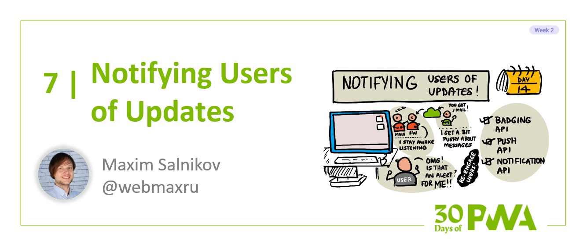

# 2.7: Notifying your users of updates

**Author: Maxim Salnikov [@webmaxru](https://twitter.com/webmaxru)**



Welcome to day 15 of the [30 Days of PWA](https://aka.ms/learn-pwa/30Days-blog) series! Today's blog post will introduce various ways to keep users notified and re-engaged with your application.

## What are the notifications we talk about?

What is a notification in the context of a web application at all? It's a way to alert users of something that's happening in its backend and/or the app itself. For example:

- A new message in a chat room
- A new version of the app is available
- Your flight is ready for check-in

Various kinds of notifications, based on their severity and urgency, require different kinds of user interaction: from blocking UI until user reaction on some request to no interaction at all, just informing in some prominent or subtle way. As a developer, you choose the exact type of notification based on your application business logic to provide the best user experience.

Also, the notification arrival time is not always predictable (at least from the user's point of view). If they have your web application open in the browser, you can use the "classic" approach to stay always connected: polling an API endpoint or using a websocket. But what if you want to have some part of your application always "on duty" in the background to listen to the events from your server and potentially show a notification? For sure, only a service worker can handle this scenario.

In this chapter, let's go through some interesting possibilities of keeping users informed timely and comfortably using the power of Progressive Web App APIs.

## Application badges

We start from the most gentle and subtle way to notify users of "something new" is available - a badge over the app icon. As mobile app users, we are familiar with the concept of badges. They are small graphical elements that are placed over the app icon on the home screen, taskbar, etc. The exact badge appearance depends on the specific platform. Often, this is a circle with contrasting background color containing the number of new items. For example, the number of unread messages in a mailbox.

Now, It's possible to use the same mechanism for web applications with the [Badging API](https://developer.mozilla.org/en-US/docs/Web/API/Badging_API). Of course, since we mention "application icon", we talk about the _installed_ web frontend application (i.e. with offline support via service worker and correct web app manifest) - check ["Make PWA Installable"](../core-concepts/03) and ["Make PWA Work Offline"](../core-concepts/05) sections to learn more about it.

### How to start

To manage a badge over the app icon, there are two methods available: `setAppBadge()` and `clearAppBadge()`. Let's assume we want to inform our user about 3 new messages in the mailbox:

```javascript
// Feature detection is always a good idea
if ('setAppBadge' in navigator) {

    navigator.setAppBadge(2).catch((error) => {
        // Code to handle an error
    });

}
```

To remove a badge:

```javascript
navigator.clearAppBadge()
```
or
```javascript
navigator.setAppBadge(0)
```

This is what an app icon with a badge looks like on the Windows 11 taskbar:


Here, an icon with a blue badge overlay is a PWA.

You can manage the badge both from your "main" application and from the service worker. The latter provides a very important use-case of setting the badge when the application tab (or even visible part of the browser) is not open. What are the most relevant events to listen to in your service worker for managing badges? Currently, there are two of them with their pros and cons:

- `push` - when a push notification is received. Pros: we control the exact timing of sending the notification request. Cons: all requirements and limitations of Push API (see details below). Also, it's obligatory to show a browser-native push notification (so we no longer talk about "silent" badge update).
- `periodicsync`- an event from Periodic Background Sync API we covered in ["Synchronizing app in the background"](../advanced-capabilities/06) section. Pros: there are no other actions or notifications needed, the badge update can happen in the background. Cons: all requirements and limitations of the Periodic Background Sync API. One of them is: there is no way to update the badge at a specific time - it's the browser that decides when to fire this event for a particular installed application, based on the Site Engagement index. And it's several hours in the best-case scenario.

As you see, currently, there is no perfect way to manage the badge from the service worker. The discussion about this topic is [ongoing](https://aka.ms/learn-PWA/30Days-2.7/github.com/w3c/badging/blob/main/explainer.md#background-updates) and will be updated in the future.


## Push notifications on the web

Another well-known mobile platform feature that came to the web and is relevant to the task of keeping users updated is push notifications. They are a way to send a packet of data (that might consist of a title, short description, url, image, several other kinds of data) to the user device from your backend. Often, push notifications are explained as a possibility for the app owners to re-engage users. Some distinctive features of push notifications are:

- They always use OS- or browser-native UI controls to display the notification. For the web, this is [Notifications API](https://aka.ms/learn-PWA/30Days-2.7/developer.mozilla.org/en-US/docs/Web/API/Notifications_API). It provides the best possible developer and user experience.
- Users explicitly opt-in to receive push notifications and can opt-out at any time. If the app developer doesn't provide the latter option in the UI, users can use platform native tools to block push notifications for the app (on mobile platforms) or for the origin (on the web).
- The user device is receiving and showing these notifications regardless of the app is open or not. Thus, for the web platform, we listen and react to the corresponding event in a service worker.
- There is always a 3rd party service that handles _subscriptions_ and sends push notifications to the user devices. It's called "Messaging Service" and it's a part of either operating system or browser. Messaging Service is a powerful server and network infrastructure able to deliver messages directly to the devices on a huge scale. As a developer, you can't (and don't need to) choose a specific Messaging Service - you implicitly use it in your code that works with Push API during subscription, unsubscription, sending a notification. And it's free to use.

### How to start

Implementing push notifications on the web includes multiple steps: 

1) Generating a set of so-called [VAPID](https://aka.ms/learn-PWA/30Days-2.7/datatracker.ietf.org/doc/html/draft-ietf-webpush-vapid-00) keys to authenticate a user device against the Messaging Service. You need one set of keys (public and private) per app. You can use either [web-push](https://aka.ms/learn-PWA/30Days-2.7/www.npmjs.com/package/web-push) module or one of free online services. Using `web-push`:

```shell
npm install web-push -g
web-push generate-vapid-keys --json
```

2) After the user explicitly opt-in to receive push notifications (for example, by clicking a button in the UI), you use `subscribe()` method of the `PushManager` interface (if it's available) of the active service worker registration:

It is a best practice to either hide or disable all related UI controls if there is no Push API support in the browser:

```javascript
if (!('PushManager' in window)) {

    // Code to disable or hide push-related UI controls

    console.log('Push API is not supported');
    return;
}
```

"Subscribe" button handler (for the sake of the example, the code is simplified and doesn't contain error handling):

```javascript
async function subscribeForPush() {
    const registration = await navigator.serviceWorker.ready;
    const vapidPublicKey = "publicKey from Step 1";
    const pushSubscription = await registration.pushManager.subscribe({
        userVisibleOnly: true, // Should be always true as currently browsers only support explicitly visible notifications
        applicationServerKey: urlBase64ToUint8Array(vapidPublicKey) // You will find urlBase64ToUint8Array() function in the link below
    });

    // Send push subscription to our server to persist it
    saveSubscription(pushSubscription);
}
```

The subscription process is completed. Several possibilities to improve the user experience:

- You can request subscription status from the Messaging Service by using `getSubscription()` to set the initial status for subscription UI controls.
- Before subscribing, it's a good idea to [check/request permission for the notification using Notifications API](https://aka.ms/learn-PWA/30Days-2.7/docs.microsoft.com/en-us/microsoft-edge/progressive-web-apps-chromium/how-to/notifications-badges#display-notifications-in-the-action-center). As a developer, you will have more flexibility to handle permission requests responses then. If you skip it, calling `subscribe()` will call the notification permission request prompt for you.
- Don't forget to implement unsubscription logic and place corresponding UI controls. It's always better to let users unsubscribe using your code (they can resubscribe again in your app) than to make them block your origin using browser settings (then to resubscribe they have to unblock your origin in the browser settings again).

You will find an extended code sample [here](https://aka.ms/learn-PWA/30Days-2.7/docs.microsoft.com/en-us/microsoft-edge/progressive-web-apps-chromium/how-to/notifications-badges#step-2---subscribe-to-push-notifications).

3) Time to send a notification! In your backend, you iterate through the push subscription objects you received and saved in Step 2 to send a special HTTPS request to the Messaging Service for each of them. Good to remember, push notifications on the web are not limited to broadcast messages. You can send a specific notification to a specific user device if together with the push subscription object you pass some user-identifying data (like your internal user ID) to the backend, so you can iterate over only specific subscriptions.

To [build](https://aka.ms/learn-PWA/30Days-2.7/datatracker.ietf.org/doc/html/draft-ietf-webpush-protocol) push notification send request, you use:

- `endpoint` field from the subscription object that is actually a URL of the Messaging Service with a unique device token
- VAPID keys you generated in Step 1
- The payload you want to send to the user device for this particular notification. Often, you `JSON.stringify()` the object following [Notification](https://aka.ms/learn-PWA/30Days-2.7/developer.mozilla.org/en-US/docs/Web/API/Notification/Notification) specification.

The simpler way to send a notification from your NodeJS backend is using `sendNotification()` method from the [web-push](https://aka.ms/learn-PWA/30Days-2.7/www.npmjs.com/package/web-push) module.

Messaging Services receives your request and sends a push notification to the user.

4) To receive a notification, a service worker on the user device will listen for the `push` event and handle it:

```javascript
self.addEventListener('push', (event) => {
    const notificationData = JSON.parse(event.data.text());

    event.waitUntil(
        self.registration.showNotification(notificationData.title, {
            body: notificationData.message,
            icon: notificationData.icon
        });
    );
});
```

To react to the user actions, you can also provide handlers for the `notificationclick` and `notificationclose` events in the service worker.

Because of the web specifics, push notifications there have some extra interesting points:

- Showing notification with data sent as a payload from your server (proxied by the Messaging Service) is only one possible scenario. Before displaying the notification, you can, for example, do another API call to request additional data. Of course, you have to consider limited service worker execution time. So all that happens in your code before calling `showNotification()` should not be too long.
- In a service worker, on receiving a `push` event, you MUST use `showNotification()` to show a native notification to the user (with only [one exception](https://aka.ms/learn-PWA/30Days-2.7/developers.google.com/web/fundamentals/push-notifications/common-notification-patterns#the_exception_to_the_rule)). If this method is not called or called incorrectly, the notification will still be shown informing the user about "something happened with your app in the background" (the exact text is decided by the browser). It's done to prevent malicious apps from "waking up" service workers by a signal from the backend without letting the user know about it.
- On Windows, push notifications are integrated into the Action Center.


On other operating systems, they might be also integrated into centralized notification UI or look like standalone browser-native dialogues.

There is a [web-push demo](https://aka.ms/learn-PWA/30Days-2.7/webpushdemo.azurewebsites.net) with the [source code available](https://aka.ms/learn-PWA/30Days-2.7/github.com/MicrosoftEdge/pushnotifications-demo) that you can use to explore the notification functionality.


## Learn more about notifying your users of updates

- [Re-engage users with badges, notifications, and push messages](https://aka.ms/learn-PWA/30Days-2.7/docs.microsoft.com/en-us/microsoft-edge/progressive-web-apps-chromium/how-to/notifications-badges) article on Microsoft Docs
- Specifications for [Badging API](https://aka.ms/learn-PWA/30Days-2.7/w3c.github.io/badging) and [Push API](https://aka.ms/learn-PWA/30Days-2.7/www.w3.org/TR/push-api)
- [RFC for Voluntary Application Server Identification (VAPID) for Web Push](https://aka.ms/learn-PWA/30Days-2.7/www.rfc-editor.org/rfc/rfc8292)
- API documentation for [Badging API](https://aka.ms/learn-PWA/30Days-2.7/developer.mozilla.org/en-US/docs/Web/API/Badging_API) and [Push API](https://aka.ms/learn-PWA/30Days-2.7/developer.mozilla.org/en-US/docs/Web/API/Push_API) on Mozilla Developer Network.
- [Web Push Book](https://aka.ms/learn-PWA/30Days-2.7/web-push-book.gauntface.com)