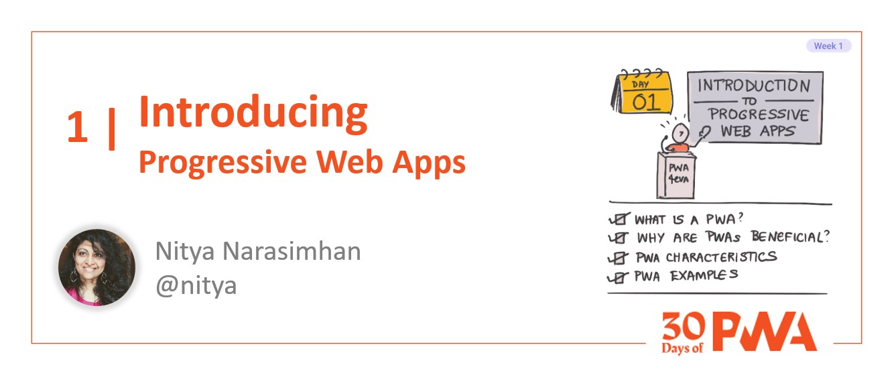
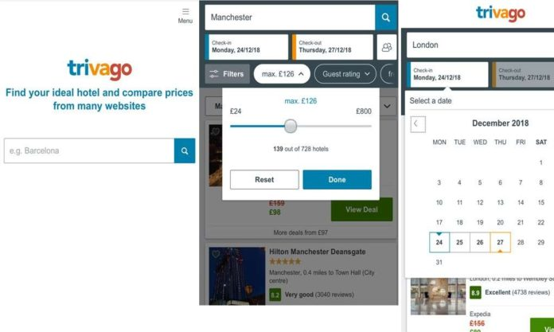

# 1.1: Introducing PWA

Welcome to **Day 1** of #30DaysOfPWA! Want to learn more about this project? Check out our [Kickoff](../kickoff.md) post to get more details on the content roadmap and contributors. Now, let's dive in!

|  | What you will learn today |
|:--- |:---|
| _Definition_ | What is a _Progressive_ Web App (PWA)? |
| _Differentiation_ | How does it compare to existing web & native apps? |
| _Adoption_ | What are PWA benefits for real-world deployments? |
| _Experience_ | What characterizes a good PWA? |
| _Exercise_ | Install and explore a sample PWA |
| _Related_ |[Week 4: Platforms And Practices](../platforms-practices) |

---

## What is a Progressive Web App (PWA)?

A [Progressive Web App (PWA)](https://docs.microsoft.com/en-us/microsoft-edge/progressive-web-apps-chromium/) is a traditional web app that is **progressively enhanced** using open web technologies, to make sure it delivers the **best possible experience** on every device, based on available capabilities.

This means that users on modern browsers and newer devices will get an _enhanced_ experience that rivals the native (installed) apps on that platform -- but users on older browsers or devices will continue to get a _usable_ experience in the form of familiar websites.

This allows Progressive Web Apps to combine the **reach** (broad availability and access) of website experiences with the **capability** (hardware features and rich resources) of platform-native experiences. 

**How does it do that?** Let's talk about progressive enhancement!

## What is Progressive Enhancement?
 
[Progressive enhancement](https://alistapart.com/article/understandingprogressiveenhancement) is a design philosophy that puts emphasis on _content-first_ experiences where developers
 * ensure there is a _baseline_ experience so users can consume core content from any device, even those with older browsers.
 * detect existence of newer capabilities (e.g., on modern browsers, newer devices) and _enhance_ the experience on those devices to use them.

To understand this better, take a look at the figure below.

Today, when users think of apps, they think of either platform-installed "native" apps (in blue) or browser-based "web" apps (in yellow) - where the browser is itself installed as a native app on device platforms. 

 * **Native apps work only on their device platform.** You need one codebase _per platform_ and possibly a specialized developer team (familiar with tools, languages) - but you get to access to all platform capabilities.
 * **Web apps work everywhere with a single codebase.** They can run across browsers, and all devices that browsers run on - using a single codebase. However, this limits them from using platform-specific capabilities that may not be supported everywhere.

Progressive Web Apps takes advantage of **open web technologies** - like Service Workers, HTTPS, Web App Manifest, Push Notifications, and other Web APIs and capabilities - to _detect and adapt_ experiences to suit the available capabilities on the platform.
 * On older devices and browsers - where nothing new may be  detected, it delivers a baseline website experience.
 * On newer devices - it can detect device form factors and *deliver responsive experiences* that align with native behaviors.
 * On modern browsers - it can detect support for Service Workers and Web App Manifest, and use those to unlock and support features like _installability_ and _offline operation_ - just like native apps.

As platforms evolve, and more platforms move to the right (in capabilities support), PWA development will become key to delivering scalable experiences across the broadest range of devices.

---

## How does PWA compare to web and native experiences?

Progressive Web Apps have the ability to get the best of both worlds - broad reach and deep capability - assuming that platforms will continue to evolve to support these open web technologies. Here are a few benefits:

 * _They have the reach of websites_. They can be indexed by search engines, discovered or shared by URL, and used from any device with a browser.
 * _They can behave like native apps_. They can work offline, be installed on device, handle push notifications, and access rich device hardware.
 * _They can use rich platform capabilities_. Ex: on Windows, PWA can be added to Start Menu, pinned to Taskbar, provide Share Targets for other apps & be published in Microsoft Store with other Windows apps.
 * _They can reduce costs_. PWAs are developed for all platforms from one codebase - not only does this reduce maintainability costs, it requires a single developer team vs. multiple platform-specific teams, to deliver the same experiences.

---

## What characterizes a "good" PWA?

Let's look at an example PWA to keep in mind during discussions this week. Pick one of these [sample PWAs](https://docs.microsoft.com/en-us/microsoft-edge/progressive-web-apps-chromium/demo-pwas) -- they have live demos & source code. I'll be using the [DevTools Tips](https://devtoolstips.org) PWA for my exploration. (See: [Source](https://github.com/captainbrosset/devtools-tips))

What makes this a good PWA experience? Because PWA is based on a design philosophy, there are no prescriptive rules - only [desirable characteristics](https://docs.microsoft.com/en-us/microsoft-edge/progressive-web-apps-chromium/#characteristics-of-a-progressive-web-app-pwa) that make experiences comparable favorably to existing native and web apps:

| Characteristic | Why Is This Desirable? |
|:---|:---|
|[Discoverability](https://developer.mozilla.org/en-US/docs/Web/Progressive_web_apps/Introduction#discoverability) | I can find PWAs in app stores, or via web search. |
| [Installability](https://developer.mozilla.org/en-US/docs/Web/Progressive_web_apps/Introduction#installability) | I can add PWAs to my device home screen, and launch them - like any native app. |
| [Re-Engageability](https://developer.mozilla.org/en-US/docs/Web/Progressive_web_apps/Introduction#re-engageability)| I can get push notification alerts (even if PWA is not actively in use) - like any native app . |
| [Network Independence](https://developer.mozilla.org/en-US/docs/Web/Progressive_web_apps/Introduction#network_independence) | I can get a usable PWA experience, even in flaky or offline network conditions - like any native app. |
| [Progressive Enhancement](https://developer.mozilla.org/en-US/docs/Web/Progressive_web_apps/Introduction#progressive_enhancement_support) | My PWA experience scales up (like native) or down (like website) based on device capabilities. |
| [Secure](https://developer.mozilla.org/en-US/docs/Web/Progressive_web_apps/Introduction#secure) | My PWA uses secure network communications with privacy safeguards in place. |
| [Responsive](https://developer.mozilla.org/en-US/docs/Web/Progressive_web_apps/Introduction#responsiveness) | My PWA adapts to suit device screen size, orientation and input modality. |
| [Linkability](https://developer.mozilla.org/en-US/docs/Web/Progressive_web_apps/Introduction#linkability) | I can link to, share, bookmark, and visit, the PWA URL - like any website. |

> Try using the sample PWA to explore characteristics 

 * Can you find it in web search results? 
 * Can you find it in the app store (try: [webboard](https://www.microsoft.com/en-us/p/webboard/9p53q9bf3mv6))
 * Can you access it when offline (try: flight mode)? 
 * Is it served over HTTPS? 
 * Does it adapt to screen size (mobile vs. desktop)? 

How can we develop PWA that can better meet these requirements? Look out for relevant posts in [Week 4: Platforms And Practices](../platforms-practices). For now, let's close this discussion with a look at real-world PWA adoption. 

---

## What drives real-world PWA adoption?

Are PWAs deployed in the real world today? What motivates an app developer to deploy PWA to production - and what are the challenges and benefits?

Let's look at some [success stories](https://docs.microsoft.com/en-us/microsoft-edge/progressive-web-apps-chromium/#success-stories) for PWA:

| | | |
|:---|:---|:---|
|2020 - Lyft | 2018 - Starbucks | 2017 - Trivago |
| PWA gets [40% more 'Install PWA' clicks](https://twitter.com/ebidel/status/1445425210119704578)  vs 'Download app' option.  | PWA had [2X daily active users](https://twitter.com/davidbrunelle/status/993960071406080000) at launch. Desktop & mobile order rates were comparable.| PWA got [150%% more engagement](https://twitter.com/ebidel/status/1445425210119704578) post install, 97% increase in clockouts. |
| Image Credit:   [Lyft on AppScope](https://appsco.pe/app/lyft) |Image Credit:   [Starbucks Case Study](https://formidable.com/work/starbucks-progressive-web-app/) | Image Credit:   [Windows Latest](https://www.windowslatest.com/2018/04/30/trivago-pushes-its-official-pwa-app-to-the-microsoft-store/)|

The above reflects metrics from [PWAStats.com](https://pwastats.com/) -- explore the site to see more such case studies and metrics. In general, PWA deployments can be evaluated on metrics like this that reflect reduced costs, improved efficiency, and user growth:

 * **App Installs** - did more users install PWA (vs. download native app)
 * **App Revenue** - did PWA usage drive more conversions or ad revenue?
 * **User Acquisiton** - did PWA result in new users (growth) for app?
 * **User Retention** - did PWA increase monthly active users on app?
 * **App Performance** - did PWA reduce app size, page load times etc.? 

The primary challenges remain cross-browser compatibility (for consistent experiences) and complexity in migrating large scale apps from existing web or native codebases to PWA. We'll dive into developer tools and best practices in later weeks, to tackle these issues.

In the next post we'll **deconstruct Progressive Web Apps (PWA)** to understand the core technologies that power our implementation, along with a peek at key developer tools to help our understanding.

---

## Exercise: Install your first PWA

Ready to dive into your first exercise? Try this: 
 1. Choose a [sample PWAs](https://docs.microsoft.com/en-us/microsoft-edge/progressive-web-apps-chromium/demo-pwas) and explore the live demo.
 2. Try [installing it](https://docs.microsoft.com/en-us/microsoft-edge/progressive-web-apps-chromium/ux#installing-a-pwa)  on desktop and on mobile. How does the experience differ? How is it similar?

In our next post, we'll dive into the building blocks of PWA - and use this sample PWA to see how they are used in practice.

---
