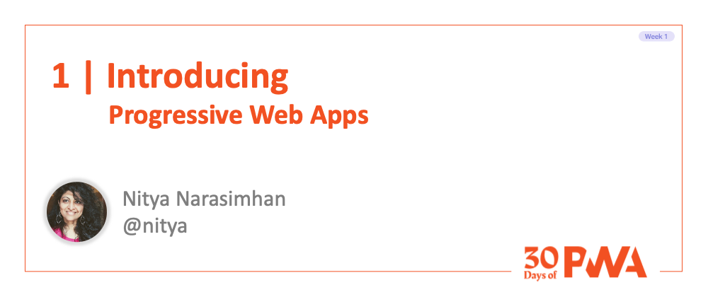

# 1.1: Introduction to PWA

### WHAT WE'LL COVER TODAY

| | |
|:--|:--- |
| **Definition** | What is a progressive web app (PWA)? How is it different from regular web apps and compiled native apps?|
| **Differentiation** | What are the benefits of PWA? What are the challenges for PWA development? What are the main characteristics of a good PWA?|
| **Adoption**| What are some real-world examples of PWA adoption? What are the core value propositions (technical & business) for deploying PWA in production? |
| **Exercise**| Explore [PWA Stats](https://www.pwastats.com/).   A community-driven site for real-world PWA case studies and learnings. |
| **Related**| Watch for [Week 4: Platforms And Practices](../platforms-practices)   Learn about platform-specific enhancements and best practices. |
| |

 

