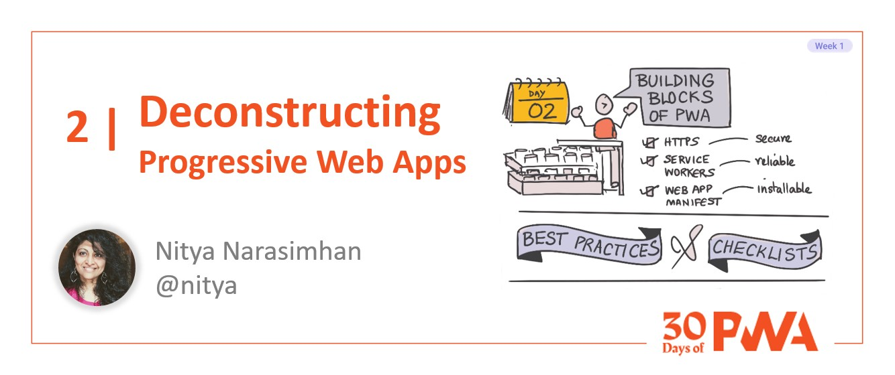
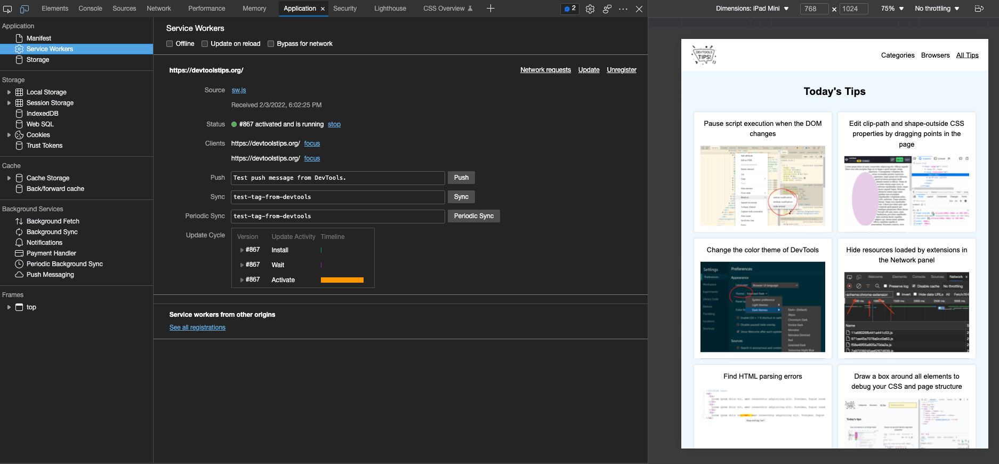

# 1.2 Deconstructing PWA

**Author: Nitya Narasimhan [@nitya](https://twitter.com/nitya)**

Welcome to **Week 1 Day 2** of #30DaysOfPWA! Want to learn more about this project? Check out our [Kickoff](../kickoff.md) post to get more details on the content roadmap and contributors. Now, let's dive in!



|  | What you will learn today |
|:--- |:---|
| _Components_ | What are the building blocks of a PWA? |
| _Function_ | How does each contribute to desired PWA behaviors? |
| _Priority_ | What are core vs. optional features for PWA development? |
| _Validation_ | How can I check if my PWA meets desired characteristics? |
| _Exercise_ | Audit the sample PWA - explore report & recommendations. |
| _Related_ |[Week 4: Platforms And Practices](../platforms-practices/) |

---

## What are the Building Blocks of a PWA?

In our last post, we talked about how _progressive enhancement_ was the key to scalable PWA experiences, the _desired characteristics_ of PWA (including installability, reliability and secure operation) and how _open web technologies_ were the key to developing good PWA.

Today, let's dive into those technologies, starting with the three core building blocks for PWA development: 

 * [HTTPS](https://aka.ms/learn-PWA/30Days-1.2/developer.mozilla.org/en-US/docs/Glossary/https) - makes your PWA secure.
 * [Service Workers](https://aka.ms/learn-PWA/30Days-1.2/docs.microsoft.com/en-us/microsoft-edge/progressive-web-apps-chromium/how-to/service-workers) - makes your PWA reliable and network-independent.
 * [Web App Manifest](https://aka.ms/learn-PWA/30Days-1.2/docs.microsoft.com/en-us/microsoft-edge/progressive-web-apps-chromium/how-to/web-app-manifests) - makes your PWA installable.

Before we jump into details, let's do a couple of activities to set the stage. In our last exercise, we picked a sample PWA to use as a reference when exploring concepts. Open that in your browser now and have it ready. I'm using [DevTools Tips](https://aka.ms/learn-PWA/30Days-1.2/devtoolstips.org) as my sample PWA.

---

## Task 1: Inspect your PWA!

Open the  PWA in a browser and  _inspect_ it using your browser's Developer Tools - e.g., [here is the guide for Microsoft Edge](https://aka.ms/learn-PWA/30Days-1.2/docs.microsoft.com/en-us/microsoft-edge/devtools-guide-chromium/css/inspect). Here's what I see when I inspect the **DevTools Tips** homepage:



This is a _runtime dashboard_ for your PWA with debugging and profiling tools - you'll learn more in [Week 3: Developer Tools](../dev-tools/). 

For now, familiarize yourself with  these sidebar elements and keep this tab open in your browser.

 * **Application** - with Manifest, Serice Workers and Storage
 * **Storage** - options including Local Storage, Session Storage, IndexedDB
 * **Cache** - representing Cache Storage in browser
 * **Background Services** - profiling panel to view/debug these actitivities.

---

## Task 2: Audit your PWA!

Visit the [PWABuilder](https://aka.ms/learn-PWA/30Days-1.2/www.pwabuilder.com) site. Look for the _Enter the URL to your PWA_ prompt, type in your PWA's URL (e.g., _[https://devtoolstips.org](https://aka.ms/learn-PWA/30Days-1.2/devtoolstips.org)_) and hit **Start**. In a few minutes, it should generate a report card that looks something like this. 


This is an **audit report** for your PWA. It tells you how well your PWA meets "desirable characteristics" with a checklist of _required_ (must-have), _recommended_ (nice-to-have) and _optional_ features. Our PWA has an excellent score!! You'll learn more in [Week 3: Developer Tools](../dev-tools/) - for now, keep the tab open and let's move on.

Time to learn about: _HTTPS, Service Workers and Web App Manifest!_

---

## 1. HTTPS

[HTTPS](https://aka.ms/learn-PWA/30Days-1.2/developer.mozilla.org/en-US/docs/Glossary/https) or _HyperText Transfer Protocol Secure_ is a secure version of the HTTP protocol, encrypting end-to-end communications between client and server endpoints in your web app by default.

Progressive Web Apps **must** be served from an HTTPS endpoint to ensure secure communications, provide user privacy safeguards and guarantee content authenticity. HTTPS is mandatory for **Service Workers** - the core PWA technology required for reliable, offline-friendly operation.

> Want to audit your PWA for security? Look at the _Security_ tab on the PWABuilder report. Here's what that looks like for the sample PWA.


Getting a good Security score is the simplest requirement to meet. Just **publish your PWA to an HTTPS-enabled endpoint**. You have two options:
 * Use a hosting service that supports HTTPS by default. Cloud Providers like [Azure](https://aka.ms/learn-PWA/30Days-1.2/azure.microsoft.com) offer options like [Azure App Service](https://aka.ms/learn-PWA/30Days-1.2/azure.microsoft.com/services/app-service/web) that can help. 
 * Use your own hosting options, and create the required certificates using free services like [Lets Encrypt](https://aka.ms/learn-PWA/30Days-1.2/letsencrypt.org/docs).

Note that Microsoft Edge will let you use `http://localhost` (non-HTTPS) to preview and test your PWA locally - _for debugging purposes only_.

---

## 2. Service Workers

[Service Workers](https://aka.ms/learn-PWA/30Days-1.2/docs.microsoft.com/en-us/microsoft-edge/progressive-web-apps-chromium/how-to/service-workers) are a special type of [Web Worker](https://aka.ms/learn-PWA/30Days-1.2/www.w3schools.com/js/js_api_web_workers.asp), a JavaScript task that can run in the background (for asynchronous or long-running operations) without impacting the performance of the page. 

Service Workers make your PWA _reliable_ and _network-independent_, ensuring that it provides a usable experience under flaky network conditions or when device is offline (ex: _Flight Mode_). It achieves this with two key capabilities:
 * **Fetch API**. Service Workers can intercept, modify and respond to all network requests from the application dynamically. They can listen for events indicating network changes, adapting their fetch responses based on the runtime conditions and app context.
 * **Cache API**. Service Workers can access client-side cache and asynchronous storage options (like IndexedDB, Local & Session Storage) to proactively store resources for offline access or performance efficiency.

> Let's see Service Workers in action with our sample PWA

Take a look at the _Inspect_ tab that we opened in Task 1 - and click on the Service Workers tab. 
 * Check the _Offline_ button, taking the browser offline.  
 * Revisit the [DevTools Tips](https://aka.ms/learn-PWA/30Days-1.2/devtoolstips.org) home page. _You should be able to view it even though you are offline_.
 * Click an artcle. What happens? _You may get the "You Are Offline" message if you have not visited it before_. 
 * Uncheck the _Offline_ button. Revisit the article (it loads) then check _Offline_ again. _You should be able to move between Home and Article pages and see them both offline_.

That's the power of Fetch (interception) and Cache (storage) delivering a native-like experience (works offline) for the PWA!

> Want to audit your PWA for Service Worker support? Look for the tab in the PWA Builder report. Here's what that looks like for DevTools Tips. 


We see it meets basic requirements (_has a service worker_) and implements some recommended and optional behaviors (_works offline_, _uses periodic sync_, _uses background sync_) for a better PWA experience.

We'll talk about Service Worker operations (scope, lifecycle) and caching strategies (for offline and performance needs) in a later post. 

---

## 3. Web App Manifest

So we've made the PWA secure and ensure reliable, network-independent operation. But how do we make it _installable_ like a native app? 

That's where the [Web Application Manifest](https://aka.ms/learn-PWA/30Days-1.2/docs.microsoft.com/en-us/microsoft-edge/progressive-web-apps-chromium/how-to/web-app-manifests) comes in. It's a [W3C Specfication](https://aka.ms/learn-PWA/30Days-1.2/www.w3.org/TR/appmanifest) helps. It's a specification that defines **a JSON-based file format** that provides developers with a **centralized place to put metadata** associated with apps.

From a PWA developer perspective, it's a 2-step process:
 * Create your _manifest.json_ file and associate it with your PWA by referencing it in the `<head>` section of your HTML page (see below). 
 * Populate the file with _required_ properties (for minimal PWA) and other _recommended or optional_ properties (for a best-in class PWA experience). 

```html
<link rel="manifest" href="/manifest.json">
```

> Let's see this in action with our sample PWA

Go back to the _Inspect_ tab we opened in Task 1.
 * Scan the `Elements` tab - do you see the link in `<head>`?
 * Scan the `Applications` tab - do you see the `manifest.json` file?

Here's what that looks like for DevTools Tips. Note that the dashboard also shows you currently populated Manifest properties grouped into categories (Identity, Presentation, Icons etc.) for convenience. We'll dive into the details in a future post. 


> Want to audit your PWA for Manifest support? 

Look at your PWABuilder report from Task 2. Here's what that looks like for DevTools Tips. 


The tool groups properties into _Required_, _Recommended_ and _Optional_ categories. Use it to prioritize and fix missing properties interactively to generate an updated _manifest.json_. Watch for [Week 3: DevTools](../dev-tools/) for more insights into this tool.

> How does Web App Manifest support Installability?

It governs how the PWA looks and behaves when installed on your target device platform. It is used by the browser to determine that a website is an installable PWA - and to provide the relevant [install experience](https://aka.ms/learn-PWA/30Days-1.2/docs.microsoft.com/en-us/microsoft-edge/progressive-web-apps-chromium/ux#installing-a-pwa) to users. It also supports direct installs from app stores when you [publish your PWA](https://aka.ms/learn-PWA/30Days-1.2/docs.microsoft.com/en-us/microsoft-edge/progressive-web-apps-chromium/how-to/microsoft-store).

## Summary


That was a lot to cover, but here are the core takeaways:
 - PWAs use open web technologies to implement progressive-enhancement techniqiues in a cross-brower compatible way.
 - Use HTTPS to ensure secure PWA operation. It is also mandatory for using Service Workers that provide reliable, offline experiences.
 - Use Service Workers to intercept fetch requests and manage local cache and storage resources, enabling reliable PWA usage even when offline.
 - Use Web App Manifest to describe relevant PWA properties for installability, enabling PWA to look and feel like native apps on devices.
 - Use Developer Tools (e.g., Inspect) to explore runtime operation of a PWA and see how these technologies are used.
 - Use Auditing Tools (e.g., PWABuilder) to validate PWA characteristics, and get actionable recommendations to make relevant fixes.

In our next post, we'll unpack the details of the Web App Manifest - but for now, try this exercise. 

## Exercise: Inspect & Audit your PWA

In the previous exercise, you selected a sample PWA and installed it in your local device (desktop or mobile). Today you'll open the app in a browser instead (I am using Microsoft Edge) and do the following tasks:

 * **Inspect your PWA** - e.g., using Microsoft Edge DevTools. 
    - Review the various Application tabs and sidebar sections.
    - Interact with the app while inspecting it - what changes?
 * **Audit your PWA** - e.g., using PWA Builder. 
    - Review the report and recommendations.
    - What differences did you see in this PWA's score & features?
    - What incremental fix can you make to improve that score?
 * **Reflect on your PWA**
    - What unique experiences does _this_ app unlock by being a PWA?
    - How does installed PWA experience differ from in-browser one? 
