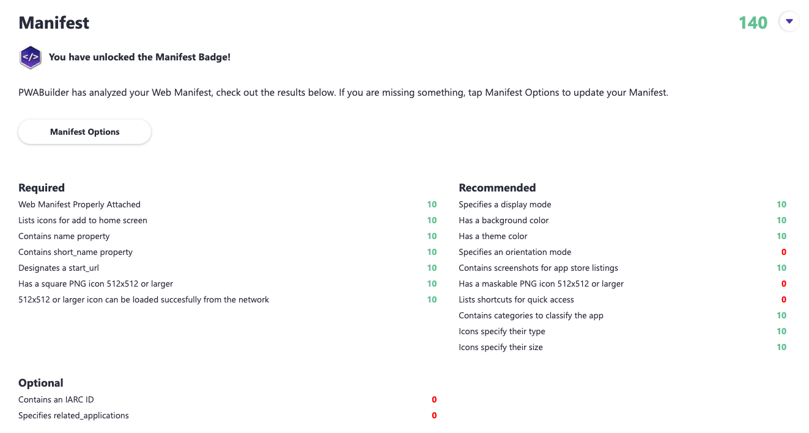

# 1.3 Make PWA Installable

**Author: Nitya Narasimhan [@nitya](https://twitter.com/nitya)**

Welcome to **Day 3** of #30DaysOfPWA! Want to learn more about this project? Check out our [Kickoff](../kickoff.md) post to get more details on the content roadmap and contributors. Now, let's dive in!


|  | What you will learn today |
|:--- |:---|
| _Definition_ | What is a Web App Manifest? |
| _Priority_ | What should a minimal PWA manifest provide? |
| _Function_ | How do manifest properties drive PWA capabilities? |
| _Validation_ | How can I create & validate a Web App Manifest? |
| _Exercise_ | Inspect the _manifest.json_ for the sample PWA |
| _Related_ | [Week 3: Developer Tools](../dev-tools/) |

---

## Let's Recap

* [Day 1](01.md): We learned PWAs are web apps that are _progressively enhanced_ to deliver experiences that **scale to device and platform capabilities**. They can behave like native apps on richer platforms and fall back to regular website behavior on less capable ones.
* [Day 2](02.md): We learned this is enabled by _open web technologies_ like Service Workers, Web App Manifest and HTTPS and support for modern Web APIs. These enable desirable PWA characteristics like **installability** and **network independence** in a cross-browser compatible way.

Plus, we picked a [Sample PWA](https://aka.ms/learn-PWA/30Days-1.3/docs.microsoft.com/en-us/microsoft-edge/progressive-web-apps-chromium/demo-pwas) to look at as we explore the concepts. Now, let's dive into PWA building blocks, starting with manifests.

## What is a Web App Manifest?

_Installability_ is a desirable PWA characterstic that allows it to be added to a device home screen and behave like other native apps - e.g., users can launch them, pin them to Taskbar, find them through device search etc.

The **Web App Manifest** is an open web [specification of a JSON format](https://aka.ms/learn-PWA/30Days-1.3/docs.microsoft.com/en-us/microsoft-edge/progressive-web-apps-chromium/how-to/web-app-manifests) that is critical to making PWAs installable. [Functionally](https://aka.ms/learn-PWA/30Days-1.3/docs.microsoft.com/en-us/microsoft-edge/progressive-web-apps-chromium/how-to/web-app-manifests), it _governs how your PWA looks and behaves when installed on device_ by defining the properties (key-value pairs) that characterize its appearance and behaviors. In other words, it describes details about your web app, such as your app name, description, icons, and more. 


## A Sample PWA Manifest

Let's take a look at what a real manifest looks like using a [Sample PWA](https://aka.ms/learn-PWA/30Days-1.3/docs.microsoft.com/en-us/microsoft-edge/progressive-web-apps-chromium/demo-pwas). I'm using [DevTool Tips](https://aka.ms/learn-PWA/30Days-1.3/devtoolstips.org) - and I can view its manifest in two ways:
 * **From runtime.** In [yesterday's post](02.md) we learned to _inspect_ the app with browser DevTools to find the Manifest section under the Application tab.
 * **From source.** Look for a [manifest.json](https://aka.ms/learn-PWA/30Days-1.3/raw.githubusercontent.com/captainbrosset/devtools-tips/main/src/manifest.json) file. Apps may choose to use a `app_name.webmanifest` naming convention if they serve it with an `application/manifest+json` MIME type. You can find a `<link rel="manifest" href="manifest.json">` inside the `<head>` tag of the page. The `href` will specify the file name of the manifest file.

 Here's what my sample PWA's _manifest.json_ looks like.

```json
{
    "name": "DevTools Tips",
    "short_name": "DevTools Tips",
    "start_url": "/",
    "categories": [
        "productivity",
        "devtools",
        "browser",
        "education"
    ],
    "display": "standalone",
    "background_color": "#ffffff",
    "theme_color": "#ffffff",
    "scope": "/",
    "description": "A collection of useful cross-browser DevTools tips",
    "icons": [
        {
            "src": "/assets/logo-192.png",
            "sizes": "192x192",
            "type": "image/png"
        },
        {
            "src": "/assets/logo-512.png",
            "sizes": "512x512",
            "type": "image/png"
        }
    ],
    "screenshots": [
        {
            "src": "/assets/screenshot-home.png",
            "sizes": "1992x1773",
            "type": "image/png"
        },
        {
            "src": "/assets/screenshot-tip.png",
            "sizes": "1992x1773",
            "type": "image/png"
        }
    ],
    "url_handlers": [
        {
            "origin": "https://devtoolstips.org"
        }
    ]
}
```

## Manifests are like App Resumes

That's a lot to take in right? It helps if you can put these properties into a few buckets - here's what I see:
 * _Identity_ - e.g., name, categories, starting URL.
 * _Characteristics_ - e.g, icons, colors, screenshots.
 * _Capabilities_ e.g., url_handlers 

Wait - doesn't this remind you of a resume? The identity information, the profile headshots, the list of skills? That's exactly how I think of it:

 * A Web App Manifest is like a resume for the application. 
 * The browser is where the application currently "works". 
 * **Installability** is the "interview" to work in a new place (on device).
 * **Discoverability** is helped by "publishing" app resumes (to app stores).

The visual explains how this analogy works for PWA.


The browser is like an amazing workplace where people look out for your success. PWAs are apps "working" there - they keep an updated "resume" (manifest) and "link" it in their HTML to tell the browser they can work "remotely" (on device). The browser uses it to "advertise" this to users ("Install This Site As An App"). Make sense?

If the user clicks that `Install` prompt, it triggers an "interview" between app new workplace (device), The latter looks up the resume for details (profile, appearance, skills) and adds it to its local "workplace directory" just like other native apps. Users can now _launch_ the app, or _discover_ it using device-specific search features. And, users and other apps can now target this app for tasks matching its listed _capabilities_ ("url handling"). Isn't that neat?

But wait - there's more. The PWA can also list its resume in app stores just like native apps (publish to [e.g., Microsoft Store](https://aka.ms/learn-PWA/30Days-1.3/docs.microsoft.com/en-us/microsoft-edge/progressive-web-apps-chromium/how-to/microsoft-store) for Windows devices). When users `Install` from app store, they just trigger the same interview process. **Installability and discoverability for the win!**


## Creating an Web App Manifest

From a PWA developer perspective, creating a manifest involves:
 * Create a _manifest.json_ and populating its properties.
 * Linking it to app HTML to advertise your PWA status. Ex:

```html
<link rel="manifest" href="/manifest.json">
```

Create your manifest with any text editor or IDE - just make sure your JSON is valid. Start with a minimal manifest to get a working PWA. Then iteratively add new [members](https://aka.ms/learn-PWA/30Days-1.3/developer.mozilla.org/docs/Web/Manifest) to improve PWA experience. Then add capability-driven attributes related to [Web APIs](https://aka.ms/learn-PWA/30Days-1.3/developer.mozilla.org/en-US/docs/Web/API) you support.

Audit your PWA with tools like [PWABuilder](https://aka.ms/learn-PWA/30Days-1.3/pwabuilder.com) to find, and fix, issues in your manifest so you can deliver a best-in-class PWA experience to users.

## What does a minimal manifest need?

The [specfication](https://aka.ms/learn-PWA/30Days-1.3/w3c.github.io/manifest#examples) defines a number of _member_ attributes - but a suggested [minimal manifest](https://aka.ms/learn-PWA/30Days-1.3/docs.microsoft.com/en-us/microsoft-edge/progressive-web-apps-chromium/how-to/web-app-manifests) should have at least these three - where *start_url* defines the entry point (default path shown) when app is launched on device.

```json
{
    "name": "My Sample PWA",
    "lang": "en-US",
    "start_url": "/"
}
```

A user-friendly description of the supported members can be read [here](https://aka.ms/learn-PWA/30Days-1.3/developer.mozilla.org/docs/Web/Manifest) - let's see what our sample PWA is declaring for instance:
 * `short_name` - app name for constrained spaces (e.g., home screen)
 * `categories` - hints for stores or app catalogs. (See W3C [examples](https://aka.ms/learn-PWA/30Days-1.3/github.com/w3c/manifest/wiki/Categories))
 * `display` - how much of browser UI does user see in app? 
 * `background_color` - placeholder to show (before stylesheet loads)
 * `theme_color` - default theme color for app
 * `scope` - what web pages can be viewed (navigation scope)
 * `description` - what is the app about?
 * `icons` - array of icon images used in various contexts
 * `screenshots` - showcase application UI/UX (e.g., for app stores)


## What is a _good_ manifest?

A good Manifest provides additional properties that help deliver the optimal experience for the user on that device. This can include:
 * adding _recommended_ members and _experimental_ members
 * adding properties to unlock new _capabilities_ on device.

For the first part, an actionable step to use audit tools like [PWABuilder](https://aka.ms/learn-PWA/30Days-1.3/pwabuilder.com) that grade manifest quality and help fix issues interactively (see example below). Look for our [Week 3: Developer Tools](../dev-tools/) coverage for more details.



For the second part, we talked about two things

**Experimental members**. These are manifest members that are being evaluated for future inclusion, but subject to change. Browser platforms may offer early implementations under a [flag](https://aka.ms/learn-PWA/30Days-1.3/docs.microsoft.com/en-us/microsoft-edge/progressive-web-apps-chromium/how-to/handle-urls#enable-url-handling) for evaluation - but keep in mind that these could change, and be unevenly supported across browsers.

 * _Example_: Our sample PWA declares a "url_handlers" member. This is an [experimental feature](https://aka.ms/learn-PWA/30Days-1.3/docs.microsoft.com/en-us/microsoft-edge/progressive-web-apps-chromium/how-to/handle-urls) that allows the app to register itself as a launch target when user wishes to open associated URLs. There is now a proposal to replace this with a ["handle_links"](https://aka.ms/learn-PWA/30Days-1.3/github.com/WICG/pwa-url-handler/blob/main/handle_links/explainer.md) member instead.

**Web capabilities**. The manifest can be used to declare support for using new [Web APIs](https://aka.ms/learn-PWA/30Days-1.3/developer.mozilla.org/en-US/docs/Web/API) that unlock app access to rich platform hardware and features.

 * _Example:_ The ["share_target"](https://aka.ms/learn-PWA/30Days-1.3/docs.microsoft.com/en-us/microsoft-edge/progressive-web-apps-chromium/how-to/web-app-manifests#identify-your-app-as-a-share-target) (used with the [Web Share API](https://aka.ms/learn-PWA/30Days-1.3/developer.mozilla.org/en-US/docs/Web/API/Web_Share_API)), activates PWA ability to [share content with other apps](https://aka.ms/learn-PWA/30Days-1.3/docs.microsoft.com/en-us/microsoft-edge/progressive-web-apps-chromium/how-to/share) like any other native app. Watch for Week 2, when we talk about advanced capabilities.

One last thought. Remember our analogy for the manifest being a resume for the PWA? Where manifest "members" reflect different sections related to identity, characteristics and capability? 

Think of _web capabilities_ and other open web technologies (e.g, Service Workers) as being a **rolodex** of team-mates that this app can call upon, to get the work done. They can now list those skills on their resume because it's a skill they are _capable_ of. However, their ability to do that job on a given device is dependent on the _availability_ of those teammates. Think of "feature detection" as equivalent to _making a call_ to see if the required colleague is around before committing to support that task.

---

## Exercise: Inspect Sample PWA Manifest

We covered a lot today - and now it's your turn to learn by actively exploring the concepts. Pick a different [Sample App.](https://aka.ms/learn-PWA/30Days-1.3/docs.microsoft.com/en-us/microsoft-edge/progressive-web-apps-chromium/demo-pwas)

 * Inspect it's Manifest in DevTools. What [members](https://aka.ms/learn-PWA/30Days-1.3/developer.mozilla.org/docs/Web/Manifest) did it define?
 * Audit it with [PWABuilder](https://aka.ms/learn-PWA/30Days-1.3/pwabuilder.com). What gaps did it identify? 
 * Explore the Manifest. 
    - Are any experimental members in use? What do they do?
    - Are any capabilities declared? What [Web APIs](https://aka.ms/learn-PWA/30Days-1.3/developer.mozilla.org/en-US/docs/Web/API) are behind them?

_Share your insights using #30DaysOfPWA_ - we'd love to see them!

 --