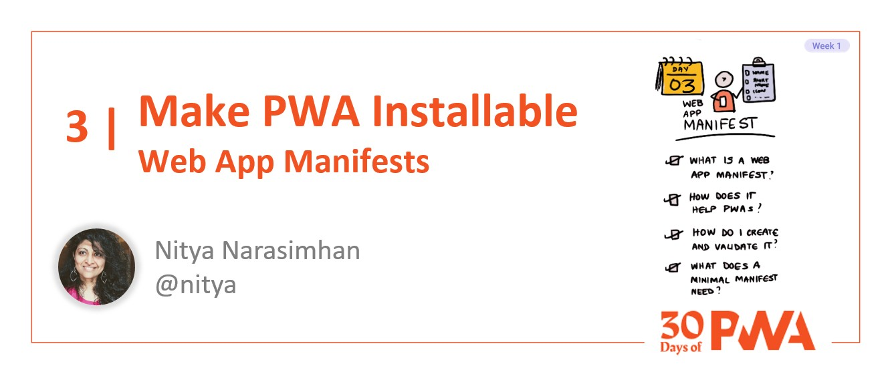

# 1.3 HTTPS

## *Coming soon!*

### WHAT WE'LL COVER TODAY

| Section | Description |
| ------- | ----------- |
| **Overview** | What is HTTPS? |
| **Deep Dive** | How does HTTPS Work?|
| **Motivation**| Why is HTTPS critical for PWA? |
| **Development** | How can I integrate HTTPS support into my PWA |
| **Exercise**| Explore [Let's Encrypt](https://letsencrypt.org/getting-started/) - a free, automated, open Certificate Authority. |
| **Related**| Watch for [Week 4: Platforms And Practices](../platforms-practices) - services with built-in HTTPS |
