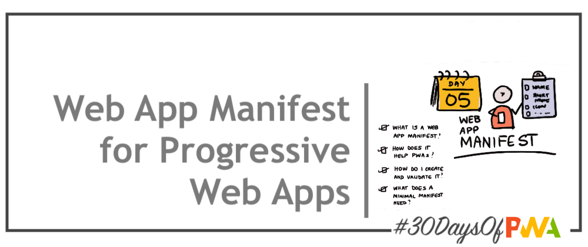

# 1.4 Service Workers

### WHAT WE'LL COVER TODAY

| Section | Description |
| ------- | ----------- |
| **Overview** | What are Service Workers? Why do PWAs need them?|
| **Implementation** | How do I implement Service Workers ? What tools can I use? |
| **Lifecycle**| Understand Service Worker Lifecycle for better debugging, usage. |
| **Caching**| Learn Service Worker + Caching Strategies for better offline experiences. |
| **Exercise**| Explore [Service Workers: Primer](https://developers.google.com/web/fundamentals/primers/service-workers) |
| **Related**| Watch for  [Week 3: Developer Tools](../dev-tools) : Workbox |
