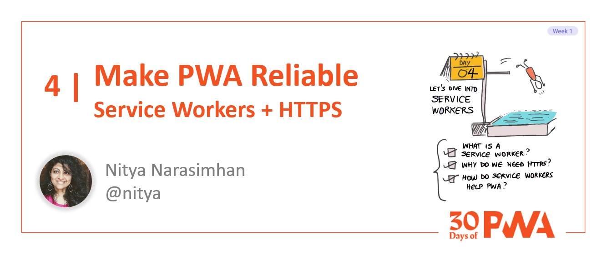

# 1.4 Make PWA Reliable

**Author: Nitya Narasimhan [@nitya](https://twitter.com/nitya)**

Welcome to **Day 4** of #30DaysOfPWA! Want to learn more about this project? Check out our [Kickoff](../kickoff.md) post to get more details on the content roadmap and contributors. Now, let's dive in!



|  | What you will learn today |
|:--- |:---|
| _Definition_ | What is a Service Worker? |
| _Priority_ | Why is HTTPS essential for PWA? |
| _Function_ | Understand registration and lifecycle events |
| _Usage_ | How are service workers used in PWA? |
| _Exercise_ | Inspect the _sw.js_ in your sample PWA |
| _Related_ | [Week 3: Developer Tools](../dev-tools/) |

---

## Let's Recap

**What we learned so far:**

 * PWAs are web apps by default. They can provide a _usable_ experience across all devices and platforms, from a single codebase.
 * PWAs use _progressive enhancement_ to scale up their experiences to suit richer platform capabilities. They can feel indistinguishable from natively installed apps in that context.
 * PWAs use _open web technologies_ to implement this behavior. Core building blocks are HTTPS, Web App Manifest and Service Workers. New _web capabilities_ unlock even richer experiences on supporting platforms.
 * _Web App Manifests_ are like app resumes - providing identity, branding and skills information that is needed for app installation (on device) or publishing (to app stores).

**What we'll cover today:** We'll explore the remaining building blocks (HTTPS, Service Workers) with specific focus on [using Service Workers](https://aka.ms/learn-PWA/30Days-1.4/docs.microsoft.com/en-us/microsoft-edge/progressive-web-apps-chromium/how-to/service-workers).

 
---

## PWAs are like startups!

To set the stage, let's use another analogy. We previously talked about how Web App Manifests are like app resumes. Now think about the PWA like a startup - with each technology being a founding team member with a specialized purpose that helps deliver a progressively-enhanced experience.

 * The app **page** is the CEO - it drives the core experience and remains responsive to user needs and interactions. 
 * The **Web App Manifest** is the resume - it describes app identity, brand and capabilities to devices and app stores _for installability_.
 * **HTTPS** is the Chief Security Officer (CSO) - it encrypts end-to-end communications between app and server endpoints _for safety_.
 * The **Service Worker** is the Chief Operations Officer (COO) - it unblocks the CEO from performing time-consuming or synchronous tasks, and takes proactive actions to ensure reliable operation even when offline.


Let's see how this translates to PWA implementations that support desirable traits like safety, network-independent operation, and re-engageability. And in particular, we'll explore service worker implementation and usage, to make this happen.

---

## Make PWAs Safe


HTTPS enforces end-to-end encryption of all client-server communications, providing privacy safeguards for information exchanged over the network. Visualize this as a Chief Security Officer locking down all entry and access paths into your startup and protecting information from malicious third-party access or tampering.

**HTTPS support is mandatory for using Service Workers**. Thankfully, as we covered [in our earlier post](02.md), it is easy to implement HTTPS support. Use modern cloud hosting providers (who enable it by default) or take advantage of free certificate options (e.g., [Let's Encrypt](https://aka.ms/learn-PWA/30Days-1.4/letsencrypt.com)) to secure your own servers.


## Make PWAs Reliable & Re-Engageable


Service Workers are a special type of [Web Worker](https://aka.ms/learn-PWA/30Days-1.4/www.w3schools.com/js/js_api_web_workers.asp). Web Workers operate in a separate thread, allowing them to execute long-running or asynchronous tasks in the background, minimizing the impact on page performance ("unblocking" the CEO).

Service Workers make PWA operation _reliable_ by helping deliver usable experiences even under flaky or offline network conditions. They do this by _intercepting_ network fetch requests from the page (CEO) and _strategically_ handling them using cached responses (if offline), or network-fetched resources (if real-time), or some combination of both based on predefined caching strategies for resource types.

Service Workers make PWAs _re-engageable_ by having the ability to alert users to app changes or context, even if the page itself is inactive. They do this by listening for asynchronous push notifications (from a server) and working with platform capabilities to deliver alerts in a device-familiar way. When users engage with the alert, they are drawn back into the app seamlessly - just like with other native app experiences.

---

## How do Service Workers work?

From a development perspective, we need to know two concepts:
 * Service Worker **Registration** - where CEO "hires" the COO.
 * Service Worker **Lifecycle** - where COO "handles" operational events.

Let's look at registration first. Like all Web Workers, the Service Worker must be authored in its own file. The location of that file (relative to the root of the app) defines the _scope_ of its authority. Service Workers can only intercept or manage requests to pages within their scope. _Placing the file at the root of your app ensures your service worker will manage all pages within it_.

Let's inspect the [DevTools Tips PWA](https://aka.ms/learn-PWA/30Days-1.4/devtoolstips.org) in the browser again. Look at _Service Workers_ under the _Application_ tab. We can see that the service worker is implemented in the "sw.js" file in the root directory - implicitly setting its scope to the whole app.


If you inspect the application source (in _Elements_ tab) you will find this snippet of code for service worker registration:

```javascript
if('serviceWorker' in navigator) {
    // Register the service worker
    navigator.serviceWorker.register('/sw.js', {
        scope: '/'
    });
}
```

Because Service Worker is a more recent technology that may not be [supported on all browsers](https://aka.ms/learn-PWA/30Days-1.4/caniuse.com/serviceworkers), we test for its existence before registering it. The scope is set implicitly by the file location - the code shows how you can explicitly set this if needed. 


---

## Service Worker: Lifecycle Events

Service worker registration is like onboarding the COO. Once that is complete, the service worker is ready to listen for lifecycle events (install, activate) to set itself up for success. Think of this as three phases:

1. **Registration**: The browser registers the service worker, kicking off the Service Worker lifecycle.

2. **Installation**: The browser triggers `install` as the first event to the Service Worker. It can use this for pre-caching resources (e.g., populate cache with long-lived resources like logos or offline pages).

```javascript
self.addEventListener( "install", function( event ){
    console.log( "WORKER: install event in progress." );
});
```

3. **Activation**: The browser sends the `activate` event to indicate that the service worker has been installed. This service worker can now do clean up actions (e.g., remove old caches from prior version) and ready itself to handle _functional_ events. If there is an old service worker in play, you can use `clients.claim()` to immediately replace the old service worker with your new one.

```javascript
self.addEventListener( "activate", function( event ){
    console.log( "WORKER: activation event in progress." );
    clients.claim();
    console.log( "WORKER: all clients are now controlled by me! Mwahahaha!" );
});
```


## Service Worker: Functional Events

Functional events are those that require the asynchronous or background processing abilities of service workers to support reliable and re-enageable behaviors. For now, think about just two: "fetch" and "push".

1. The [**fetch event**](https://aka.ms/learn-PWA/30Days-1.4/developer.mozilla.org/en-US/docs/Web/API/FetchEvent) is triggered when the browser tries to access a page that lies within the _scope_ of the service worker. The service worker acts as an interceptor - returning a response either from the cache or from the network (or some combination of both) based on predefined strategies. We'll cover more on this in the next post.

```javascript
self.addEventListener( "fetch", function( event ){
    console.log( "WORKER: Fetching", event.request );
});
```

2. The [**push event**](https://aka.ms/learn-PWA/30Days-1.4/developer.mozilla.org/en-US/docs/Web/API/PushEvent) is triggered when the browser receives a push message from a server to display as a toast notification to users. This occurs only if the PWA had previously _subscribed_ for server notifications _and_ user has granted the PWA permission to receive them. Push events are critical to [re-engaging users](https://aka.ms/learn-PWA/30Days-1.4/docs.microsoft.com/en-us/microsoft-edge/progressive-web-apps-chromium/how-to/notifications-badges) when the app is not otherwise active.

```javascript
self.addEventListener( "push", function( event ){
    console.log( "WORKER: Received notification", event.data );
});
```

In our next post, we'll dive into details of service worker support for offline operation - looking at how service workers engage with the Fetch and Cache Storage APIs to provide continuity of experience in a network-independent manner. For now, it's time for a hands-on exercise!

---

## Exercise: Explore Service Workers

Use DevTools to inspect a different [sample PWA](https://aka.ms/learn-PWA/30Days-1.4/docs.microsoft.com/en-us/microsoft-edge/progressive-web-apps-chromium/demo-pwas) and see if you can identify and understand the service worker hooks and implementation:

* Go to `Elements` tab and explore the application source
    - Where is the service worker registered?
    - What is the scope for registration?
* Go to `Applications` tab and explore the service worker file
    - What events is it handling?
    - Can you understand its caching strategy (for fetch)?
    - Is it re-engaging the user (with push)?
* Go to the `Cache Storage` section
    - What files or assets do you see stored there?
    - How do these correlate to actions taken for `install` event?
* Go to the `Service Workers` section - click "Offline"
    - What happens when you reload the page? 
    - What happens when you go to a different site (offline)?
