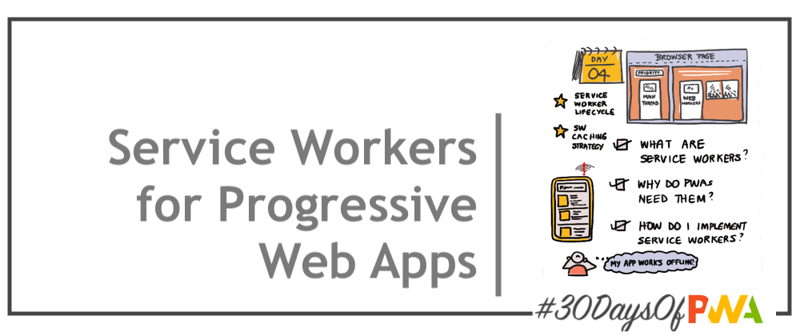

# 1.5 Web App Manifest

### WHAT WE'LL COVER TODAY

| Section | Description |
| ------- | ----------- |
| **Overview** | What is a Web App Manifest? |
| **Motivation** | How does it help PWAs?  |
| **Requirements** | What does a minimal App Manifest need? |
| **Usage** | How can I create and validate a web app manifest? |
| **Exercise** | Explore [Web App Manifest: Keys](https://developer.mozilla.org/en-US/docs/Web/Manifest#members) |
| **Related** | Watch for [Week 3: Developer Tools](../dev-tools) | PWABuilder |
