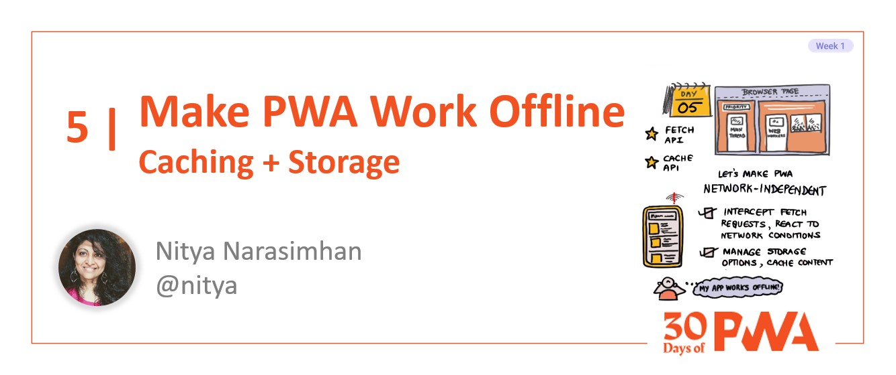
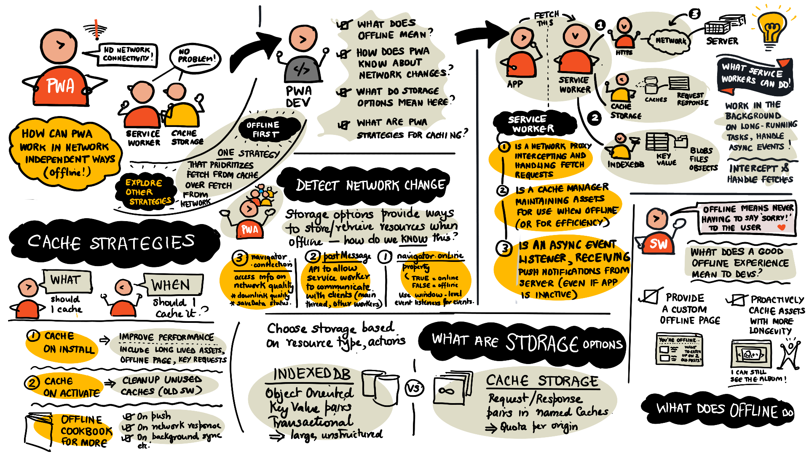

# 1.5 Make PWA Work Offline

**Author: Nitya Narasimhan [@nitya](https://twitter.com/nitya)**

Welcome to **Day 5** of #30DaysOfPWA! Want to learn more about this project? Check out our [Kickoff](../kickoff.md) post to get more details on the content roadmap and contributors. Now, let's dive in!



|  | What you will learn today |
|:--- |:---|
| _Offline PWA_ | What does offline mean? What should the PWA experience be? |
| _Detection_ | How does PWA know about network changes? |
| _Storage_ | What storage options can service workers use? |
| _Caching_ | What caching strategies can PWAs employ? |
| _Exercise_ | Explore offline experience in sample PWA. |
| _Related_ | [Week 3: Developer Tools](../dev-tools/) |

---

## Let's Recap

**What we learned so far:**

 * PWAs are web apps that use _progressive enhancement_ to scale experiences up and down to suit device and browser capabilities. On more capable devices, they can be indistinguishable from natively installed apps.
 * PWAs use _open web technologies_ with core building blocks being HTTPS (make it secure), Service Workers (make it reliable) and Web App Manifest (make it installble).
 * _Service Workers_ are web workers that run in the background, executing time-consuming, asynchronous tasks without impacting page performance and responsiveness to users.

**Yesterday, we learned about Service Workers:**

* They are **Network proxies**. They _intercept and modify_ app requests for network resources, making HTTPS usage mandatory. Their ability to modify network messages means they need HTTPS to prevent _others_ from using that ability to hijack client-server communications.
* They are **Cache managers.** They _precache assets_ and manage cache storage using pre-defined strategies. This means the PWA can operate offline (using pre-cached offline pages and responses) and be more performant (e.g., pre-caching assets with longer lifetimes).
* They are **Async Event handlers.** They _receive push notifications_ even if the app is inactive - and can respond by triggering device-familiar alerts that can _re-engage the user_  to interact with the app, just like in other native experiences.

**And we learned about the Service Worker Lifecycle**:

Service Workers handle fetch events for app resources (paths) within their "scope". To minimize conflict with existing service workers (wrapping up prior requests), they are brought to life in three phases, with the install-activate transition waiting on existing service workers to exit.

 * _registration_ - service worker is downloaded and initialized.
 * _installation_ - service worker settles in, gets first event.
 * _activation_ - service worker is greenlit for active duty.

Using our "service worker as Chief Operations Officer" analogy - it's like the startup hired a new COO (registration), gave them their badge (install event), then waited till the prior COO cleared the office before handing over the key (activate event). The badge allows the COO to bring in things they need (pre-cache) but it's the key that gives them the power to handle calls (functional events) and redecorate (e.g., clear out previous version's cache).

**Today's Focus**:

The service worker is ready - now what? Today we'll look at how the service worker handles the _functional_ events, with emphasis on the _fetch_ and _cache_ related APIs that drive network-independent offline-ready experiences.
 
---

## What does "Offline" mean?

A key difference between native (installed) and web (in-browser) experiences has traditionally been about _network dependency_. Regular websites won't function reliably if you are off network (e.g., _flight mode_) or have poor network connectivity (in transit or low-bandwidth regions).

Service workers can help make PWAs _network independent_ by making sure they deliver a usable experience even under flaky or absent network conditions. Some recommended practices here include:
 * **Providing a custom offline page**. Rather than showing the browser's default offline page, this can show something meaningful that keeps the user engaged in the app until the network connection is restored. For instance, _pre-cache_ a custom offline page that reflects the app's branding; show it when user is offline and navigates to an un-cached page or route, giving them confidence that the app is in charge and knows about current network status.
 * **Proactively cache assets or responses with longevity**. There may be content in your app that remains unchanged for long intervals - e.g., banner images, authentication state, media for playback etc. Proactively cache and use them _even if online_ for improved performance and native-like behaviors.

Now, when service workers intercept a "fetch" request, they can evaluate different strategies for returning a response. _For example:_ an "offline first" strategy might aggressively prioritize cache over network when returning responses. While this may bring performance benefits (reduced network delays) it also requires managing priorities of cached elements for impact.

In the next couple of sections, let's look at the code that helps us implement these strategies in our service worker!

But first, take a minute to inspect your chosen [Sample PWA](https://aka.ms/learn-PWA/30Days-1.5/docs.microsoft.com/en-us/microsoft-edge/progressive-web-apps-chromium/demo-pwas) and look at its service worker implementation. Keep that open in a tab so you can explore it in the context of this discussion. I'm using [DevTools Tips](https://aka.ms/learn-PWA/30Days-1.5/devtoolstips.org) and I've made a copy of its `sw.js` file in [this gist](https://aka.ms/learn-PWA/30Days-1.5/gist.github.com/nitya/3aa3b72dc6abb177b577574f32382c7d) for my reference.

---

## Understanding Storage Options 

Making resources available offline requires taking advantage of on-device storage. Given their async nature, service workers (web workers) have access to two options:

 * [CacheStorage](https://aka.ms/learn-PWA/30Days-1.5/developer.mozilla.org/en-US/docs/Web/API/CacheStorage) - an API to a store of _named_ [Cache](https://aka.ms/learn-PWA/30Days-1.5/developer.mozilla.org/en-US/docs/Web/API/Cache) objects that can be accessed by both service workers and an app’s main JavaScript thread. Caches store request/response pairs for network resources. Caches need to be managed explicitly - for updates and deletes - with quotas set per origin. A service worker can have multiple named Cache objects if needed.
 * [IndexedDB](https://aka.ms/learn-PWA/30Days-1.5/developer.mozilla.org/en-US/docs/Web/API/IndexedDB_API) - an API to store large amounts of _structured data_ including files and blobs. It's an object-oriented transactional database that uses key-value pairs and is ideal for storing individual assets (vs. response pages in cache). You can read more about IndexedDB in week 4 Platforms & Practices.

Note that _Web Storage_ options (localStorage and sessionStorage) are synchronous and can't be used within web workers - but you could use them from the main thread with potential performance hits. Learn more about that [here](https://aka.ms/learn-PWA/30Days-1.5/docs.microsoft.com/en-us/microsoft-edge/progressive-web-apps-chromium/how-to/offline#understand-storage-options-for-pwas). Want to get a better sense of storage options? Just [inspect the Application Panel](https://aka.ms/learn-PWA/30Days-1.5/docs.microsoft.com/en-us/microsoft-edge/devtools-guide-chromium/progressive-web-apps#service-workers) of the PWA using DevTools and debug interactively.


 Take a look at the Microsoft Edge docs for the [Service Workers](https://aka.ms/learn-PWA/30Days-1.5/docs.microsoft.com/en-us/microsoft-edge/devtools-guide-chromium/progressive-web-apps#service-workers), [Cache Storage](https://aka.ms/learn-PWA/30Days-1.5/docs.microsoft.com/en-us/microsoft-edge/devtools-guide-chromium/progressive-web-apps#service-worker-caches) and [IndexedDB](https://aka.ms/learn-PWA/30Days-1.5/docs.microsoft.com/en-us/microsoft-edge/devtools-guide-chromium/storage/indexeddb) panels to learn how to explore them in real contexts.

---

## Cache Storage & Strategies

Caches need to be managed explicitly - creation, modification and deletion of resources must be done by the service worker with intent. Cache _usage_ is dependent on the strategy used for handling fetch requests. The [Offline Cookbook](https://aka.ms/learn-PWA/30Days-1.5/web.dev/offline-cookbook) is a great resource that provides insights into all three questions:
 * what to cache (real-time vs. long-living resource types)
 * when to cache it (on install, activate, fetch events)
 * how to handle fetch requests (cache first, network first, a combination)

Let's look at a couple of strategies, with code from the sample PWA.

### 1. Cache on install to improve performance

Here's the relevant snippet of code from the DevTools Tips [sw.js](https://aka.ms/learn-PWA/30Days-1.5/gist.github.com/nitya/3aa3b72dc6abb177b577574f32382c7d) gist, annotated with my comments for clarity

```javascript

// named cache in Cache Storage
const CACHE_NAME = 'devtools-tips-v3';

// list of requests whose responses will be pre-cached at install
const INITIAL_CACHED_RESOURCES = [
    '/',
    '/offline/',
    '/all/',
    '/browser/edge/',
    '/browser/safari/',
    '/browser/firefox/',
    '/browser/chrome/',
    '/assets/style.css',
    '/assets/filter-tip-list.js',
    '/assets/share.js',
    '/assets/logo.png',
    'https://unpkg.com/prismjs@1.20.0/themes/prism-okaidia.css',
    '/assets/localforage-1.10.0.min.js'
];

// install event handler (note async operation)
// opens named cache, pre-caches identified resources above
self.addEventListener('install', event => {
    event.waitUntil((async () => {
        const cache = await caches.open(CACHE_NAME);
        cache.addAll(INITIAL_CACHED_RESOURCES);
    })());
});
```

This gets key request-response pairs pre-cached for offline readiness. But how are these retrieved - and when?


### 2. Cache-first on (fetch) retrieval

Now, when a fetch event is received, the service worker can enforce its preferred policy - here a _cache first_ strategy means that the service worker looks for a match in the cache and only goes to the network on a miss. Note that you can pre-filter on request parameters to refine the policy - e.g. go to cache only if resource type is an HTML page etc.

Here's the relevant snippet from our sample PWA.

```javascript

// We have a cache-first strategy, 
// where we look for resources in the cache first
// and only on the network if this fails.
self.addEventListener('fetch', event => {
    event.respondWith((async () => {
        const cache = await caches.open(CACHE_NAME);

        // Try the cache first.
        const cachedResponse = await cache.match(event.request);
        if (cachedResponse !== undefined) {
            // Cache hit, let's send the cached resource.
            return cachedResponse;
        } else {
            // Nothing in cache, let's go to the network.

            // ...... truncated ....
        }
    }
}
```

---

## Detecting Network Changes

The above examples showcased scenarios where the caching policy was independent of network status (i.e., always checks cache first). But what if you wanted to condition your strategy on the current status of the network?

The [`navigator.onLine`](https://developer.mozilla.org/en-US/docs/Web/API/Navigator/onLine) property returns a boolean (true/false) value reflecting the online status of the browser. Different browsers might implement this differently - so you may want to understand nuances to avoid false positives and negatives. The property should send update events if that status changes - and you can listen for those events at the `window` level.

```javascript
window.addEventListener("online",  function(){
    console.log("You are online!");
});
window.addEventListener("offline", function(){
    console.log("Oh no, you lost your network connection.");
});
```
---

## A Visual Summary

Service Workers can also do other things - like [handle push notifications](https://aka.ms/learn-PWA/30Days-1.5/docs.microsoft.com/en-us/microsoft-edge/progressive-web-apps-chromium/how-to/service-workers#push-notifications) or [fetch data in the background](https://aka.ms/learn-PWA/30Days-1.5/docs.microsoft.com/en-us/microsoft-edge/progressive-web-apps-chromium/how-to/background-syncs) and use that to update app or cache for efficiency. Look for content in week 4 (Platforms and Practices) that might be relevant in context.

That was quite a lot, right? Hopefully this visual summary (of everything we talked about on Service Workers, Storage Options and Caching Strategies) will help you review and recall key elements.





---

## Learning Resources

Working with service workers can be challenging. There are a number of resources worth exploring on your own, to improve your understanding and simplify your developer experience.

 * *Modern Browser Support* | Sites like [caniuse.com](https://aka.ms/learn-PWA/30Days-1.5/caniuse.com/serviceworkers) and [is Service Worker ready?](https://aka.ms/learn-PWA/30Days-1.5/jakearchibald.github.io/isserviceworkerready#moar) provide easy-to-read dashboards showing the degree of support for specific Service Worker API and features across browsers.
 * *Service Worker API* | This [MDN resource](https://aka.ms/learn-PWA/30Days-1.5/developer.mozilla.org/en-US/docs/Web/API/Service_Worker_API) has good coverage of Service Worker interfaces, use cases and related APIs.
 * *Storage Options* | Learn more about [Cache Storage API](https://aka.ms/learn-PWA/30Days-1.5/developer.mozilla.org/en-US/docs/Web/API/CacheStorage), [Cache API](https://aka.ms/learn-PWA/30Days-1.5/developer.mozilla.org/en-US/docs/Web/API/Cache) and [IndexedDB API](https://aka.ms/learn-PWA/30Days-1.5/developer.mozilla.org/en-US/docs/Web/API/IndexedDB_API) - to understand what types of data each supports, and how they can be used by service workers.
 * *Workbox* | These [Google-developed libraries](https://aka.ms/learn-PWA/30Days-1.5/developers.google.com/web/tools/workbox) power production-ready service workers and outline [common recipes](https://aka.ms/learn-PWA/30Days-1.5/developers.google.com/web/tools/workbox/guides/common-recipes) for caching strategies you can use in your PWA.

Look out for content in the following weeks that may explore some of these topics in more detail.

---

## Exercise: Your Turn!!

You know the drill! Pick a [Sample PWA](https://aka.ms/learn-PWA/30Days-1.5/docs.microsoft.com/en-us/microsoft-edge/progressive-web-apps-chromium/demo-pwas) and inspect it in browser DevTools. 
 
  * Open Service Worker panel, and view the implementation file.
  * Look for the install event handler - correlate it to cache contents. Was anything pre-cached on startup?
  * Look for the fetch event handler - what kind of caching strategy is the PWA enforcing?
  * Toggle "Offline"  mode in DevTools Service Worker panel. Navigate back to different pages of the app. What do you see?
    - Do you get a custom offline page for non-cached assets?
    - Do you get valid pages when you navigate to pre-cached routes?
  * Review the rest of the service worker implementation - try to understand what events it is handling, and how those impact caching strategies and offline behaviors.