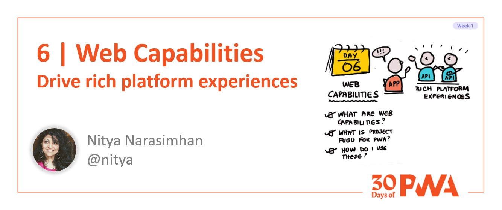
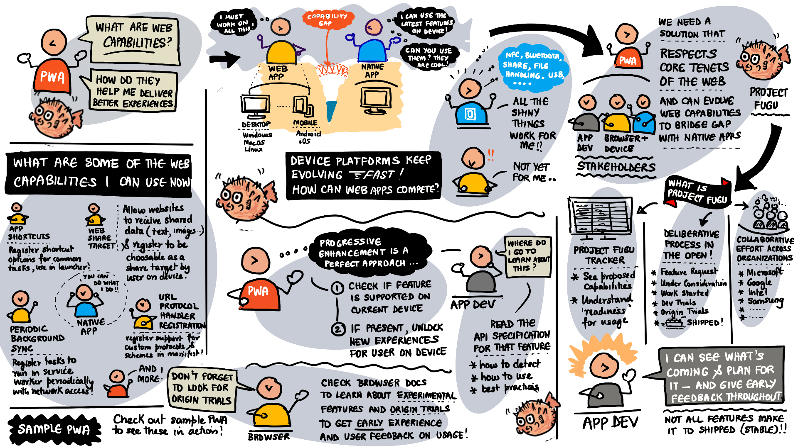

# 1.6 Make PWA Capable

**Author: Nitya Narasimhan [@nitya](https://twitter.com/nitya)**

Welcome to **Day 6** of #30DaysOfPWA! Want to learn more about this project? Check out our [Kickoff](../kickoff.md) post to get more details on the content roadmap and contributors. Now, let's dive in!

|  | What you will learn today |
|:--- |:---|
| _Definition_ | What is the Web Capabilities project? |
| _Status_ | What is Project Fugu? |
| _Usage_ | What are some capabilities I can try? |
| _Implementation_ | What is feature detection? How do I use it?  |
| _Exercise_ | Explore capabilities support in sample PWA. |
| _Related_ | [Week 2: Advanced Capabilities](../advanced-capabilities/) |

---

## Let's Recap

We've learned that:
 * Progressive Web Apps use _progressive enhancement_ to deliver platform-specific experiences on capable devices, while falling back to familiar, usable website behaviors elsewhere.
 * Implementation uses _open web technologies_ that enable behaviors like installability, network-independent operation, safety, and discoverability (in search and app stores).
 * Core building blocks are _HTTPS_ (safe operation), _Service Workers_ (work offline, re-engage users), and _Web App Manifests_ (install on device, publish to store). 
 * Service Workers are the beating heart of PWAs. We learned about storage options, caching strategies and lifecycle events that help us implement key functionality for offline-ready app experiences.

But wait, there's more. Platforms keep evolving rapidly, and PWAs need to keep up with their platform-specific counterparts in capabilities. Today we'll look at the final piece of the puzzle: _web capabilities_.

---

## What are Web Capabilities?

Let's start with the motivation. Device platforms today evolve faster than the web platform can. Platform-specific apps can keep pace, delivering richer experiences driven by new device hardware or features. But web apps are limited in their ability follow suit because they need those capabilities to be implemented for platform-specific software first so the browser can then proxy them into a web platform feature. This creates the _experience gap_ between web and platform-specific app experiences that progressive web apps try to fill.

So, what if those device-specific capabilities could be exposed to the web platform through _standardized interfaces_ that all stakeholders agree on? Now, web apps gain access to the same device capabilities as platform-specific apps, and they do this without losing their core web identity and characteristics.

This is the promise of the [Web Capabilities Project](https://aka.ms/learn-PWA/30Days-1.6/developers.google.com/web/updates/capabilities), also known as _Project Fugu_. 

---

## What is Project Fugu?

[Project Fugu](https://aka.ms/learn-PWA/30Days-1.6/www.chromium.org/teams/web-capabilities-fugu) is a collaborative initiative with one driving vision: _"web apps should be able to do anything that platform-specific apps can"_. Contributors include representatives from Google, Intel, Microsoft, Samsung, and other stakeholders vested in the success of the web platform.

Why Fugu? It's the Japanese word for _pufferfish_ (also the project logo) that is a delicacy, but can kill you if prepared incorrectly. [This article](https://aka.ms/learn-PWA/30Days-1.6/felixgerschau.com/web-capabilities-project-fugu-google) explains that the Chromium team chose it to reflect their deep belief that _if_ they violated the core tenets of the web (user security, privacy, trust) it would adversely impact the project's ability to thrive.

How does Fugu work? It's a multi-stage process where proposals for new capability APIs are made in the open and evolved iteratively with feedback from all key stakeholders. The steps of the [standardization process](https://aka.ms/learn-PWA/30Days-1.6/web.dev/fugu-status) are as follows:

 1. New capability is suggested - by filing a [feature request](https://aka.ms/learn-PWA/30Days-1.6/web.dev/fugu-status)
 2. Capability goes [under consideration](https://aka.ms/learn-PWA/30Days-1.6/fugu-tracker.web.app#under-consideration) - explainers written, feedback solicited.
 3. Work has [started](https://aka.ms/learn-PWA/30Days-1.6/fugu-tracker.web.app#started) - on a formal API spec to iterate on,
 4. Available in [developer trials](https://aka.ms/learn-PWA/30Days-1.6/fugu-tracker.web.app#developer-trial) - under experimental flag, not for production
 5. Available in [origin trials](https://aka.ms/learn-PWA/30Days-1.6/fugu-tracker.web.app#origin-trial) - for validation, in prototypes for larger audiences
 6. Capability [has shipped](https://aka.ms/learn-PWA/30Days-1.6/fugu-tracker.web.app#shipped) - API is _stable_ in latest browser version.

The [Fugu Tracker](https://aka.ms/learn-PWA/30Days-1.6/fugu-tracker.web.app) provides real-time updates about each capability API's status in this pipeline.

---

## What capabilities can I use today?

Look through [the Shipped list on the Project Fugu API tracker](https://aka.ms/learn-PWA/30Days-1.6/fugu-tracker.web.app#shipped) and click on an API to learn what it can do _and how well it is supported on various browsers_ (including on mobile Android and iOS platforms). Here are some examples from that list:

| Capability | Description |
|:---|:---|
| App Shortcuts | Lets a web application register shortcuts for common tasks. These would typically be added to the app launcher icon (for a progressive web app) enabling the user to quickly run key tasks. |
| Web Share Target | Web Share Target allows websites to receive shared data (text, URLs, images) and register to be choosable by the user as targets from sharing contexts, including (but not limited to) Web Share. |
| Periodic Background Sync | Periodic Background Sync is an extension of Background Sync that allows websites to register tasks to be run in a service worker at periodic intervals with network connectivity. |
| URL Protocol Handler Registration | Enable web applications to register themselves as handlers of custom URL protocols/schemes using their installation manifest. |
| Windows Controls Overlay (for Installed Desktop PWA) | When the window controls overlay is enabled for installed desktop web apps, the app's client area is extended to cover the entire window--including the title bar area--and the window control buttons (close, maximize/restore, minimize) are overlaid on top of the client area.|

You can also check the browser documentation to learn about experimental features and origin trials for exploration. Here's [a list of those features for Microsoft Edge](https://aka.ms/learn-PWA/30Days-1.6/docs.microsoft.com/en-us/microsoft-edge/progressive-web-apps-chromium/how-to/origin-trials#features-that-are-available-to-test). We'll look at many of these in more detail in [Week 2](../advanced-capabilities/) when we focus exclusively on the advanced capabilities that PWAs can access today. 

---

## Let's See Capabilities in Action!

Want to see how capabilities are used in PWA? Check out the [Sample PWAs](https://aka.ms/learn-PWA/30Days-1.6/docs.microsoft.com/en-us/microsoft-edge/progressive-web-apps-chromium/demo-pwas) section and look at the features supported by each. Install the app and explore them to see if you can use that capability on your chosen device and browser. Then look through the source to understand how the capability was used in the context of this app. 

| Sample PWA | Capabilities demonstrated |
|:---|:---|
|[Webboard](https://aka.ms/learn-PWA/30Days-1.6/docs.microsoft.com/en-us/microsoft-edge/progressive-web-apps-chromium/demo-pwas#webboard) | Shortcuts, Web Share, Share Target  |
| [Dev Tools Tips](https://aka.ms/learn-PWA/30Days-1.6/docs.microsoft.com/en-us/microsoft-edge/progressive-web-apps-chromium/demo-pwas#devtools-tips) | Web Share, URL Handling, Background Sync, Periodic Background Sync, Notifications |
| [My Tracks](https://aka.ms/learn-PWA/30Days-1.6/docs.microsoft.com/en-us/microsoft-edge/progressive-web-apps-chromium/demo-pwas#my-tracks) | Windows Control Overlay, Protocol Handling, Shortcuts, File Handling |
| [My Movies](https://aka.ms/learn-PWA/30Days-1.6/docs.microsoft.com/en-us/microsoft-edge/progressive-web-apps-chromium/demo-pwas#my-movies) | Background Sync, Notifications |
| [BPM Techno](https://aka.ms/learn-PWA/30Days-1.6/docs.microsoft.com/en-us/microsoft-edge/progressive-web-apps-chromium/demo-pwas#bpm-techno) | Shortcuts, URL handling, File handling, Protocol handling, Share Target|
| [1DIV](https://aka.ms/learn-PWA/30Days-1.6/docs.microsoft.com/en-us/microsoft-edge/progressive-web-apps-chromium/demo-pwas#1div)| Windows Control Overlay|

_Note that all browsers may not yet implement a shipped API_ - so check the documentation for the capability API to understand how you can detect support for that feature.

---

## Visual Summary

That was a lot! Here's a visual summary of what we covered. 

The main takeaways are:
 * Web Capabilities are a multi-organizational initiative to help web apps do _anything that platform-specific apps can do_.
 * Project Fugu provides an API tracker to learn about current capability proposals and their status in the standards pipeline.
 * Capability proposals are handled in the open, with status going from feature request, to under consideration, started, dev and origin trials - before final shipping.
 * You can explore sample PWAs to understand how these capabilities are used (experience) and integrated (code).

And don't forget to look out for a full week of deep dives into advanced capabilities just days away!

---

## Learning Resources

 1. [Unlocking new Capabilities for the web](https://aka.ms/learn-PWA/30Days-1.6/developers.google.com/web/updates/capabilities#process) - the process.
 2. [Project Fugu: Status](https://aka.ms/learn-PWA/30Days-1.6/web.dev/fugu-status) - the blog
 3. [Project Fugu: Tracker](https://aka.ms/learn-PWA/30Days-1.6/fugu-tracker.web.app#shipped) - the dashboard
 4. [Project Fugu: Chromium](https://bugs.chromium.org/p/chromium/issues/list?can=2&q=proj-fugu) - the proposals
 5. [Sample PWAs](https://aka.ms/learn-PWA/30Days-1.6/docs.microsoft.com/en-us/microsoft-edge/progressive-web-apps-chromium/demo-pwas) - Microsoft Edge capabilities
 6. [Experimental Features + Origin Trials](https://aka.ms/learn-PWA/30Days-1.6/docs.microsoft.com/en-us/microsoft-edge/progressive-web-apps-chromium/how-to/origin-trials) - Microsoft Edge

---

## Exercise

Pick one of the [sample PWAs](https://aka.ms/learn-PWA/30Days-1.6/docs.microsoft.com/en-us/microsoft-edge/progressive-web-apps-chromium/demo-pwas):
 * Identify the new capabilities it supports
 * Look up those capabilities in Fugu API tracker and learn what they do.
 * Check to see which browsers they are currently supported on.
 * Install the PWA on supported browsers, try using the capability.
 * Explore the code - can you see how feature was detected, then used?