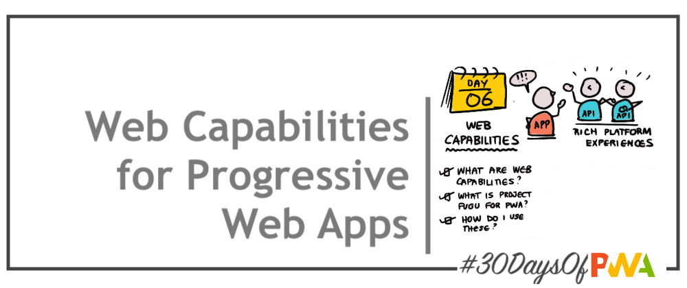

# 2.6 Web Capabilities

### WHAT WE'LL COVER TODAY

| | |
|:--|:--- |
| **Overview** | What are Web Capabilities?  |
| **Standards** | What is Project Fugu? Why does it matter? |
| **Adoption**| How ready are they for real-world adoption?|
| **Usage**| How do I get started using web capabilities?|
| **Exercise**| Explore [Fugu API Tracker](https://fugu-tracker.web.app/) |
| **Related**| Watch for [Week 2: Advanced Capabilities](../advanced-capabilities) - a deeper dive! |

 
