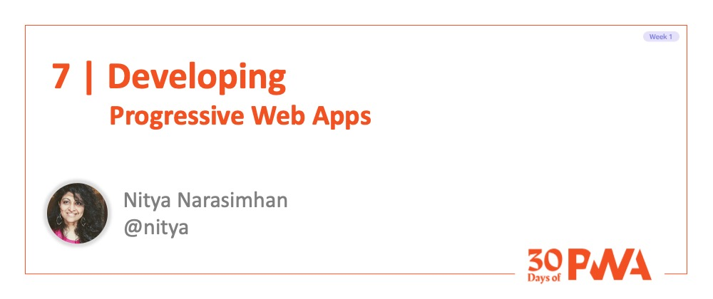
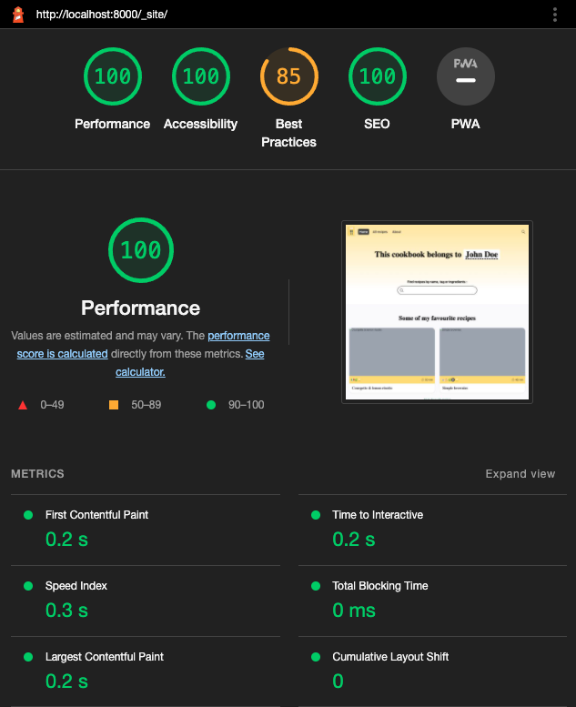
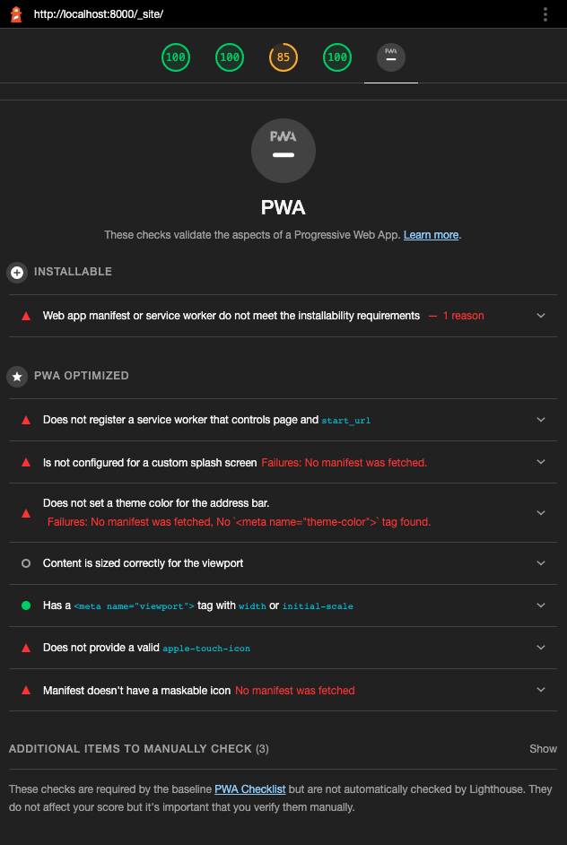
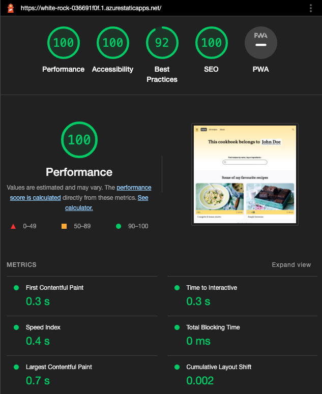
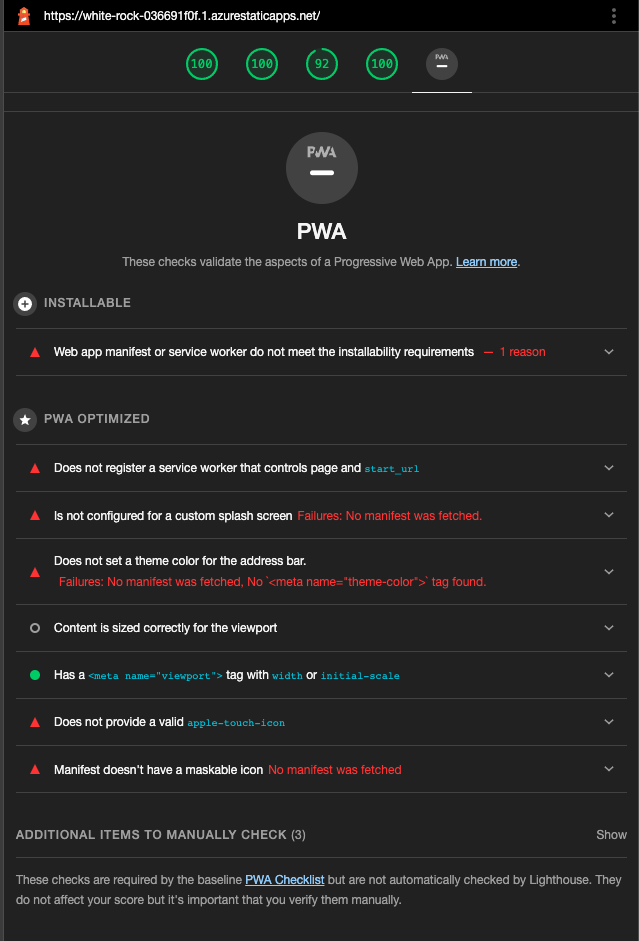
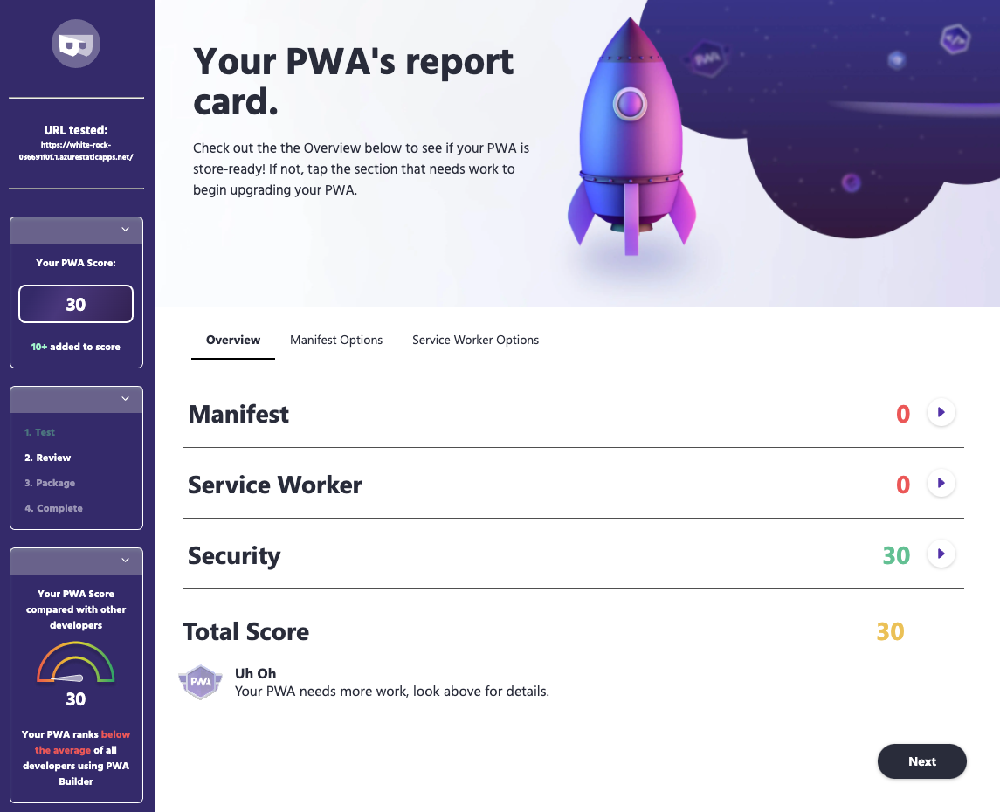
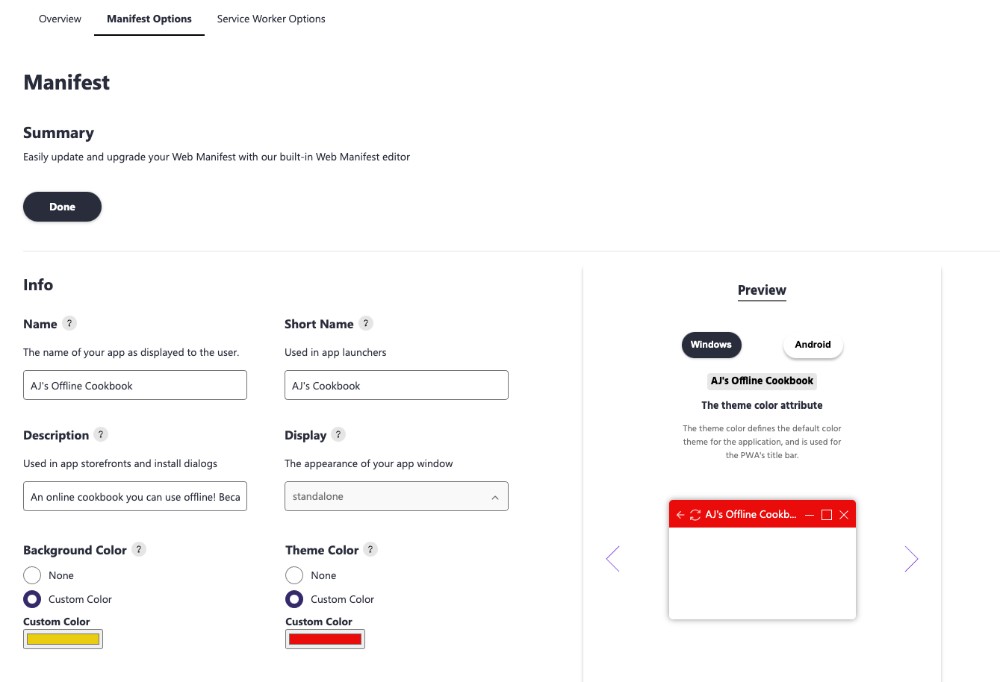
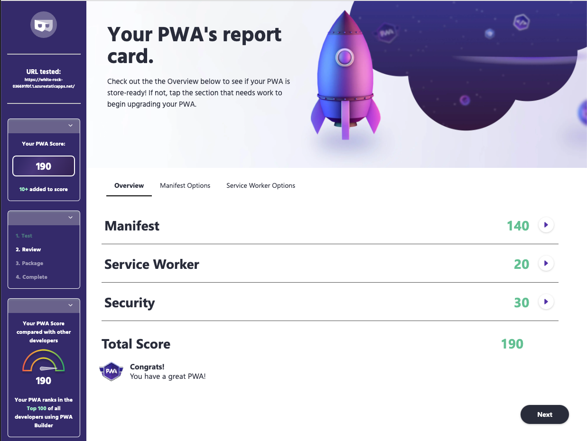
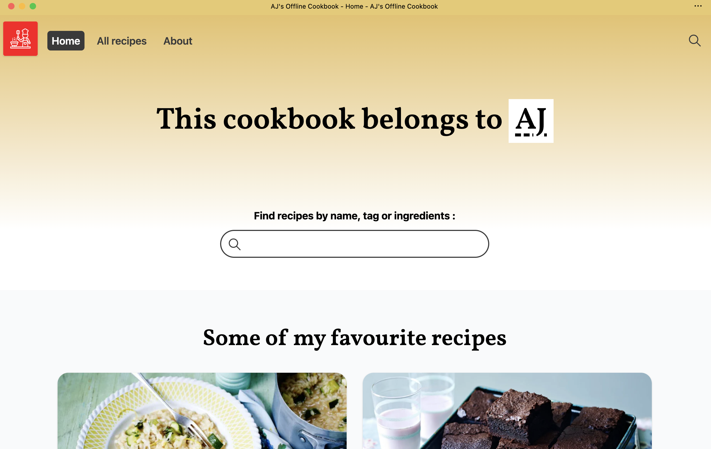

# 1.7 Developing Your PWA!


**Author: Nitya Narasimhan [@nitya](https://twitter.com/nitya)**

Welcome to **Day 7** of #30DaysOfPWA! Want to learn more about this project? Check out our [Kickoff](../kickoff.md) post to get more details on the content roadmap and contributors. Now, let's dive in



|  | What you will learn today |
|:--- |:---|
| _Development_ | Let's iteratively enhance an app for PWA readiness. |
| _Tooling_ | Let's talk DevTools and Audits! |
| _Deployment_ | Let's talk HTTP options. |
| _Celebration_ | Let's use that shiny new PWA! |
| _Exercise_ | Your turn. Transform your app into a PWA. |
| _Related_ | [Week 4: Platforms And Practices](../platforms-practices)|

---

## Let's Recap

Actually, let's take a minute to celebrate this moment. We made it to the end of week 1 and it was packed with a quick tour through Progressive Web App core concepts! Here's a visual guide to what we covered!


-- 

## What We'll Do Today

It's time to put all those learnings to work with a practical code exercise. Let's take an _existing_ application and iteratively enhance it for Progressive Web App functionality. Here's a roadmap:

 * Select an existing web app. Something that works!
 * Run app locally, inspect it for PWA baseline.
 * Make it safe. Deploy to an HTTPS endpoint.
 * Make it installable. Add that Web App Manifest.
 * Make it network-independent. Register a service worker.
 * Make it work offline. Try a cache-first policy.
 * Audit the PWA. Does it meet recommended practices?
 * Test the PWA. Does it install? Work offline?

---

## Select a Web App

If you follow me online, you might have noticed [my #Recipes4AJ](https://twitter.com/search?q=Recipes4AJ&src=typed_query&f=live) tweets. It's my way of leaving recipe trails for my 13yo should he find himself wanting to make them some day. And I wanted to convert these into a website with more images, tags and search capability. I found this great [Eleventy starter](https://github.com/maeligg/my-online-cookbook) for an [Online Cookbook](https://myonlinecookbook.netlify.app/) that was a perfect starting point.

But I realized that we might want to use recipes on camping trips (when we are off the grid) or when travelling (with limited data). Wouldn't it be great if this _online cookbook_ was **offline friendly?**> Let's make it happen with Progressive Web Apps!!

---

## Audit as Baseline

My first step was to create an instance of this template and make sure the current app worked on my local device following the basic `npm install; npm, run dev` guidance provided by the starter template.

Now, I could inspect it in my browser DevTools. Did you know [Microsoft Edge](https://docs.microsoft.com/en-us/microsoft-edge/progressive-web-apps-chromium/how-to/) and other browsers will allow PWA APIs to be accessed from _http://localhost_ debugging purposes only. We don't have a PWA yet but this will come in handy as we iterate.

My _Application_ tab shows there is nothing to see (no Manifest, no Service Workers) but I can run a Lighthouse audit to get a sense of Baseline performance and PWA readiness. Here is what I see.

| Desktop Perf | Desktop PWA |
|:---|:---|
| | |

---

## Secure it with HTTPS

The first step is to take my local app and deploy it to an HTTPS-enabled server so I can satisfy one core requirement of PWA: _make it secure!_.

I chose to deploy my app to [Azure Static Web Apps](https://docs.microsoft.com/en-us/azure/static-web-apps/). The process was quick and painless using the [Azure Static Web Apps Extension](https://marketplace.visualstudio.com/items?itemName=ms-azuretools.vscode-azurestaticwebapps) for VS Code. Simply follow the instructions on that page and you should have your app deployed to the Azure cloud in no time.

Some benefits with this are that the workflow asks you to authenticate with GitHub - and then automatically provisions your repo with GitHub Actions to make the deployment automatic on further commits.

We now have our app running in the cloud - a quick look at the Lighthouse audit shows that production deployment gives us a positive impact! Look at all those greens! But we still have to fix PWA issues.

| Performance | PWA  |
|:--- |:--- |
| ||

---

## What's Next for PWA?

We know we have to add a manifest, and configure the service worker. And we can do this manually by:
 * Creating a `manifest.json` file with relevant members and adding the relevant `<link>` in app HTML to show its location.
 * Creating a `sw.js` file for service worker implementation and populating it with the relevant lifecycle and functional event handlers for operation, and placing it in the right location of app structure to suit its scope.
 * Registering the service worker in the app code.

We can take advantage of helpful PWA tools that make this easier for us. 

For example, Eleventy (the static site generator powering my app) provides an [eleventy-plugin-pwa](https://www.npmjs.com/package/eleventy-plugin-pwa) that uses [Workbox](https://developers.google.com/web/tools/workbox) under the hood. We'll look at Workbox and other tools in our "Developer Tools" week. But for now, I wanted to be a little more hands-on so I could learn what was happening.

---

## The PWABuilder Assist

I started by using [PWABuilder](https://www.pwabuilder.com/) - a free auditing tool that evaluates your PWA, providing an audit report with actionable options to help you fix identified issues. Just enter your hosted app URL and click Start.

Here's what my audit report looks like. _Sad Trombone_ - we only scored a 30!



**The good news?** We checked off the _Security_ requirement with our HTTPS-enabled hosting. **More good news?** The _Manifest Options_ and _Service Worker Options_ tabs can help us generate the required _manifest.json_ and _sw.js_ files in a way that helps us understand what exactly we are adding, and why.

---

## Configure Manifest Options

Let's dive into the Manifest Options tab. Here is what that looks like as I start modifying things.



Some things that make this useful:
 * It pre-populates some fields, making it easier to do small edits.
 * It provides previews showing how manifest options impacts your app on desktop and mobile.
 * It has helpers to generate icons and screenshots!

You can generate and save the file to `manifest.json` for use in your PWA. You can also just generate this with any text editor - just make sure it is valid JSON. I saved the file and manually cleaned it up a little:
 * updating icon paths to reflect project structure
 * picking some [categories](https://developer.mozilla.org/en-US/docs/Web/Manifest/categories) for my app domain

The icons and manifest were saved into the `src/` and `src/assets` folder of my PWA and the _eleventy.js_ config file updated to show that these should be "passed through" to the build as is. Here is my manifest.json!

 ```json
 {
    "lang": "en-us",
    "name": "AJ's Offline Cookbook",
    "short_name": "AJ's Cookbook",
    "description": "An offline-friendly online cookbook perfect for that campfire trip off-the-grid",
    "start_url": "/",
    "background_color": "#ff001b",
    "theme_color": "#e8ca6c",
    "orientation": "any",
    "display": "standalone",
    "scope": "/",
    "dir": "ltr",
    "icons": [
        {
            "src": "/assets/logo192.png",
            "sizes": "192x192",
            "type": "image/png"
        },
        {
            "src": "/assets/logo512.png",
            "sizes": "512x512",
            "type": "image/png"
        }
    ],
    "categories": [
        "food",
        "health",
        "book",
        "entertainment"
    ],
    "screenshots": [],
    "shortcuts": []
}
 ```

Now, we need to update the app HTML to show where the manifest.json is located. In my 11ty project, I update this in the `src/layouts/base.njk`  template. The end result is a `<link>` in your app _index.html_ that looks like this.

 ```html
<link rel="manifest" href="/manifest.json">
 ```

If you inspect a site preview (localhost) or deployed (build) version now, you should see the Manifest section of the Applications tab reflect the properties you just added. Let's commit the changes and go to the next fix.


---

## Add Service Worker


As before, you can do this manually or jumpstart the process using PWABuilder. We need to do two things:
 * Create the service worker implementation.
 * Register the service worker to initialize on startup 

[This guide](https://docs.microsoft.com/en-us/microsoft-edge/progressive-web-apps-chromium/how-to/#step-3---add-a-service-worker) explains how we can do this with PWABuilder. Let's try it out.

I generated the service worker for the `cache-first` strategy. The download gave me two files. 

First the _pwabuilder-sw-register.js_ file which does the registration for you. The contents are below.

```js
// This is the "serving cached media" service worker

// Add this below content to your HTML page inside a <script type="module"></script> tag, or add the js file to your page at the very top to register service worker
// If you get an error about not being able to import, double check that you have type="module" on your <script /> tag

/*
 This code uses the pwa-update web component https://github.com/pwa-builder/pwa-update to register your service worker,
 tell the user when there is an update available and let the user know when your PWA is ready to use offline.
*/

import 'https://cdn.jsdelivr.net/npm/@pwabuilder/pwaupdate';

const el = document.createElement('pwa-update');
document.body.appendChild(el);
```

I saved this to `src/pwbuilder-sw-register.js` in my project repo, then added this to my `src/layouts/base.njk` file inside the `<head>` tag. 

Next, the _pwabuilder-sw.js_ implementation file.

```js
// This is the service worker with the Cache-first network

const CACHE = "pwabuilder-precache";

importScripts('https://storage.googleapis.com/workbox-cdn/releases/5.1.2/workbox-sw.js');

self.addEventListener("message", (event) => {
  if (event.data && event.data.type === "SKIP_WAITING") {
    self.skipWaiting();
  }
});

workbox.routing.registerRoute(
  new RegExp('/*'),
  new workbox.strategies.CacheFirst({
    cacheName: CACHE
  })
);
```

Lastly, I updated the `eleventy.js` configuration to have both files were passed through to build. Let's do a quick inspection in DevTools. Would you look at that? We have a service worker!!  Time to commit the changes and push them to deployed app.


---

## The Final Audit

Let's run that final PWA Builder Audit ..

| Where It Started | Where It's Going |
|:---|:---|
|  |  |

We did it!! We have an installable PWA with a viable offline experience, ready to start building up from!! You can see my demo site [running on Azure Static Web Apps here](https://white-rock-036691f0f.1.azurestaticapps.net/). Note that this has been minimally customized from the template. I'll do more with it after this week!

---

## The Final Proof

Yes the audit tells us we did good - but does it actually work the way we want it to? Time to test it for PWA capabilities!!

 * **Install it on desktop**. This is what mine looks like when installed on a MacBook Pro. Notice the standalone mode (no browser address bar or other hints that this is a web app)
 * **Explore it** - does it work and feel like a native app?
 * **Go offine!**. Disconnect from the network (e.g., put your laptop in Flight mode). Can you still launch and explore it?
 * **Does it feel native?** Use the search tool (Finder on Mac) - can you discover your PWA just like any other natively installed app?



We have just begun the journey but hopefully you now have a solid foundation for an app that you can play with and evolve as we walk through more advanced capabilities, developer tools, platforms and practices.

I had a wonderful time being your guide through week 1 of core concepts. Now if you'll excuse me, I have a long weekemd ahead. I think I might need to plan that camping trip, go off the grid - and cook up a storm!

Happy learning trails!

---

## Exercise


Your turn!! Take an existing app and try to refactor it to be a basic PWA.
 * Inspect it locally - check your Application and Lighthouse tabs
 * Audit it on PWABuilder - get baseline scores and guidance
 * Host it on HTTPS-enabled server - GitHub pages or Azure Static Web Apps can help
 * Add a Manifest - and link it.
 * Test it - can you install this to desktop?
 * Add a Service Worker - and register it.
 * Inspect it once in DevTools locally - then deploy it
 * Test it - go Offline. Does the app still work?
 * Audit it - how has the score changed?

---