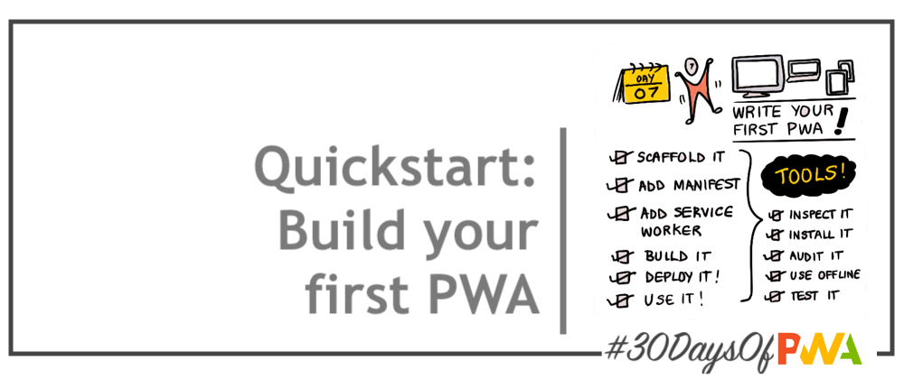

# 1.7 Quickstart

### WHAT WE'LL COVER TODAY

| Section | Description |
| ------- | ----------- |
| **Scaffold** | Build a basic Progressive Web App with vanillaJS |
| **Enhance** | Add Web App Manifest, Service Workers support. |
| **Build** | Deploy and validate PWA operation (installability, offline usage) |
| **Audit** | Evaluate PWA for compliance, optimization |
| **Celebrate** | You built, deployed, and audited, your first PWA! |
| **Exercise** | Explore [HNPWA: OSS Examples](https://hnpwa.com/) (archived). |
| **Related** | Watch for [Week 4: Platforms And Practices](../platforms-practices) - For Windows  |
