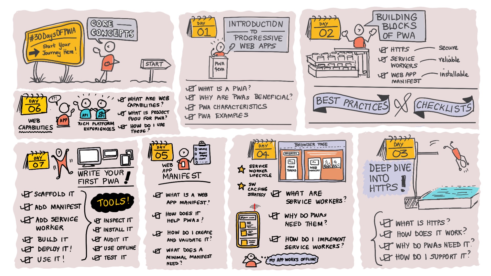

# Week 1. Core Concepts

Welcome to Week 1 of #30DaysOfPWA. Want to learn more about this project? Check out our [Kickoff](../kickoff.md) post to get more details on the content roadmap and contributors. Then read on for what we'll cover **this week**.

---

## WHAT WE'LL COVER IN WEEK 1

| Topic | Description|
|:--- |:--- |
| 1 - [Introducing PWA.](01.md) | What is a Progressive Web App (PWA)? How does it compare to other apps? What drives real-world PWA adoption? What characterizes a _good_ PWA?    **Exercise:** Install and explore a PWA.  **Watch For:** [Week 4: Platforms And Practices](../platforms-practices/) |
| 2 - [Deconstructing PWA.](02.md) | What are the building blocks of a PWA? What does each contribute to PWA experience? What are core (vs. optional) features for PWA development?    **Exercise:** Audit sample PWA - explore the reports.   **Watch For:** [Week 4: Platforms And Practices](../platforms-practices/)|
| 3 - [Make it Installable.](03.md) | What is a Web App Manifest? What does a minimal PWA manifest provide? How does do properties unlock advanced capabilities?    **Exercise:** Inspect _manifest.json_ - using DevTools.  **Watch For:** [Week 3: Developer Tools](../dev-tools/) |
| 4 - [Make it Reliable.](04.md) | What is a Service Worker? Why is HTTPS essential? Understand registration and lifecycle events. Learn key use cases and Web APIs for service workers.    **Exercise:** Inspect _sw.js_ - using DevTools.   **Watch For:** [Week 3: Developer Tools](../dev-tools/) |
| 5 - [Make it Work Offline.](05.md) | What is an offline PWA experience? How do PWAs detect network changes? Understand PWA caching strategies and storage options.    **Exercise:** Inspect  _Cache_, _Storage_ - using DevTools.  **Watch For:** [Week 3: Developer Tools](../dev-tools/)  |
| 6 - [Make it Capable.](06.md) | What is the web capabilities project? What are key web APIs, interfaces? What is Feature Detection? What are pros & cons for PWA development?     **Exercise:** Explore new capabilities in installed PWA.   **Watch For:** [Week 2: Advanced Capabilities](../advanced-capabilities/) |
| 7 - [Build it Iteratively.](07.md) | How do I build a PWA from scratch? How do I enhance an existing app for PWA readiness? What tools and practices can I rely on as a developer?      **Exercise:** Audit & fix existing app. Get minimal PWA.   **Watch For:** [Week 3: Developer Tools](../dev-tools/) |

