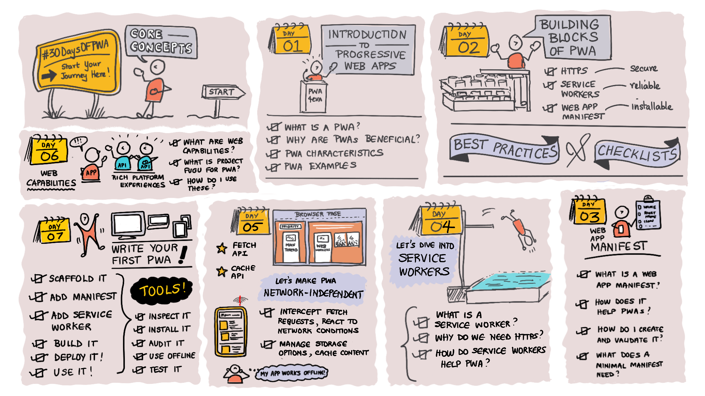

# 2. Core Concepts

### WHAT WE'LL COVER IN WEEK 1

### 2.1 | &nbsp; [Introduction to PWA](02.md) 

* What is a Progressive Web App? 
* Why are the benefits and challenges of PWA?
* What are the characteristics of PWA?
* What are real-world examples of PWA adoption?
* Explore: [PWA Stats](https://www.pwastats.com/) 
* Related: [Week 4: Platforms And Practices](../platforms-practices)

### 2.2 | &nbsp; [Building Blocks](03.md) 

* What are the core components of a PWA?
* What are the minimal requirements for a good PWA?
* What are good practices for PWA development?
* How can I validate my PWA for compliance?
* Explore: [PWA Checklist](https://web.dev/pwa-checklist/)
* Related: [Week 3: Developer Tools](../dev-tools)

### 2.3 | &nbsp; [HTTPS](04.md) 

* What is HTTPS? 
* How does it work? 
* Why is it necessary for Progressive Web Apps? 
* How can I integrate HTTPS support into my PWA?
* Explore: [Let's Encrypt](https://letsencrypt.org/getting-started/)
* Related: [Week 4: Platforms And Practices](../platforms-practices)

### 2.4 | &nbsp; [Service Workers](06.md) 
* What are service workers? 
* Why are do PWAs need them? 
* How do I implement service workers in my PWA?
* Review: Service Worker Lifecycle. 
* Review: Caching Strategies.
* Explore: [Service Workers: Primer](https://developers.google.com/web/fundamentals/primers/service-workers)
* Related: [Week 3: Developer Tools](../dev-tools) | Workbox

### 2.5 | &nbsp; [Web App Manifest](05.md) 
* What is a Web App Manifest? 
* How does it help PWAs? 
* What does a minimal App Manifest need? 
* How can I create and validate it?
* Explore: [Web App Manifest: Keys](https://developer.mozilla.org/en-US/docs/Web/Manifest#members)
* Related: [Week 3: Developer Tools](../dev-tools) | PWABuilder

### 2.6 | &nbsp; [Web Capabilities](07.md) 
* What are Web Capabilities? 
* What is Project Fugu? 
* How ready are they for real-world adoption?
* How do I get started using web capabilities?
* Explore: [Fugu API Tracker](https://fugu-tracker.web.app/)
* Related: [Week 2: Advanced Capabilities](../advanced-capabilities)

### 2.7 | &nbsp; [Quickstart ](08.md) 
* `Scaffold`: a basic vanillaJS PWA.
* `Enhance`: add manifest, service workers. 
* `Build`: deploy and validate PWA operation. 
* `Audit`: evaluate PWA for compliance, optimizations.
* `Celebrate`: you built your first PWA!!
* Explore: [HNPWA: OSS Examples](https://hnpwa.com/) | Archived 
* Related: [Week 4: Platforms And Practices](../platforms-practices) | For Windows 
