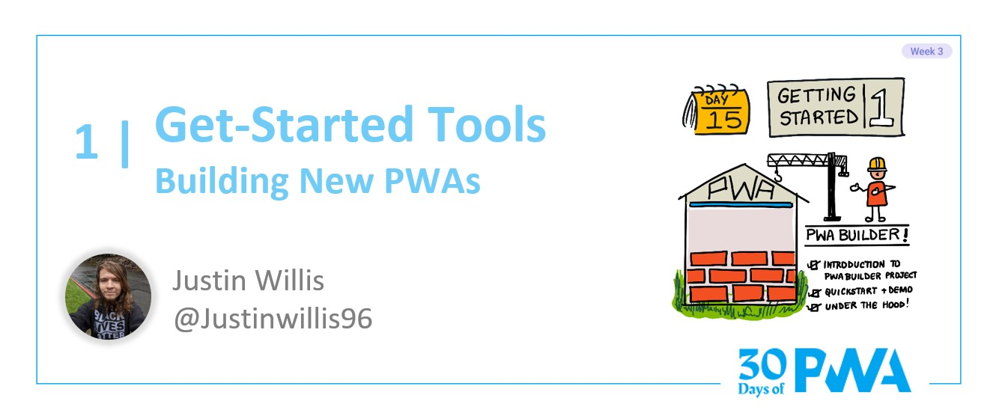

# 3.1: Get-started tools: Building new PWAs

## *Coming soon!*

**Author: Justin Willis [@justinwillis96](https://twitter.com/Justinwillis96)**

Welcome to **Week 3 Day 1** of #30DaysOfPWA! Want to learn more about this project? Check out our [Kickoff](../kickoff.md) post to get more details on the content roadmap and contributors. Now, let's dive in!

### WHAT WE'LL COVER TODAY

| Section | Description |
| ------- | ----------- |
| **Introduction** | Introducing new tools from the PWABuilder project, PWA Studio and the PWA Starter! |
| **Getting started + demo** |Let's use these two new tools to create a new PWA with just a few button clicks.  |
| **Under the hood** | Deep dive into some of the tools used in PWA Studio and Starter|

---

