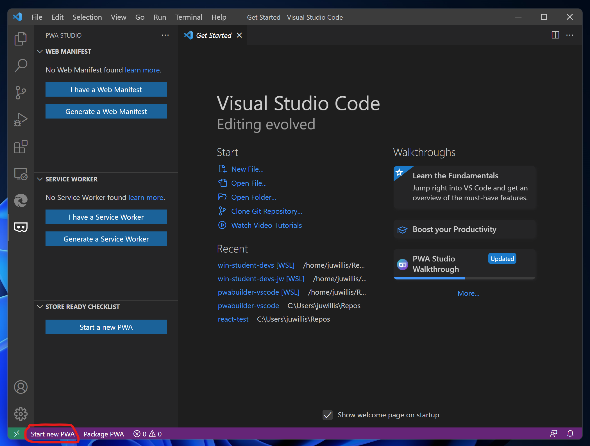
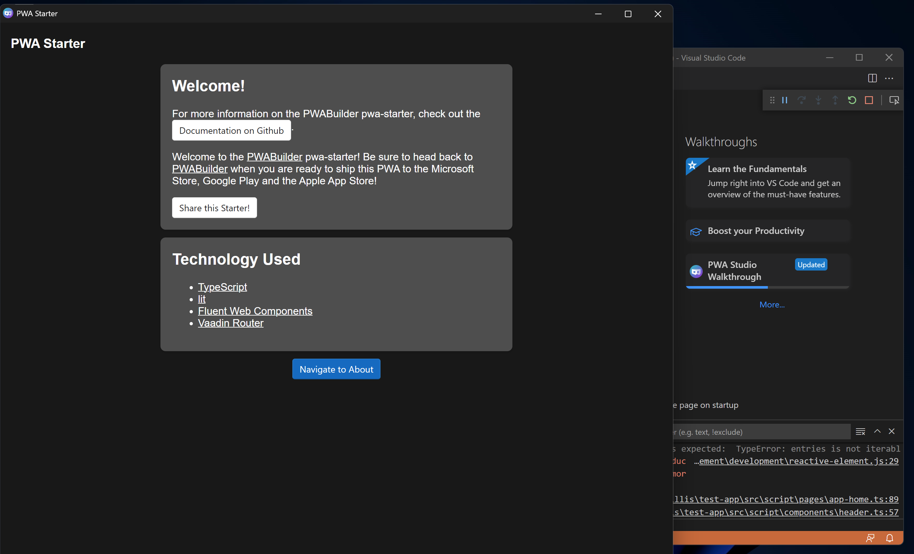
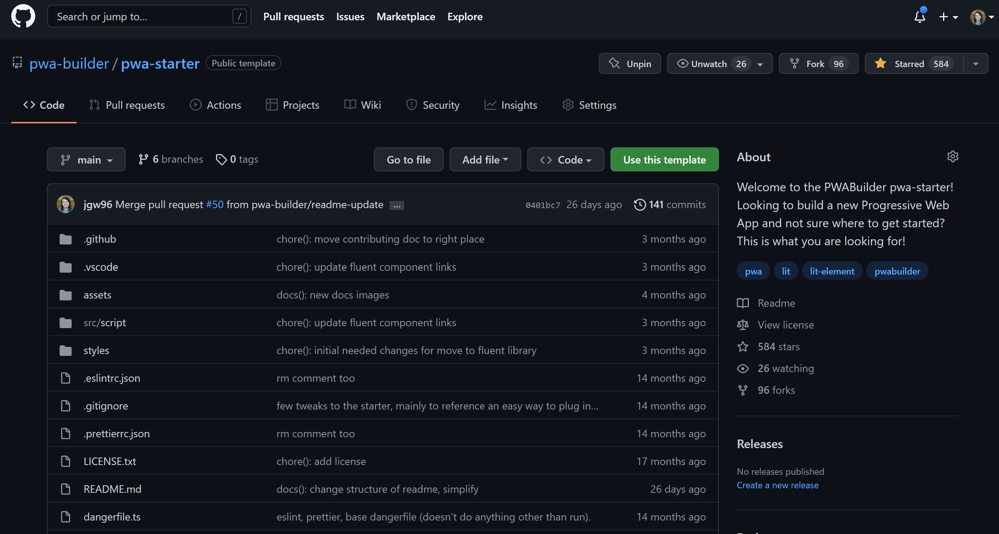

# 3.1: Get-started tools: Building new PWAs

**Author: Justin Willis (Software Engineer on the PWABuilder team) [@justinwillis96](https://twitter.com/Justinwillis96)**

Welcome to **Week 3 Day 1** of #30DaysOfPWA! Want to learn more about this project? Check out our [Kickoff](../kickoff.md) post to get more details on the content roadmap and contributors. Now, let's dive in!

### WHAT WE'LL COVER TODAY

| Section | Description |
| ------- | ----------- |
| **Introduction** | Introducing new tools from the PWABuilder project, PWA Studio and the PWA Starter! |
| **Getting started + demo** |Let's use these two new tools to create a new PWA with just a few button clicks.  |
| **Under the hood** | Deep dive into some of the tools used in PWA Studio and Starter|

---

## Introduction

Hello! For today’s post on the [30 Days of PWA](https://aka.ms/learn-pwa/30Days-blog) series, we will be getting started with some new tooling from the [PWABuilder Project](https://aka.ms/learn-PWA/30Days-3.1/github.com/pwa-builder/PWABuilder)! The PWABuilder team has been working on tools for developers at any step of the building process, from starting a brand new PWA to packaging your existing PWA for the app stores. In this article, we will focus on [PWA Studio](https://aka.ms/learn-PWA/30Days-3.1/pwa-studio) and [the PWA Starter](https://aka.ms/learn-PWA/30Days-3.1/github.com/pwa-builder/pwa-starter) to help you get started with building new PWAs.

## Getting Started + Demo

Let's start building a new Progressive Web App using PWA Studio! PWA Studio's `Start a new App` feature creates your app using [the PWA Starter](https://github.com/pwa-builder/pwa-starter).

1. First, if you have not installed PWA Studio yet, install it from the [VSCode Marketplace](https://aka.ms/learn-PWA/30Days-3.1/pwa-studio).

2. Now that you have PWA Studio installed, tap the PWABuilder Icon on the left side of VSCode

3. You should now see a `Start new PWA` button in the bottom bar of VSCode. Tap this button to start generating a PWA.

4. Enter your respository name when propmted, this is normally the name of your app.

5. Your PWA will be generated using the Starter and all of your dependencies will be installed!

6. At this point, you are now ready to start coding! Tap `F5` or tap `Run` and `Start Debugging` at the top of VSCode. Your new PWA will now open in dev mode, with auto-reload, in its own App window. Enabling you to build your PWA in an app-first manner.

## Under the hood

### PWA Starter

[The PWA Starter](https://aka.ms/learn-PWA/30Days-3.1/github.com/pwa-builder/pwa-starter) is a code template, similar to what tools like create-react-app or the Angular CLI can generate.

With the PWA Starter, you get an app that:
- Has no build system to set up and no boilerplate code to add. Everything is included out of the box.
- Has a Service Worker system using [Workbox](https://aka.ms/learn-PWA/30Days-3.1/developers.google.com/web/tools/workbox)
- Scores close to 100 on Lighthouse, out of the box
- Using the [Fluent Web Components](https://aka.ms/learn-PWA/30Days-3.1/docs.microsoft.com/en-us/fluent-ui/web-components), you can build native looking PWAs on Windows
- Has everything needed to be installable in the browser
- Is ready to be packaged for the app stores using [PWABuilder](https://aka.ms/learn-PWA/30Days-3.1/www.pwabuilder.com)

### PWA Studio

PWA Studio is an extension that brings everything you need to build PWAs to [VSCode](https://aka.ms/learn-PWA/30Days-3.1/code.visualstudio.com). When you [install PWA Studio](https://aka.ms/learn-PWA/30Days-3.1/pwa-studio), you can:
-	Start building a new PWA in seconds using the PWABuilder pwa-starter.
-	Learn how to publish your app to the Web with Azure Static Web Apps
-	Add a Web Manifest and Service Worker to your existing web app
-	Package your PWA for the Microsoft Store, Google Play, and Apple App Store
-	Generate Icons for your PWA
-	Validate that your PWA is installable in the browser and is ready to publish to the app stores
-	Learn more about using the Web App Manifest to enable new features in your PWA
-	Use the snippets to implement native features that can improve the User Experience of your PWA.

And that was how we use the new PWA Studio VSCode Extension and the PWA Starter to start building a PWA with just a few button clicks!

In our [next post](02.md), we'll dive into converting our existing website to a PWA!

## Resources

- [PWABuilder Project](https://aka.ms/learn-PWA/30Days-3.1/github.com/pwa-builder/PWABuilder)
- [Install PWA Studio](https://aka.ms/learn-PWA/30Days-3.1/pwa-studio)
- [The PWA Starter](https://aka.ms/learn-PWA/30Days-3.1/github.com/pwa-builder/pwa-starter)
- [VSCode](https://aka.ms/learn-PWA/30Days-3.1/code.visualstudio.com)
- [Fluent Web Components](https://aka.ms/learn-PWA/30Days-3.1/docs.microsoft.com/en-us/fluent-ui/web-components)
- [Workbox](https://aka.ms/learn-PWA/30Days-3.1/developers.google.com/web/tools/workbox)

