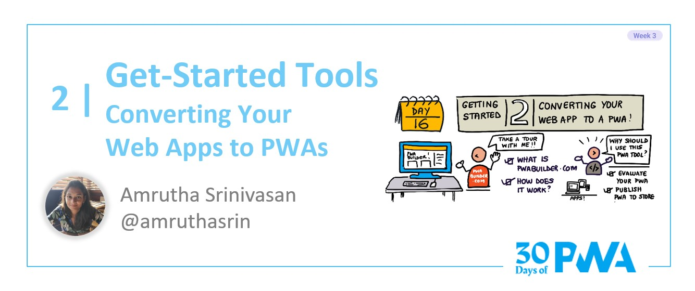

# 3.2: Get-started Tools: Converting your web app to a PWA!

**Author: Amrutha Srinivasan [@amrutha](https://twitter.com/amruthasrin)**

Welcome to **week 3 day 2** of the [30 Days of PWA](https://aka.ms/learn-pwa/30Days-blog) series! Yesterday we talked about the great tools that are out there to build a top quality PWA from scratch. Today we will talk about PWABuilder.com, another offering under the PWABuilder project that allows you to easily evaluate and publish your PWA to different app stores. 

## What is PWABuilder?
PWABuilder is a project designed to make building and packaging good quality PWAs a smooth experience for developers. [PWABuilder.com](https://aka.ms/learn-PWA/30Days-3.2/www.pwabuilder.com) is a one-stop shop to evaluate and publish your PWA to app stores in a matter of minutes. It strives to achieve the following: 
*	Create and publish your PWA package to multiple app stores such as the Microsoft store. It eliminates the need to understand the platform-specific code or underlying platforms in order to submit to these stores.
*	Evaluate the quality of your PWA by analyzing the manifest and service worker, and give you recommendations of what can be improved to make your PWA even better.
*	Edit your manifest and add more advanced features to your service worker. This means that even if you have a non-PWA website, you can easily convert it into a PWA just by choosing the right “ingredients” from the manifest and service worker options that we provide. 

Fun fact, PWABuilder.com is itself a PWA! It's also completely [open source](https://aka.ms/learn-PWA/30Days-3.2/github.com/pwa-builder/PWABuilder), along with all the other great tools that are part of the PWABuilder suite.

## How it works
Let’s now deep dive into what PWABuilder can do for you. The PWA we are going to use in this walkthrough is [Webboard](https://aka.ms/learn-PWA/30Days-3.2/webboard.app), an open source Whiteboarding app.

First, we enter the URL on the homepage of PWABuilder.

You will be taken to this report card page that tells you your score for each component of the PWA. As you can see the scoring is divided into three sections : Manifest, Service Worker and Security. In each of these sections there are a number of items that your PWA is evaluated based on. This is all to ensure that your PWA meets all the criteria and quality standards so that it is usable, secure and easily discoverable in any of the app stores. 

Under the tab “Manifest Options” you can add more details to your manifest. Here you can generate icons of all the sizes needed by the various app stores, as well as screenshots that will appear on the product detail pages (PDP) when a user looks up your app in the store. To learn more about the web app manifest and why it is important, refer to one of our [previous articles](https://microsoft.github.io/win-student-devs/#/30DaysOfPWA/core-concepts/03).

If you don’t have a service worker or would like to improve on your existing one based on your score, go to the “Service Worker Options” Tab. Here there is code provided for service workers that offer advanced functionality such as an offline experience and caching media files. To understand more about service workers, refer to [this article](https://microsoft.github.io/win-student-devs/#/30DaysOfPWA/core-concepts/04).

When you’re happy with all the changes you have made, you are now ready to publish! PWABuilder.com generates packages for your PWA for many app stores such as the Microsoft Store, iOS App store and the Google Play Store.

There you have it, folks!  That’s how quickly you can convert your website to a PWA, or add some more of the rich platform capabilities to your existing PWA that can then be published to various app stores!

## Why should you use PWABuilder?
Simply having a web app manifest and a service worker does not necessarily make a good PWA. Tools like [PWABuilder.com](https://aka.ms/learn-PWA/30Days-3.2/www.pwabuilder.com), [pwa-starter](https://aka.ms/learn-PWA/30Days-3.2/github.com/pwa-builder/pwa-starter) and the [PWA Studio](https://aka.ms/learn-PWA/30Days-3.2/pwa-studio) VS Code extension, can help your app reach its potential by harnessing all the powers of PWA technology. Whether you want to start building from scratch, or just need some additional features sprinkled on top to make your PWA shine, these tools can help you get there.
Stay tuned for more!

## Exercise
Try PWABuilder.com today with a website/PWA that you are working on. Run the PWA through PWABuilder, add more capabilities to your service worker and make it publish-ready by filling up all the fields in the manifest. Try generating a test package on the Windows platform in the publish page and sideload it. When you feel your PWA is ready, try publishing it to one of the app stores.

## Resources

* [PWABuilder's GitHub Repository - Raise an issue or contribute to make PWABuiilder even better!](https://aka.ms/learn-PWA/30Days-3.2/github.com/pwa-builder/PWABuilder)
* [Join the PWABuilder Discord Server!](https://aka.ms/learn-PWA/30Days-3.2/discord.gg/f3my6ruZ)
* [PWA Studio - our VS Code extension](https://aka.ms/learn-PWA/30Days-3.2/pwa-studio)
* [PWA Starter - a template to start building a PWA from scratch](https://aka.ms/learn-PWA/30Days-3.2/github.com/pwa-builder/pwa-starter)

