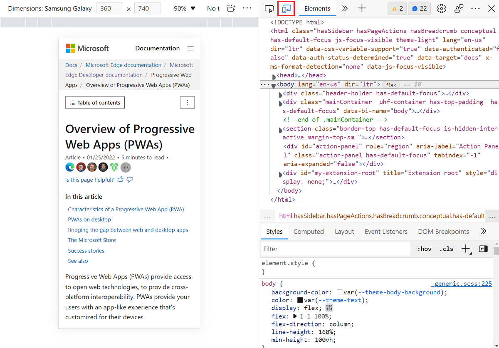
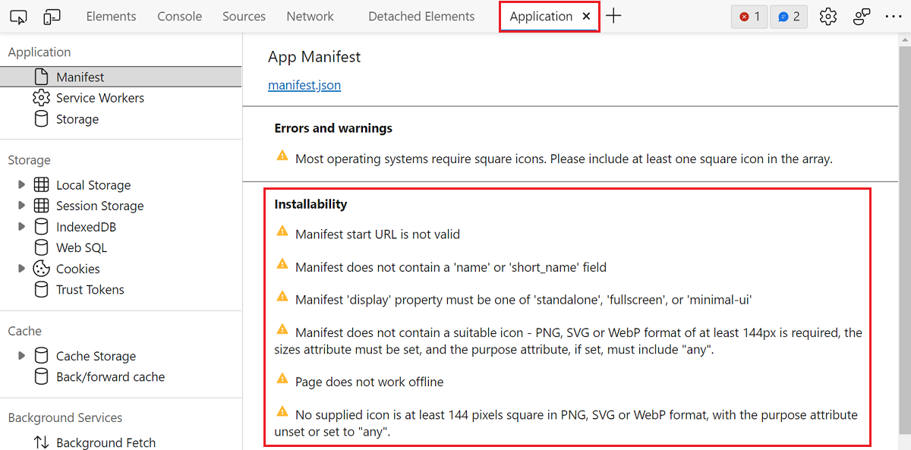
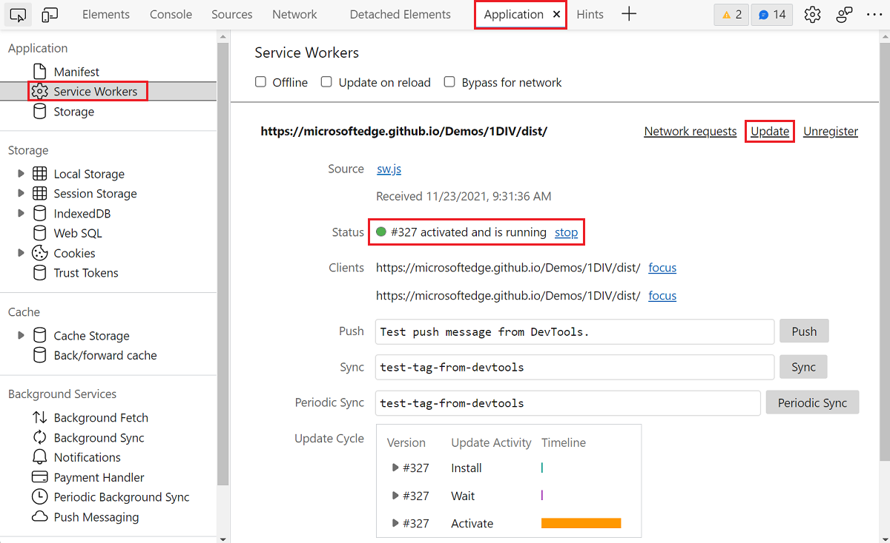
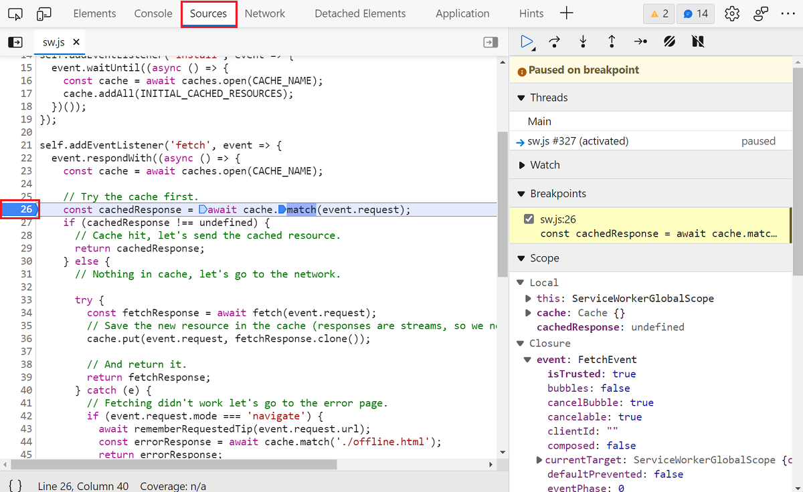
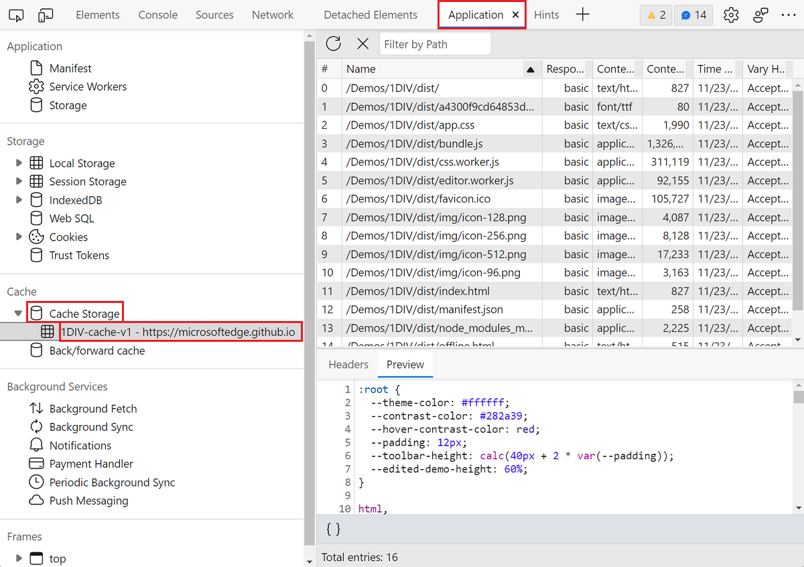
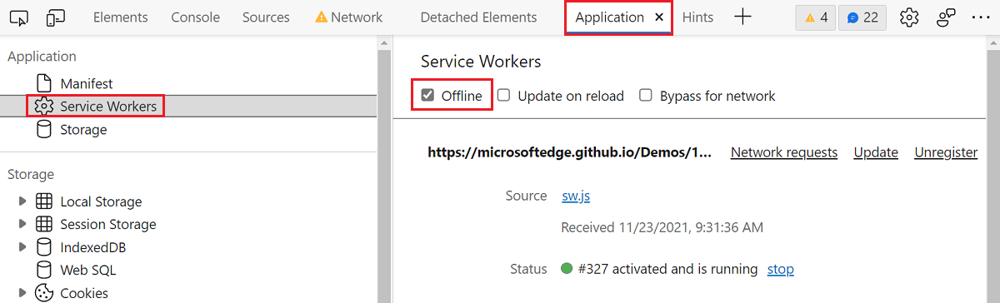

# 3.3: Debugging tools #1

As you start creating your PWA and making use of service workers, storage, and other features, you may start running into bugs. Thankfully, web browsers come with powerful built-in tools you can use to inspect your application's code and debug it.

On top accessing HTML and CSS, editing it live in the browser, finding JavaScript errors or debugging them, browser developer tools (or just DevTools) also come with tools specifically made for PWAs.

## Overview

Today, we'll cover some of the most useful tools when working on Progressive Web Apps code. In this article we'll take a look at how to simulate different devices, troubleshoot installability and caching issues, as well as test offline scenarios.

Although we'll be using Microsoft Edge to demo the tools, other browsers have very similar tools.

## Testing on other devices

Nothing replaces testing on real devices. So once your app is getting ready and runs on a web server, it's great if you can check it on other computers and mobile devices.

It's not always possible though and DevTools comes with a very useful **Device Emulation** tool you can use to check what your app would look and feel like on other devices.

To start **Device Emulation**:

* Open DevTools by pressing `F12` or right-clicking the page and selecting `Inspect`.
* Click the **Toggle device emulation** button in the top-left corner of DevTools.

Choose the devices you want to emulate in the **Dimensions** drop-down menu. When you do, the viewport resizes to match the emulated device's screen, and your cursor acts like a touch input if the emulated device supports it. If you want, you can also click **Edit** in the menu and create your own devices.

Learn more about the [**Device Emulation** tool here](https://aka.ms/learn-PWA/device-emulation).

## Making sure the app is installable

During week 1, we saw the 3 building blocks of a PWA: using [HTTPS](../core-concepts/04.md), a [Service Worker](../core-concepts/05.md), and a [Web App Manifest](../core-concepts/06.md).

Web browsers will check that all 3 are available before making a web app installable. But they also run a few more checks on the content of the worker and manifest before letting a user install the app.

There may be times when the web browser thinks your app isn't ready to be installed, and it is not always straightforward to know why. To debug this problem, you can review the installability information in the **Application** tool.

To review this information:

* Open DevTools.
* Open the **Application** tool by clicking the `+` sign in the toolbar and finding the tool name in the list.
* Once in the tool, go to the **Manifest** tab in the left sidebar.

You may see a number of warnings that prevent your application from being installable.

Review and address these warnings, and reload the page. Once the warnings are gone, the web browser should display the app installation button in the address bar, which in Microsoft Edge, looks like this:

Learn more about using the [**Application** tool to review your Web App Manifest](https://aka.ms/learn-PWA/debug-PWA).

## Reloading manifest changes

While we're on the topic of fixing manifest issues, there will be times when you make manifest changes and want to test the app again.

Because the manifest file is read upon installation, the only way for the OS to know about the change is by installing the app again. So, in order to reload your manifest changes:

1. Un-install the app:
   * On a mobile device, PWAs can be un-installed like any other apps.
   * On desktop computers, using Microsoft Edge, or Chrome, go to the special `about:apps` page to un-install any app.
1. Go to the app again with your web browser, and make sure the new manifest is loaded.
   * You may need to force a hard-reload: open DevTools, then right-click on the page refresh icon in the browser toolbar and choose **Empty cache and hard refresh**.
1. Install the app again.

## Checking if your service worker is running

Once registered, a service worker has its own lifecycle, independent from the one of the web page that registered it. It can get started and stopped, as well as updated by the browser outside of your control. As a developer, it's important to know what state a service worker is currently in, and here DevTools can help again.

To find information about your PWA service worker:

* Open DevTools.
* Open the **Application** tool by clicking the `+` sign in the toolbar and finding the tool name in the list.
* Once in the tool, go to the **Service Workers** tab in the left sidebar.

From there a few different pieces of information are provided including the name of the service worker file (which you can click to open it) and its status. This tool makes it easy to see whether the worker is running but can also be used to stop the service worker and, more usefully,  update it.
If you made a change to the code of your service worker and want to test it right away, click the **Update** link to do it.

If you want to debug the JavaScript code in your worker, click its **Source** file name in the tool. This will automatically open the file in the **Sources** tool. You can always go back to the **Application** tool by using the tab bar at the top, but the **Sources** tool is very handy for when you need to investigate JavaScript problems that require checking what the code does step by step.

* Click in the line number gutter, next to where you suspect the bug might be. This will add a breakpoint on that line. The next time this line runs, the JavaScript debugger will pause there.
* Now use the app so that this line of code is execute. For example, if you added the breakpoint in your `fetch` handler, use the app so that a network request is made.
* The debugger now pauses on that line, making it possible to review the values of all the accessible variables, as well as continue the execution step by step.

Learn more about using the [**Sources** tool to debug JavaScript code](https://aka.ms/learn-PWA/sources-tool).

## Troubleshooting cache issues

A lot of your service worker code likely revolves around accessing the cache, either reading from it or writing to it. There will come a time when you need to debug cache issues. Here the **Sources** tool will be useful to debug your code step by step, but it's also very important to be able to see what's in the cache already.

DevTools comes with a way to visualize the cache for your PWA.

* Open DevTools.
* Open the **Application** tool by clicking the `+` sign in the toolbar and finding the tool name in the list.
* Once in the tool, expand the **Cache Storage** section in the left sidebar.
* Find your cache (it will be displayed in the expanded section with the name you chose in your service worker code) and click on it.

This tool will display all of the cached resources in a table. The table is very handy, it lets you search through the list, sort by various columns, preview the content of a resource, etc.

One of the most useful thing you can do in this tool is delete entries from the cache. This way you can make changes to your caching code, and test again, as if the resource had not been cached before. To delete a cached resource:

* Select it by clicking on it in the **Cache Storage** table.
* Click the **Delete Selected** button in the table toolbar.

Learn more about using the [**Cache Storage** tool](https://aka.ms/learn-PWA/cache-storage).

## Testing offline support

Making your PWA work even when there is no network connection is key to a true app-like user experience, but it's almost certain that when coding, you do have access to the network. So how do you test the offline scenario?

Again, DevTools comes to the rescue!

* Open DevTools.
* Open the **Application** tool by clicking the `+` sign in the toolbar and finding the tool name in the list.
* Once in the tool, go to the **Service Workers** tab in the left sidebar.
* Select the **Offline** checkbox at the top of the tool.

Once done, the browser will act as if you're not connected to the internet and you can use the app to see how it behaves. For example, you could try to refresh (by pressing `F5` or `ctrl+R`/`cmd+R`) and see if the app loads at all.

## Summary

As we've seen today, DevTools is a true Swiss-army knife when it comes to debugging PWA issues. There's a tool for almost any scenario you might be having problems with. You can emulate mobile devices, check manifest errors, verify the state of your service worker and debug it, look at what's been cached, and even test your app's offline support!

No one writes perfect code in one go, and with developer tools like these browser DevTools, you don't have to. You can feel comfortable experimenting and trying things out, and as soon as something seems wrong, just hit `F12` to get debugging information about the problem.
