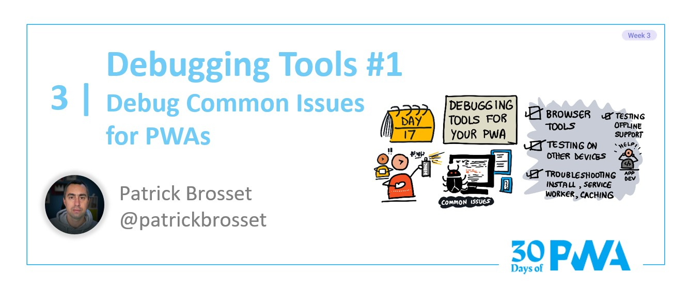

# 3.3: Debugging tools #1

## *Coming soon!*

**Author: Patrick Brosset [@patrickbrosset](https://twitter.com/patrickbrosset)**

Welcome to **Week 3 Day 3** of #30DaysOfPWA! Want to learn more about this project? Check out our [Kickoff](../kickoff.md) post to get more details on the content roadmap and contributors. Now, let's dive in!

### WHAT WE'LL COVER TODAY

| Section | Description |
| ------- | ----------- |
| **Testing on other devices** | How to simulate your app being rendered on a mobile device during development? |
| **Troubleshooting installation issues** | How to detect issues preventing your app from installing and resolve them? |
| **Reloading manifest changes** | How to make sure your manifest changes are reloaded? |
| **Troubleshooting server worker issues** | How to check if your service worker is running, force update it, and debug it? |
| **Troubleshooting cache issues** | How to view and manage your cached resources? |
| **Testing offline support** | How to simulate offline mode? |
