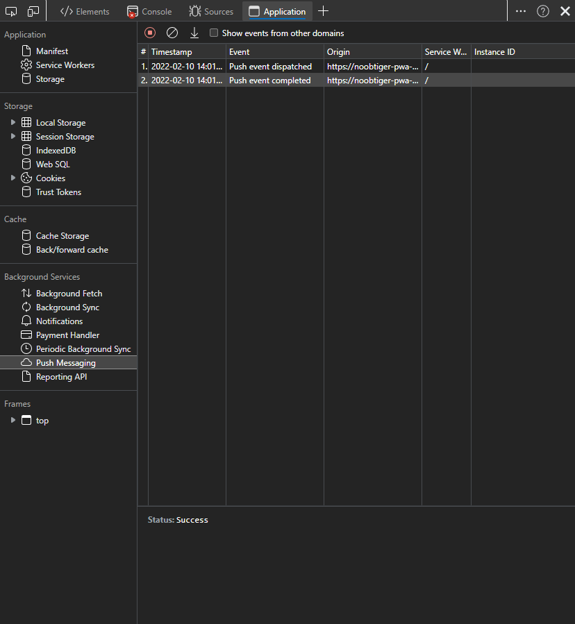

# 3.4: Debugging tools #2

In the past couple of weeks, you learnt that PWA are installable and can run offline and also in background if needed. Yesterday, you learned how to debug offline capabilities and test responsive design of the PWA using DevTools. Today lets go through more tools available in DevTools for debugging advanced features of PWAs such as background downloads, push notifications etc.
### WHAT WE'LL COVER TODAY

| Section | Description |
| ------- | ----------- |
| **PWA permissions** | How to check PWA permissions? |
| **Manage Notifications** | How to emulate push notifications? |
| **Background Sync/Fetch** | How to view background sync/fetch events? |
| **Storage** | What are available storage options and how to view them? |

All the screenshots in today's article are taken from this [repo](https://github.com/noobtiger/pwa-devtools-debug-2), you can clone it locally or view in cloud using Github Codespaces.

## MANAGING PWA PERMISSIONS
PWAs can make full use of modern web features such as push notification, location, storage etc. However for PWA to use these features, they have to be granted permission. For example, to send notifications to the user, PWA has to request permission via JavaScript in PWA. Browsers shows a prompt requesting users for the permission like below.

To validate and manage all the permissions for PWA, **App permissions** list can be accessed via settings menu in installed PWA or through site information icon in the url bar of the browser. This lists all the permissions available to the PWA, permissions can be changed here or reset to default values.

## PUSH NOTIFICATIONS
PWA can improve engagement by sending push notifications from the server. Subscribe to push events from server via [Push API](https://developer.mozilla.org/en-US/docs/Web/API/Push_API) in service worker and notifications can be triggered using [Notifications API](https://developer.mozilla.org/en-US/docs/Web/API/Notifications_API). To see list of all the notifications that are triggered by the PWA, follow below steps:
  - Open DevTools.
  - Navigate to Application panel.
  - Open Notifications in background services section.
  - Click on Start recording events button.

This will start recording all the notifications triggered by the PWA in service worker for the next 3 days even if DevTools is closed. To see the notification details, select the notification in the detail.

PWA can subscribe to push messages from server in service worker via Push API. Once subscribed, PWA will start receiving push events even if application is closed. To see all the push messages in DevTools, follow similar steps as above, the table can be accessed via Push Messaging section in background services in Application panel.

You can also emulate sending push messages in DevTools via Service workers section in Application panel as described in steps below. 
  - Open DevTools.
  - Navigate to Application panel.
  - Open Service workers in Application section.
  - Enter value in push text input.
  - Click on Push button to send mock push message.

Submitting mock push messages this way will trigger all push event handlers and also log the messages in push messaging table.

## BACKGROUND SYNC/FETCH
In the previous section, you learned about Push API that allows PWA to receive messages from server. PWAs also provide [Background Sync API](https://developer.mozilla.org/en-US/docs/Web/API/Background_Synchronization_API), [Background Fetch API](https://developer.mozilla.org/en-US/docs/Web/API/Background_Fetch_API) and [Periodic Background Sync API](https://developer.mozilla.org/en-US/docs/Web/API/Web_Periodic_Background_Synchronization_API) to send network requests and messages to server. The advantage of using background APIs over fetch or xhr is that network requests made through these APIs can be deferred until PWA has active network connectivity.

Similar to push messages and notifications tables as described in previous section, Background API events can be viewed in Background services sub-section in Application panel. Also Background sync and periodic background sync events can be mocked via service workers section in application panel. Currently it is not possible in chromium DevTools to mock Background fetch events.

## STORAGE

