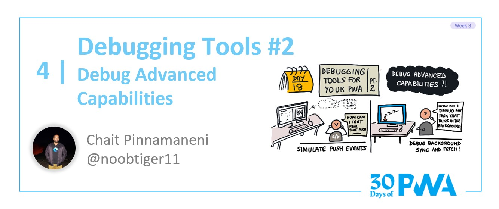

# 3.4: Debugging tools #2

## *Coming soon!*

**Author: Chait Pinnamaneni [@noobtiger11](https://twitter.com/noobtiger11)**

Welcome to **Week 3 Day 4** of #30DaysOfPWA! Want to learn more about this project? Check out our [Kickoff](../kickoff.md) post to get more details on the content roadmap and contributors. Now, let's dive in!

### WHAT WE'LL COVER TODAY

| Section | Description |
| ------- | ----------- |
| **Permissions** | How to check and reset user permissions? |
| **Manage notifications** | How to emulate push notifications? |
| **Background sync and fetch** | How to view background sync and fetch events? |
| **IndexedDB storage** | How to view and manage data stored in IndexedDB? |
