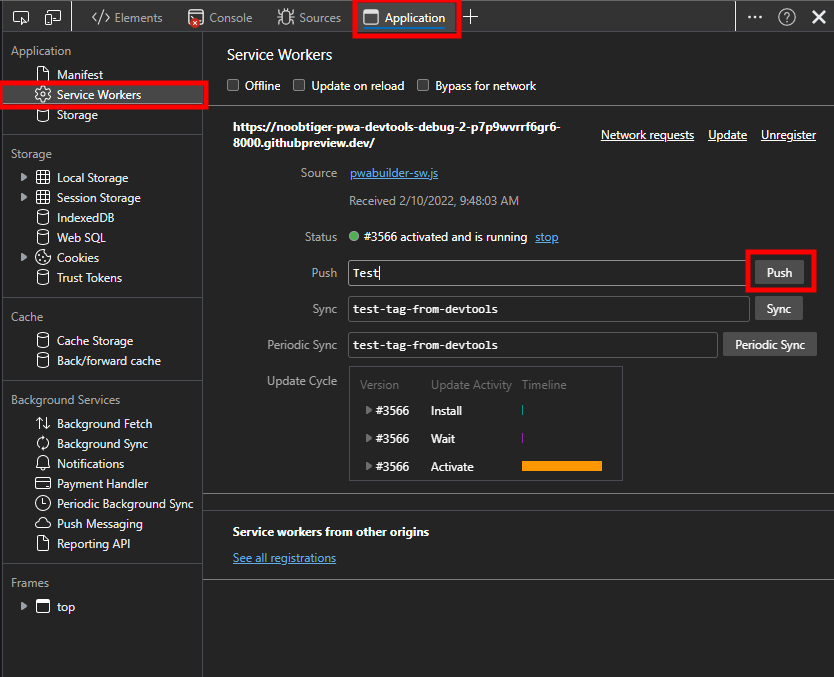

# 3.4: Debugging tools #2


Welcome to day 2 of debugging PWA using DevTools. Yesterday, you learned to debug common issues related to PWA using DevTools. However as you learned in week 2 of this series, PWAs are capable of more advanced features like [background synchronization](../advanced-capabilities/06.md), [push notifications](../advanced-capabilities/07.md) etc. Today we will go through tools available in DevTools for debugging these advanced features of PWAs.

All the screenshots in today's article are taken from Microsoft Edge DevTools, other browsers have similar tools as well.
### WHAT WE'LL COVER TODAY

| Section | Description |
| ------- | ----------- |
| **PWA permissions** | How to check PWA permissions? |
| **Manage Notifications** | How to emulate push notifications? |
| **Background Sync/Fetch** | How to view background sync/fetch events? |
| **IndexedDB storage** | How to view and manage IndexedDB data? |

## Managing PWA permissions
PWAs can make full use of modern web features such as notifications, location, storage etc. However for PWAs to use these features, they have to be granted permission. For example, to send notifications to the user, a PWA has to request permission via the [Notifications API](https://developer.mozilla.org/en-US/docs/Web/API/Notifications_API) which looks something like this:

```
Notification.requestPermission().then(function(result) {
  console.log(result);
});
```

This will prompt browsers to show a dialog requesting users for the permission like below.


Often during development, you want to test user flows where the user either granted or denied certain permission to the PWA.  This can be achieved through **App permissions** list, here you can validate and manage all the permissions. For example, to reset notifications permission, follow the below steps:

  - Open App permissions through site information icon in the url bar (1) or via settings menu in installed PWA (2).
  - Find Notification in the list and change it to default value (3).
  - Alternatively you can also reset all permissions (4).


## Push notifications
As you learned in [Notifying Your Users of Updates](../advanced-capabilities/07.md), PWAs can improve engagement by sending push notifications to the user. This is achieved through the [Push API](https://developer.mozilla.org/en-US/docs/Web/API/Push_API) and the [Notifications API](https://developer.mozilla.org/en-US/docs/Web/API/Notifications_API), both of which are accessible to service workers.

PWAs can subscribe to push messages from the server via the Push API. Once subscribed, a PWA will start receiving push events even if the application is closed. When a push event is received, the PWA can send a notification to the user via the Notifications API.

To see list of all the push messages and notifications in DevTools, follow below steps:
  - Open DevTools.
  - Navigate to Application panel (1).
  - Open **Push messaging** in background services section (2) and start recording (3).
  - Similarly, open **Notifications** in background services section (4) and start recording (5).
  - Click on any notification to view the details (6). 


Since the push events have to be triggered by the server, to test and debug push messaging flow in a PWA, you often have to send mock events from the server. Microsoft Edge DevTools provides a convenient way to avoid this by simulating sending push events directly from the browser. To send mock push events in a PWA:
  - Open DevTools and navigate to Application pane.
  - Open Service workers in Application section.
  - Enter value in push text input.
  - Click on Push button to send mock push message.
  - Validate the push event is sent in push messaging table as described above.



## Background sync/fetch
PWAs also provide [Background Sync API](https://developer.mozilla.org/en-US/docs/Web/API/Background_Synchronization_API), [Background Fetch API](https://developer.mozilla.org/en-US/docs/Web/API/Background_Fetch_API) and [Periodic Background Sync API](https://developer.mozilla.org/en-US/docs/Web/API/Web_Periodic_Background_Synchronization_API) to send/receive network requests and messages. The advantage of using these background APIs over fetch or xhr is that network requests made through these APIs can be deferred until PWA has active network connectivity. Refer [Synchronizing app data in the background](../advanced-capabilities/06.md) for more information.

Similar to push messages and notifications tables described in previous section, Background API events can be viewed in Background services sub-section in Application panel. Also Background sync and periodic background sync events can be mocked via service workers section in application panel similar to mock push messaging in previous section. These mock events trigger all the event handlers in PWA and also gets listed in the corresponding background services table in DevTools. Currently it is not possible in Microsoft Edge DevTools to mock Background fetch events.


## IndexedDB storage
To provide offline support, PWAs should be able to store data locally. There are multiple storage options for the web, you can read more about them [here](../core-capabilities/05.md). In PWAs, recommended practice is to use [Cache](https://developer.mozilla.org/en-US/docs/Web/API/CacheStorage) for storing static resources and [IndexedDB](https://developer.mozilla.org/en-US/docs/Web/API/IndexedDB_API) is used for more structured data. Yesterday, you learned about debugging cache issues in DevTools. To view and manage IndexedDB data in DevTools, follow below steps.
  - Open DevTools and navigate to Application pane (1).
  - Expand created IndexedDB database (2), there can be multiple databases here.
  - Click on created table to view data (3).
  - There are also options at the top of the table (4) to clear the entire table or delete one selected row in table.


## Summary
After reading yesterday's and today's blogs in this series, you should have a pretty good understating of how DevTools can be used for PWA development. Lot of PWA development pain can be alleviated by using specific tools in DevTools like sending mock push or background events to PWA directly in DevTools, viewing storage etc. The feature set for PWAs is growing and we are also planning to add tooling support for new features as well. If you have any feature requests or feedback, contact us by "Send Feedback" button in upper right corner in Microsoft Edge DevTools.
