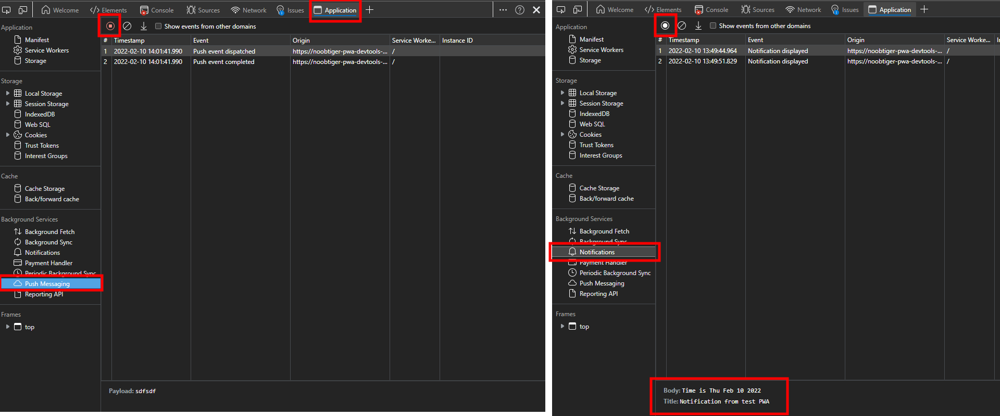
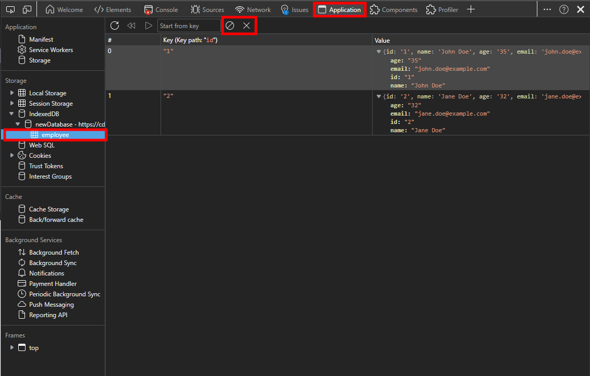

# 3.4: Debugging tools #2

## *Coming soon!*

**Author: Chait Pinnamaneni [@noobtiger11](https://twitter.com/noobtiger11)**

Welcome to **Week 3 Day 4** of #30DaysOfPWA! Want to learn more about this project? Check out our [Kickoff](../kickoff.md) post to get more details on the content roadmap and contributors. Now, let's dive in!


Welcome to the second day of debugging PWA using browser DevTools!

Yesterday, you learned to debug common issues related to PWA using DevTools. However as you learned in [week 2](../advanced-capabilities/) of this series, PWAs are capable of more advanced features like [background synchronization](../advanced-capabilities/06.md), [push notifications](../advanced-capabilities/07.md) and more.

Today we will go through the tools available to you for debugging these advanced features of PWAs.

|  | What you will learn today |
|:--- |:---|
| _PWA permissions_ | How to check for PWA permissions? |
| _Manage notifications_ | How to emulate push notifications? |
| _Background sync and fetch_ | How to view background sync and fetch events? |
| _IndexedDB storage_ | How to view and manage your data stored in IndexedDB? |

---

Note that all the screenshots in today's article are taken from Microsoft Edge DevTools, but other browsers have similar tools as well.

## Managing PWA permissions

PWAs can make full use of modern web features such as notifications, location, storage etc. However for PWAs to use these features, they have to be granted permission.

For example, to send notifications to the user, a PWA has to request permission via the [Notifications API](https://developer.mozilla.org/en-US/docs/Web/API/Notifications_API) which looks something like this:

```javascript
Notification.requestPermission().then(function(result) {
  console.log(result);
});
```

This will prompt browsers to show a dialog requesting users for the permission as shown below.


Often during development, you want to test user flows where the user either granted or denied certain permissions to the PWA.  This can be achieved by using the **App permissions** list. With this list, you can validate and manage all the permissions that your app uses.

For example, to reset notifications permission:

* Open the **App permissions** page by clicking the **View site information** icon in the url bar or the **Settings and more** menu button in an installed PWA's title bar.
* Find **Notifications** in the list and reset it back to its default value.
* Alternatively you can also reset all permissions by clicking **Reset permissions**.


## Push notifications

As you learned in [Notifying Your Users of Updates](../advanced-capabilities/07.md), PWAs can improve engagement by sending push notifications to the user. This is achieved through the [Push API](https://developer.mozilla.org/en-US/docs/Web/API/Push_API) and the [Notifications API](https://developer.mozilla.org/en-US/docs/Web/API/Notifications_API), both of which are accessible to service workers.

PWAs can subscribe to push messages from the server via the Push API. Once subscribed, a PWA will start receiving push events even if the application is closed. When a push event is received, the PWA can send a notification to the user via the Notifications API.

DevTools can track all these events for you, which can help you debug the entire user notification flow. To see the list of all the push messages and notifications in DevTools:

* Open DevTools.
* Open the **Application** tool.
* Open **Push messaging** under the **Background services** section.
* Click **Start recording events** to start listing push notification events in the table.
* For notifications, open **Notifications** under the **Background services** section and click **Start recording events**.
* Click on any notification to view the details.



Since the push events have to be triggered by the server, to test and debug push messaging flow in a PWA, you often have to send mock events from the server.

DevTools provides a convenient way to avoid this by simulating sending push events directly from the browser. To send mock push events in a PWA:

* Open DevTools and open the **Application** tool.
* Open **Service Workers** in the **Application** section.
* Type your test message in the **Push** input field.
* Click the **Push** button to send the message.
* You can then validate that the event was sent in the **Push messaging** table as described above.


## Background sync/fetch

PWAs can also use the [Background Sync API](https://developer.mozilla.org/en-US/docs/Web/API/Background_Synchronization_API), [Background Fetch API](https://developer.mozilla.org/en-US/docs/Web/API/Background_Fetch_API), and [Periodic Background Sync API](https://developer.mozilla.org/en-US/docs/Web/API/Web_Periodic_Background_Synchronization_API) to send and receive network requests and messages.

The advantage of using these background APIs over fetch or xhr is that network requests made through these APIs can be deferred until the PWA has active network connectivity and be done even when the PWA is not being used. Check out [Synchronizing app data in the background](../advanced-capabilities/06.md) for more information.

Similar to how you can view push messages and notifications, Background API events can also be viewed in DevTools. The **Background services** section of the **Application** tool has 3 sub-sections:

* **Background Fetch** can record the background fetch events.
* **Background Sync** can record background sync events.
* **Periodic Background Sync** can record periodic background sync events.

You can also send test background sync events and periodic background sync events in the **Service Workers** section, which works like when sending test push messages as explained previously.

These mock events trigger all the event handlers in PWA and also gets listed in the corresponding background services table.


## IndexedDB storage

To provide offline support, PWAs should be able to store data locally. There are multiple storage options for the web and you can read more about them [here](../core-concepts/05.md).

In PWAs, a recommended practice is to use [Cache storage](../advanced-capabilities/05.md) for storing static resources and [IndexedDB](https://developer.mozilla.org/en-US/docs/Web/API/IndexedDB_API) is used for more structured data.

[Yesterday](./03.md), you learned about debugging cache issues in DevTools. To view and manage your app's IndexedDB data in DevTools:

* Open DevTools
* Open the **Application** tool.
* Under **Storage**, expand the **IndexedDB** section until you find your database  and the table you want to open. Note that there can be multiple databases here.
* Your table appears in the main area of the tool, and you can view the data.
* The toolbar displayed at the top of the table can be used to clear the entire table or delete the selected row.



## Summary

After reading yesterday's and today's articles in this series, you should have a pretty good understating of how the browser DevTools can be used for PWA development and debugging. A lot of PWA issues can be resolved with DevTools and development can be made easy by using the specialized tools we went over in the past two days.

The feature set available to PWAs is always growing and the DevTools is planning to add tooling support for these new features as well. If you have any feature requests or feedback, you can contact the Microsoft Edge DevTools team by clicking the **Send Feedback** button in upper right corner of DevTools.
