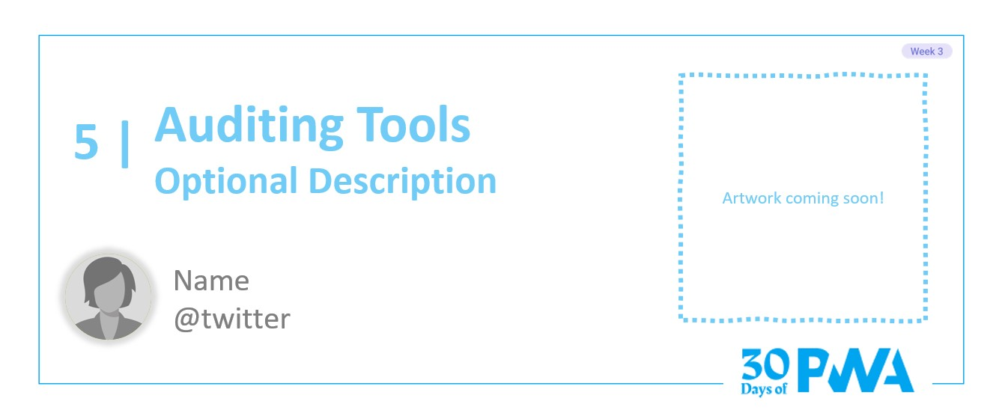
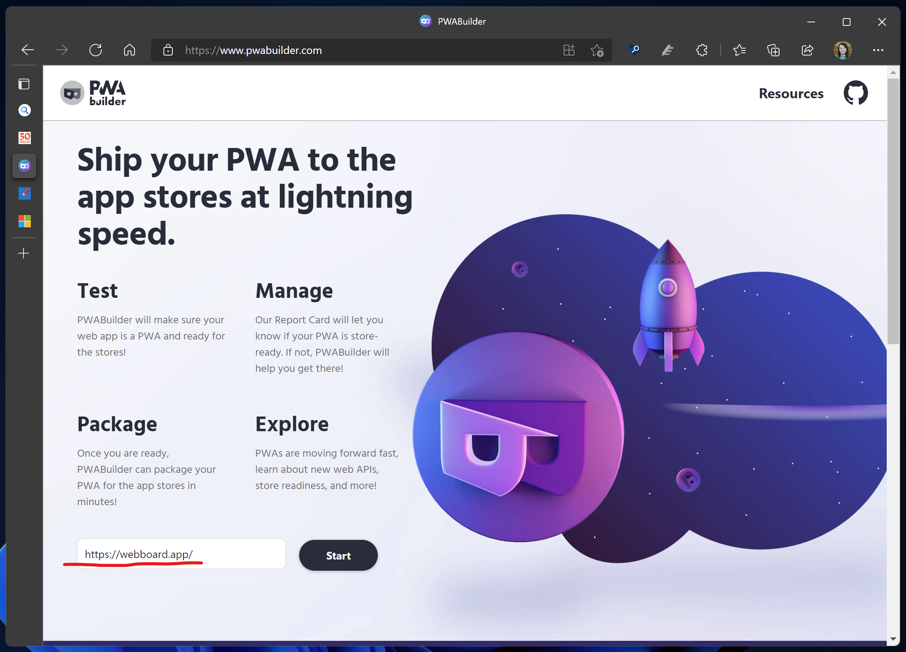
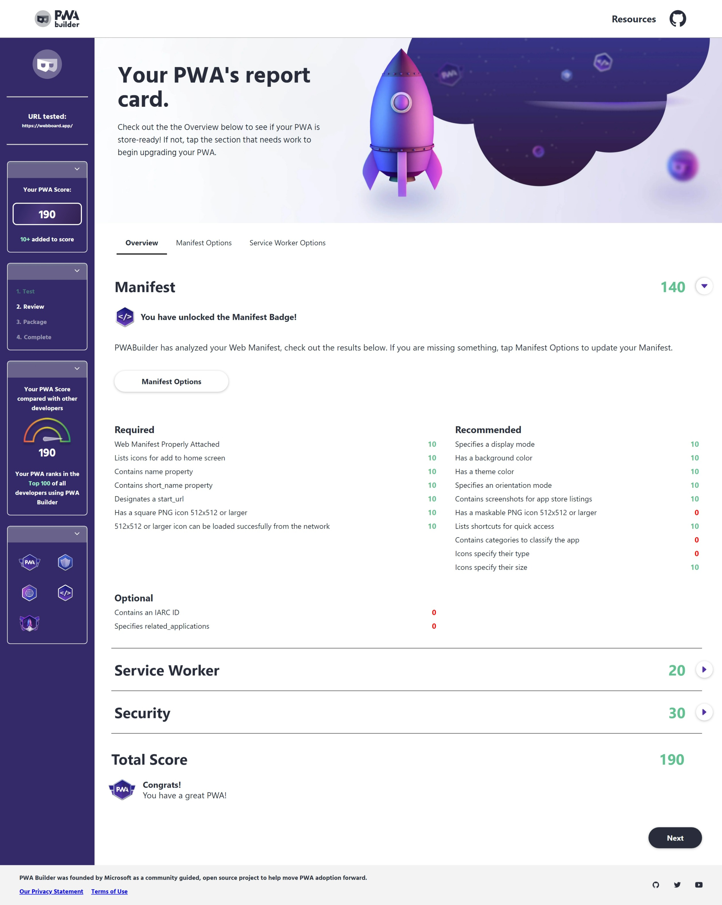
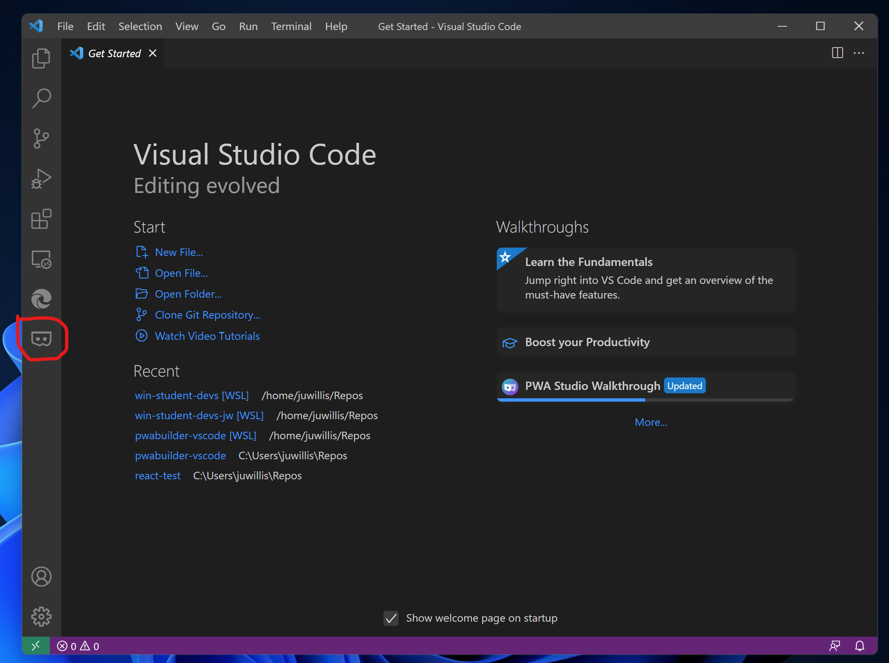
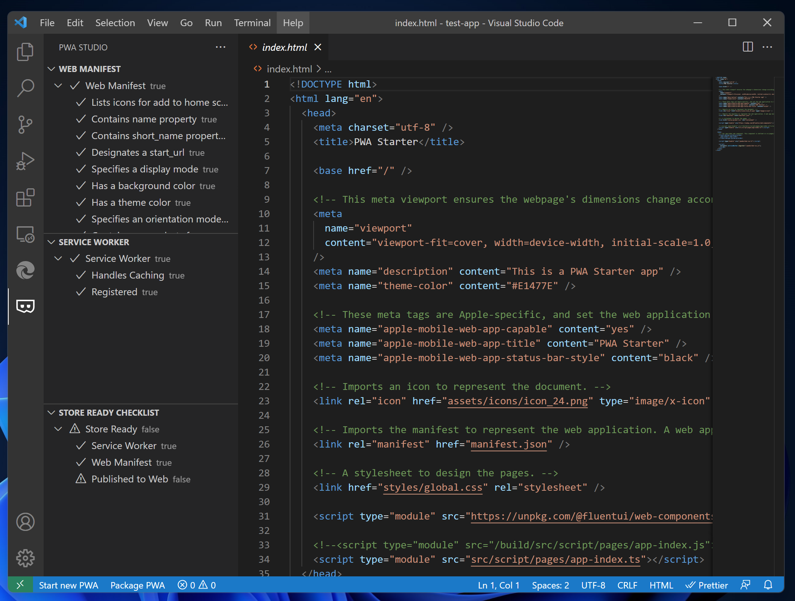
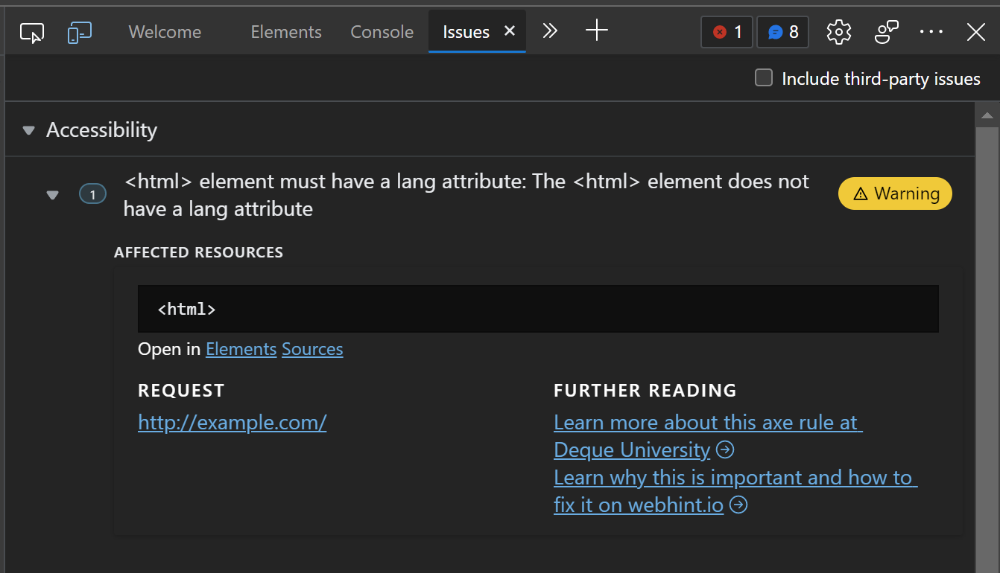
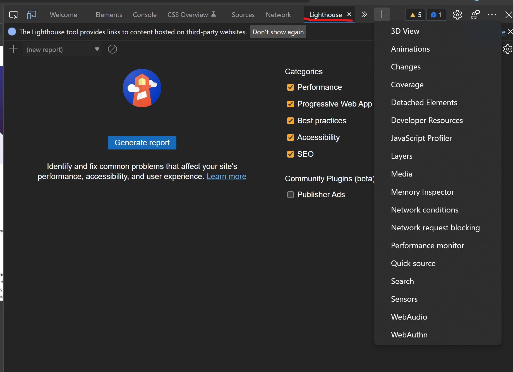

# 3.5: Auditing tools

**Author: Justin Willis (Software Engineer on the PWABuilder team) [@justinwillis96](https://twitter.com/Justinwillis96)**

Welcome to **Week 3 Day 5** of #30DaysOfPWA! Want to learn more about this project? Check out our [Kickoff](../kickoff.md) post to get more details on the content roadmap and contributors. Now, let's dive in!

**Author: Justin Willis [@justinwillis96](https://twitter.com/Justinwillis96)**

Welcome to **Week 3 Day 5** of #30DaysOfPWA! Want to learn more about this project? Check out our [Kickoff](../kickoff.md) post to get more details on the content roadmap and contributors. Now, let's dive in!

### WHAT WE'LL COVER TODAY

| Section | Description |
| ------- | ----------- |
| **Why audit your PWA** | Why should you use these auditing tools? |
| **Audit with PWABuilder** | PWABuilder can tell you if your PWA is installable and store ready
| **Audit accessibility with Webhint** |Let's use these two new tools to create a new PWA with just a few button clicks.  |
| **Audit performance with Lighthouse and Edge Devtools** | Deep dive into some of the tools used in PWA Studio and Starter|

---

Hello! For today’s post on the 30 Days of PWA series, we will be learning how to audit our PWA using various tools to help improve our PWA for our users. 

## Why audit your PWA

So, why should we audit our PWA anyways? And what does this even mean?

When we are talking about auditing your PWA, we mean using tools to ensure that your PWA is: 

- Installable from the browser
- Ready to submit to app stores such as the Microsoft Store
- Accessible
- Fast

and more. We do this to, in an automated way, ensure our PWA is the best it can be for users. Users want high quality apps that are accessible, fast and discoverable, and auditing ensures we are meeting these important wants.

Today we are going to use PWABuider, Webhint and Edge Devtools to audit our PWA, let's dive in!

## Audit with PWABuilder

Let's start with PWABuilder. The focus of the audit PWABuilder does is to ensure your PWA is high-quality, installable, and ready to publish to app stores like the Microsoft Store. To do this, PWABuilder looks at the:

- Web Manifest
- Service Worker
- HTTPS Setup

and audits them based on a set of requirements. 
These also happen to be the technical essentials you need for your app to be considered a PWA. 

| Web Manifest | Service Worker | Security
| ------- | ----------- | ----------- |
| Properly linked + registered | Properly linked + registered | Uses HTTPS
| Contains required fields for installation | Works Offline | Valid HTTPS Setup
| Icons follow best practices | Suggested features to improve your offline experience | No HTTP content on page
| Suggested fields to improve your PWA or enable new features | | |

Each section has a set of Required audits. These are audits that are required to be in the app stores and for installation from the browser. There are also Recommended and Optional audits for each section. These audit things such as, for example, manifest fields you can add to improve the installation experience of your PWA, but are not required.

To get started with PWABuilder's audits, you can use either https://pwabuilder.com or the [PWA Studio VSCode Extension](https://marketplace.visualstudio.com/items?itemName=PWABuilder.pwa-studio).

### Getting our audits from pwabuilder.com
Already have a published and live PWA that you want to audit? 

- Grab your URL and head over to https://pwabuilder.com
- Enter the URL to your PWA on the homepage of pwabuilder.com and click Start

- pwabuilder.com will now analyze your PWA and return your audits

### Getting our audits with PWA Studio
PWA Studio enables you to use PWABuilders audits while your building your PWA, not just after your PWA has gone live.

- Install PWA Studio from the [VSCode Marketplace](https://marketplace.visualstudio.com/items?itemName=PWABuilder.pwa-studio)
- Open your codebase in VSCode
- Click the PWABuilder icon on the left side of VSCode

- You will now see your audits

## Audit accessibility with Webhint

Now on to auditing accessibliity. We want to ensure our apps are inclusive and built for everyone and anyone. 
You may have heard of [Webhint](https://webhint.io/) before, but did you know it's audits are built into the [Issues panel in Edge devtools?](https://docs.microsoft.com/en-us/microsoft-edge/devtools-guide-chromium/issues/)

The Issues panel allows you to quickly see any of the issues webhint detected in your app. On top of this, it also tells you which HTML element the problem affects and how to fix it.

.

To use it:
- Open your app in Edge
- Open [Edge devtools](https://docs.microsoft.com/en-us/microsoft-edge/devtools-guide-chromium/)
- Refresh your app, because some issues are reported based on network requests. Notice the updated count in the Issues counter.
- Select the Issues tab. The Issues panel opens with issues grouped into different categories.

## Audit performance with Lighthouse and Devtools

And we are now ready to audit our apps performance. When I say performance here, I mean loading Performance or "How fast your PWA loads on a certain device with a certain network connection".

**Note** Edge devtools can also help you evaluate and improve your apps runtime performance. Check our [docs](https://docs.microsoft.com/en-us/microsoft-edge/devtools-guide-chromium/evaluate-performance/) to learn more.

Edge devtools has the [Lighhouse](https://docs.microsoft.com/en-us/microsoft-edge/devtools-guide-chromium/speed/get-started) tool built in. Lighthouse can quickly evaluate our apps loading performance and give us suggestions on how to make it load faster. It will evaluate our app running on our device, but with CPU throttling and Network throttling to better match what you users experience. When talking about loading performance, it is important to remember that we need to ensure our apps load fast on our users devices, not just our development machines. Lighthouse enables us to do this directly from our development device.

To get started auditing your loading performance with Lighthouse:

- Open your app in Edge
- Open [Edge devtools](https://docs.microsoft.com/en-us/microsoft-edge/devtools-guide-chromium/)
- Open the Lighthouse tab in devtools 

- Click `Generate Report` to get a baseline report
- Analyze the report and make the suggested changes to your app.

For a full walkthrough on using Lighthouse to improve the loading performance of your application, check our [docs](https://docs.microsoft.com/en-us/microsoft-edge/devtools-guide-chromium/speed/get-started). 

Using these tools, we can quickly make changes to our PWA to ensure it provides the best experience possible for our users. And, because PWAs instantly updateable just like a normal website, we can get these changes out to our users quickly!

In our next post, we’ll dive into converting our existing website to a PWA!

## Resources
- [pwabuilder.com](https://pwabuilder.com)
- [PWA Studio VSCode Extension](https://marketplace.visualstudio.com/items?itemName=PWABuilder.pwa-studio)
- [Edge devtools](https://docs.microsoft.com/en-us/microsoft-edge/devtools-guide-chromium/)
- [Evaluate Runtime Performance](https://docs.microsoft.com/en-us/microsoft-edge/devtools-guide-chromium/evaluate-performance/)
- [Evaluate Loading Performance](https://docs.microsoft.com/en-us/microsoft-edge/devtools-guide-chromium/speed/get-started)