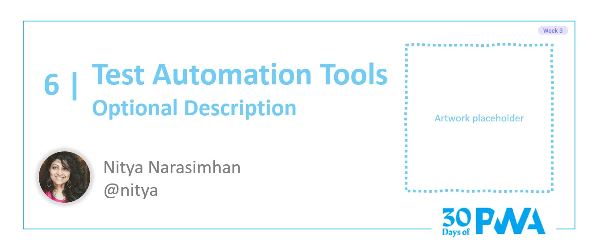
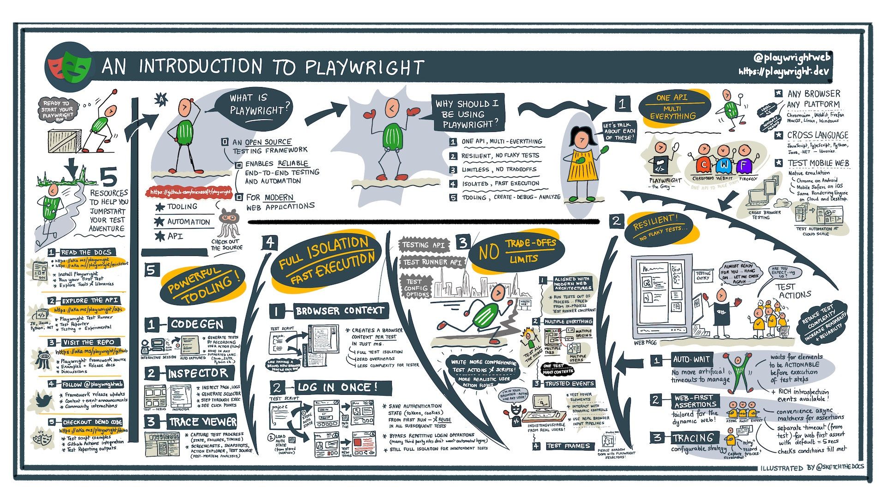
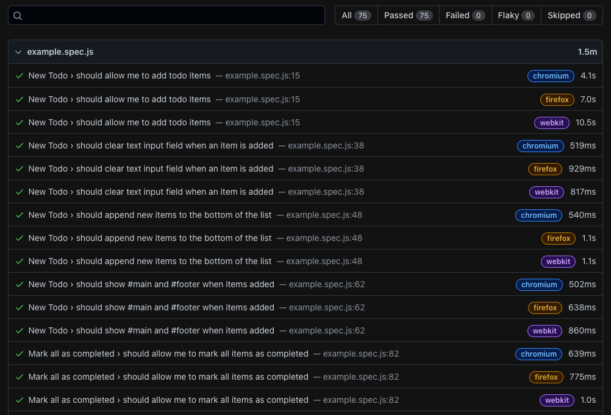
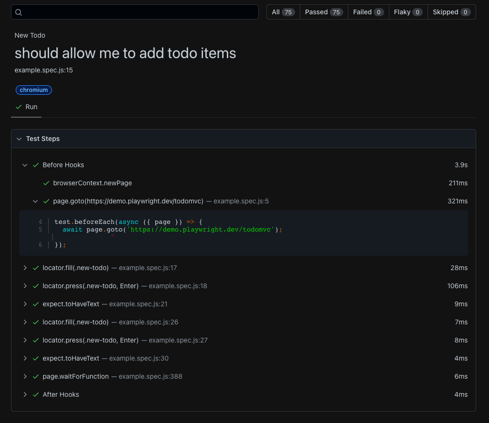

# 3.6: Test automation tools

**Author: Nitya Narasimhan [@nitya](https://twitter.com/nitya)**

Welcome to Week 3, **Day 6** of #30DaysOfPWA. Check out our [Kickoff](../kickoff.md) post to learn about our roadmap and contributors. In today's post we'll talk about _Test Automation_ - what it is, why it matters, and developer tools to help us build reliable end-to-end testing workflows for our PWA.




### WHAT WE'LL COVER TODAY

| Section | Description |
| ------- | ----------- |
| **Test Automation** | What is it and why does it matter for modern web apps?|
|**Test Pyramid** | What does a testing strategy for modern web apps involve? |
|**Testing PWA** | What does a functional testing spec for PWA need? |
|**Hello, Playwright**| Reliable end-to-end test framework for modern web apps. |
|**Using Playwright** | Explore quickstarts, powerful tools, and PWA test scenarios |
|**Exercise**| Take Playwright for a spin with a sample PWA! |

---

## Test Automation

Test Automation is the practice of _executing tests automatically_ to validate software product functionality, then _using testing insights_ to iteratively improve product quality. Test Automation is key to continuous delivery in modern DevOps culture: build-deploy pipelines keep software products in a continuous state of readiness for production release. 

Why explore Test Automation for PWA? Two reasons: growing test complexity & better tooling capability.

#### Testing Complexity

Progressive Web Apps combine the reach of traditional web apps with the richer capability of platform-native apps. The first needs _cross-browser_ testing to ensure usable experiences across all targeted browsers. The second needs _progressive enhancement_ testing strategies to validate the enhanced experiences available to more capable devices.

Increased frequency of testing (e.g., on every feature commit or bug fix) coupled with many testing granularities (unit, integration, end-to-end) and configurations (browsers, device platforms) makes manual testing time-consuming and error-prone. This is where test automation excels, reducing time to detect issues, eliminating operator errors, and scaling effectively with cloud resources.

#### Tooling Capability

Adopting automated testing strategies today is a no-brainer thanks to the rich ecosystem of tools and technologies available to web developers. Modern web automation software can execute user actions and other operations on a web browser without human intervention. Check out the [Microsoft Edge docs](https://aka.ms/learn-PWA/30Days-3.6/docs.microsoft.com/en-us/microsoft-edge/test-and-automation/test-and-automation) for more on relevant testing tools and technologies for web development, including:

 * _[Origin Trials](https://aka.ms/learn-PWA/30Days-3.6/docs.microsoft.com/en-us/microsoft-edge/origin-trials)_ - trial experimental APIs (e.g., web capabilities) on live sites with real users.
 * _[WebDriver](https://aka.ms/learn-PWA/30Days-3.6/docs.microsoft.com/en-us/microsoft-edge/webdriver-chromium/c-sharp)_ - a W3C standard wire protocol for out-of-process clients to remotely instruct browsers.
 * _[DevTools Protocol](https://aka.ms/learn-PWA/30Days-3.6/docs.microsoft.com/en-us/microsoft-edge/devtools-protocol-chromium)_ - directly inspect, debug, and profile,  Chromium-based browsers like Edge.
 * _[Puppeteer](https://aka.ms/learn-PWA/30Days-3.6/docs.microsoft.com/en-us/microsoft-edge/puppeteer)_ - a Node.js _library_ for browser automation using DevTools Protocol.
 * _[Playwright](https://aka.ms/learn-PWA/30Days-3.6/docs.microsoft.com/en-us/microsoft-edge/playwright)_ - _framework_ for reliable end-to-end testing of modern web apps, across browsers.
 * _[webhint](https://aka.ms/learn-PWA/30Days-3.6/docs.microsoft.com/en-us/microsoft-edge/test-and-automation/webhint)_ - linter for accessibility, performance, security, PWA and cross-browser compatibility.

We'll focus on [_Playwright_](https://aka.ms/learn-PWA/30Days-3.6/playwright.dev) in this post - but do explore the other resources to learn how they fit into your testing toolkit.

---

## Test Pyramid

To craft an Agile testing strategy, it helps to use visual metaphors like this [practical test pyramid](https://aka.ms/learn-PWA/30Days-3.6/www.pearson.com/us/higher-education/program/Cohn-Succeeding-with-Agile-Software-Development-Using-Scrum/PGM201415.html) that organizes our thinking around two guiding principles: (1) Write tests at various granularities, and (2) Write _fewer_ tests as you go higher up the pyramid.

What does testing granularity mean? My version of the pyramid has unit testing at the base, with exploratory testing at the top. Test automation helps with the bottom four layers, while manual testing is key to uncovering "gaps" that automated testing might overlook at the top.

| Level | Type | Description |
|:---|:---|:---|
| 4 | Exploratory Testing | _Manual testing_ (freeform, unstructured, creative) to uncover unforeseen issues, or test edge cases and experimental features. |
| 3 | End-to-End Testing| Tests complete application specification (all stories, all scripts) with realistic test data and measurable outcomes for validation. |
| 2 | UI Testing| Tests user interactions and workflow against a specified story. Validates behavior, layouts, usability, accessibility etc.|
| 1 | Integration Testing | Tests that multiple components work together as intended, where some are external dependencies for your application. |
| 0 | Unit Testing | Tests that an independent component of work functions as intended.|

In implementing the strategy, we want _many small, fast tests_ at the base, and _fewer more coarse-grained tests_ as we go higher. There are numerous unit testing libraries and tools that make the first objective achievable. But end-to-end test automation can be ["notoriously flaky"](https://aka.ms/learn-PWA/30Days-3.6/martinfowler.com/articles/practical-test-pyramid.html#TheImportanceOftestAutomation) given the many _browser quirks, timing issues, animations, and unexpected UI interactions_ that we need to deal with.

This is where having a reliable testing framework like Playwright really helps. Its [test hierarchies](https://aka.ms/learn-PWA/30Days-3.6/playwright.dev/docs/api/class-suite#suite-tests) make it easy to compose high-level _test suites_ from low-level _test cases_ - and use _test configurations_ with multiple _test projects_ to create maximum flexibility. The [test runner](https://aka.ms/learn-PWA/30Days-3.6/playwright.dev/docs/intro) can focus on execution, running tests in parallel for efficiency, using multiple projects for cross-browser coverage, and capturing traces for post-execution analysis.

---

## Testing PWA

Next, let's think about the _functional_ specification of these tests - what kinds of features (unit testing) and interaction workflows (end-to-end testing) should we consider for Progressive Web Apps? Here's one way to approach this:

 * **PWAs are web apps.** Start with existing ["strategies for carrying out testing"](https://aka.ms/learn-PWA/30Days-3.6/developer.mozilla.org/en-US/docs/Learn/Tools_and_testing/Cross_browser_testing/Testing_strategies) for web apps, and identify the optimal testing configurations (target devices, browsers) for your intended audience.
 * **PWAs have additional [desirable characteristics](../core-concepts/01.md)** to validate. We know from the [previous post](05.md) that _auditing tools_ are ideal here and can be integrated into a test automation workflow it they expose a programmable interface. Ex: [playwright-lighthouse](https://aka.ms/learn-PWA/30Days-3.6/github.com/abhinaba-ghosh/playwright-lighthouse) makes it easy to run Lighthouse audits as part of your end-to-end testing workflow.
 * **PWAs may have functional testing requirements** for core components, that are automation-friendly. Ex: we can [emulate offline mode](https://aka.ms/learn-PWA/30Days-3.6/playwright.dev/docs/api/class-browsercontext#browser-context-set-offline) to test service workers and caching strategies. Read this [testing service workers](https://aka.ms/learn-PWA/30Days-3.6/medium.com/dev-channel/testing-service-workers-318d7b016b19) post for useful guidance.
 * **PWAs may use new or experimental [web capabilities](../advanced-capabilities/01.md)** that are unevenly supported across browsers and devices. We can use [feature detection](https://aka.ms/learn-PWA/30Days-3.6/developer.mozilla.org/en-US/docs/Learn/Tools_and_testing/Cross_browser_testing/Feature_detection) to test for their existence on target devices, and execute conditional test actions based on the outcome.

But how can we put these specifications into implementation for reliable end-to-end testing? Let's talk about Playwright!

---

## Hello, Playwright!

[Playwright](https://aka.ms/learn-PWA/30Days-3.6/playwright.dev) is an open-source testing framework that enables reliable end-to-end testing and automation for modern web applications. It comes with a built-in [Playwright Test Runner](https://aka.ms/learn-PWA/30Days-3.6/playwright.dev/docs/next/intro) for test automation, and a [Playwright Library](https://aka.ms/learn-PWA/30Days-3.6/playwright.dev/docs/next/library) to simplify integration with third-party solutions.



Playwright has a number of benefits that differentiate it from other test automation frameworks. Scan the visual guide for more details on each:
 * It has a unified [API](https://aka.ms/learn-PWA/30Days-3.6/playwright.dev/docs/next/api/class-playwright) for use across browsers and device platforms.
 * It enables mobile web testing with [native emulation](https://aka.ms/learn-PWA/30Days-3.6/playwright.dev/docs/emulation) and rich [device profiles](https://aka.ms/learn-PWA/30Days-3.6/github.com/microsoft/playwright/blob/bdfe92f8a7499644c431c5c05de17d71e6006084/packages/playwright-core/src/server/deviceDescriptorsSource.json).
 * It has multi-language support - including TypeScript, JavaScript, Java, Python and .NET.
 * No flaky testing - with [auto-waiting](https://aka.ms/learn-PWA/30Days-3.6/playwright.dev/docs/actionability) and [web-first assertions](https://aka.ms/learn-PWA/30Days-3.6/playwright.dev/docs/test-assertions) eliminating messy timeouts.
 * No limits - aligns with modern web architectures, runs out-of-process, and supports multi-everything.
 * Powerful tools - for authoring, debugging, profiling, and reporting tests and execution.
 * Full isolation - with browser contexts ready in ms, fast execution and [parallelization](https://aka.ms/learn-PWA/30Days-3.6/playwright.dev/docs/test-parallel) options.

Want to get hands-on experience with the various capabilities? Check out the [demo.playwright](https://aka.ms/learn-PWA/30Days-3.6/github.com/MarcusFelling/demo.playwright) repository for code examples showcasing test scenarios for accesibility, android, authentication, performance (DevTools & Lighthouse), and visual-comparison. Plus, learn how [Continuous Integration](https://aka.ms/learn-PWA/30Days-3.6/playwright.dev/docs/ci) options like GitHub Actions work seamlessly with Playwright, right out of the box.


---

## Using Playwright

Playwright currently has two options to kickstart your end-to-end testing journey:
 * Use the [Getting Started](https://aka.ms/learn-PWA/30Days-3.6/playwright.dev/docs/intro) guide to use Playwright from the command line.
 * Use the [Playwright Test for VSCode](https://aka.ms/learn-PWA/30Days-3.6/ms-playwright.playwright) extension (_in preview_) to use Playwright from the IDE.

For now, we'll use the first option since the extension is still in preview and works only with the latest version of Playwright Test. In an earlier post, I [PWA-enabled an existing web app](../core-concepts/07.md). Today, I'll revisit that project and instrument it for end-to-end testing with Playwright. Ready? Let's go.

### 1. Install Playwright

Since I'm scaffolding Playwright tests for an _existing_ project, I'll use the command below. If you are _creating_ a new project, just add the project name as the final argument.

```javascript
$ npm init playwright
```

The output looks as shown (compressed for clarity). Note that you can choose to get a GitHub Actions workflow instrumented for you during setup. The scaffolding process may take a while the first time since it installs Playwright (Test runner and library) and all supported browsers (Chromium, Firefox and Webkit) by default.

```javascript
Need to install the following packages:
  create-playwright
Ok to proceed? (y) y
Getting started with writing end-to-end tests with Playwright:
Initializing project in '.'
✔ Do you want to use TypeScript or JavaScript? · JavaScript
✔ Where to put your end-to-end tests? · e2e-tests
✔ Add a GitHub Actions workflow? (Y/n) · true
Installing Playwright Test  ...
Downloading browsers (npx playwright install) ...
..
Writing playwright.config.js.
Writing .github/workflows/playwright.yml.
Writing e2e-tests/example.spec.js.
Writing package.json.
✔ Success! Created a Playwright Test project at <....>
```

The end result: three key files - a test _specification_, a test _configuration_, and a _GitHub Actions workflow_ for continuous integration. We'll review these later.


### 2. Run Playwright test

The process ends by suggesting we run `npx playwright test` so let's do that. We see that the default test specification apparently defines _75_ tests and uses _3 workers_ (one for each browser project), completing the entire run in 35 seconds.

```
$ npx playwright test
Running 75 tests using 3 workers
...
  75 passed (35s)

To open last HTML report run:
  npx playwright show-report
```

### 3. View the HTML Report

Excellent! The default tests ran and passed! And hey - we have a report so let's check that out!

```javascript
$ npx playwright show-report

  Serving HTML report at http://127.0.0.1:9323. Press Ctrl+C to quit.
```

The report looks something like this. Note how it provides execution time stats on a _per-test (case) + per-browser (project)_ basis, and for the spec (test suite) as a whole.




 The HTML reporting format allows you to drill down further into test steps, and break down the time taken for executing each test action. This is what the report looks like when you click on the first line item, and drill down into  details. For instance, we can see the test step involved, along with the actual code that was executed from the script.



### 4. Validate GitHub Actions workflow

Great! We validated the test script locally and checked that it ran against all browser targets _and_ generated a report that we were able to view locally. The setup step also created a `playwright.yml` file with the GitHub actions workflows for running Playwright tests and uploading reporting artifacts for post-run analysis. 

Let's validate that this works by committing our code to GitHub to trigger the workflow. You can see the initial scaffolded code in my [add-playwright](https://aka.ms/learn-PWA/30Days-3.6/github.com/fearlessly-dev/recipe-me/tree/add-playwright) branch with these key files:
 * [playwright.yml](https://aka.ms/learn-PWA/30Days-3.6/github.com/fearlessly-dev/recipe-me/blob/add-playwright/.github/workflows/playwright.yml) = GitHub Actions workflow
 * [e2e-tests/example.spec.js](https://aka.ms/learn-PWA/30Days-3.6/github.com/fearlessly-dev/recipe-me/blob/add-playwright/e2e-tests/example.spec.js) = Test specification
 * [playwright.config.js](https://aka.ms/learn-PWA/30Days-3.6/github.com/fearlessly-dev/recipe-me/blob/add-playwright/playwright.config.js) = Test configuration

Merging that branch into main triggers [the GitHub action](https://aka.ms/learn-PWA/30Days-3.6/github.com/fearlessly-dev/recipe-me/actions/runs/1919689804) as anticipated, leading to the entire suite of tests being run in the cloud. The test run took `5m 40s` with the bulk of the time (~4m) used for installing Playwright and browsers. We can also see the [HTML Report Artifact](https://aka.ms/learn-PWA/30Days-3.6/github.com/fearlessly-dev/recipe-me/suites/5498490318/artifacts/175855529) available for download and local viewing.

🎉 Time to celebrate! We have an **end-to-end testing harness setup with continuous integration using GitHub Actions** for our project. It's time to start customizing the test script and configuration to be more aligned to your project needs. We don't have time to dive into details, but let's take a quick look at the two key files to know.


### 5. Inspect the Configuration File

The Playwright configuration file lets you specify [test options](https://aka.ms/learn-PWA/30Days-3.6/playwright.dev/docs/api/class-testoptions) for running multiple test projects concurrently, and [execution options](https://aka.ms/learn-PWA/30Days-3.6/playwright.dev/docs/api/class-testconfig) to control how those tests are executed by Playwright. The [playwright.config.js](https://aka.ms/learn-PWA/30Days-3.6/github.com/fearlessly-dev/recipe-me/blob/add-playwright/playwright.config.js) file in the default setup looks something like this (cleaned up for clarity):

```javascript
// @ts-check
const { devices } = require('@playwright/test');

/**
 * @see https://playwright.dev/docs/test-configuration
 * @type {import('@playwright/test').PlaywrightTestConfig}
 */
const config = {
  testDir: './e2e-tests',
  timeout: 30 * 1000,
  expect: {
    timeout: 5000
  },
  forbidOnly: !!process.env.CI,
  retries: process.env.CI ? 2 : 0,
  workers: process.env.CI ? 1 : undefined,
  reporter: 'html',
  use: {
    actionTimeout: 0,
    trace: 'on-first-retry',
  },

  /* Configure projects for major browsers */
  projects: [
    {
      name: 'chromium',
      use: {
        ...devices['Desktop Chrome'],
      },
    },
    {
      name: 'firefox',
      use: {
        ...devices['Desktop Firefox'],
      },
    },
    {
      name: 'webkit',
      use: {
        ...devices['Desktop Safari'],
      },
    },
};

module.exports = config;
```

Some observations:

 * The `projects` property defines target browsers to run the test against
 * The `workers` property decides the degree of parallelization of the runs
 * The `reporter` property selects the type of report (HTML) generated for the run
 * The `trace` property requests that traces be recorded only on first retry


We can now customize this in many ways. Some options to try:
 * Set [trace](https://aka.ms/learn-PWA/30Days-3.6/playwright.dev/docs/trace-viewer#recording-a-trace) to `on` to trigger recording, then view the data with Trace Viewer. [Read this post](https://aka.ms/learn-PWA/30Days-3.6/dev.to/azure/004-tool-talk-hello-trace-viewer-2a61) for more details.
 * Add [emulator targets](https://aka.ms/learn-PWA/30Days-3.6/playwright.dev/docs/test-configuration#emulation) to `projects` - validate responsiveness of app experiences.
 * Set [screenshot](https://aka.ms/learn-PWA/30Days-3.6/playwright.dev/docs/test-configuration#automatic-screenshots) to `on` - make Playwright Test capture screenshots after every test for analysis.
 * Set [video](https://aka.ms/learn-PWA/30Days-3.6/playwright.dev/docs/test-configuration#record-video) to `on` - make Playwright Test record videos after every test for analysis.

Note: Every such action has a related cost and complexity. It's good to experiment with various configuration options in your local test environment - then use the reports to iterate for efficiency in time and resource usage.


### 6. Inspect the Test Script

Start by looking at the basic [first test](https://aka.ms/learn-PWA/30Days-3.6/playwright.dev/docs/next/intro#first-test) script to understand key aspects of the test specification. Here is what that looks like:

```javascript
const { test, expect } = require('@playwright/test');

test('basic test', async ({ page }) => {
  await page.goto('https://playwright.dev/');
  const title = page.locator('.navbar__inner .navbar__title');
  await expect(title).toHaveText('Playwright');
});
```

Some observations:
 * `page` is the most common [fixture](https://aka.ms/learn-PWA/30Days-3.6/playwright.dev/docs/api/class-fixtures#fixtures-page) used in tests, creating an isolated context for running that test.
 * `page.locator` creates a [Locator](https://aka.ms/learn-PWA/30Days-3.6/playwright.dev/docs/api/class-locator), a view into page based on an associated selector.
  * `expect(..).toHaveText(..)` is an example of a web-first [Assertion](https://aka.ms/learn-PWA/30Days-3.6/playwright.dev/docs/test-assertions) with convenience async matchers that enforce auto-waiting for reliable testing.

You can learn more about these and other core concepts like test hooks, browser contexts, and explore the Playwright API, by scanning the [documentation](https://aka.ms/learn-PWA/30Days-3.6/playwright.dev/docs/intro#installation). Now, look at the scaffolded [e2e-tests/example.spec.js](https://aka.ms/learn-PWA/30Days-3.6/github.com/fearlessly-dev/recipe-me/blob/add-playwright/e2e-tests/example.spec.js) and see if you can get an understanding of how these concepts translate to more complex end-to-end testing specifications.


### 7. Next Steps 

The default scaffolded test provides a comprehensive end-to-end testing example for a _ToDoMVC_ application showcasing various features of the Playwright Test API. However, this may be overwhelming for a beginner. Instead, try these steps:

 * Complete the [Quickstart](https://aka.ms/learn-PWA/30Days-3.6/playwright.dev/docs/intro) - learn core concepts like _fixtures_, _hooks_, and _assertions_.
 * Get more familiar with the [Command-Line Tools](https://aka.ms/learn-PWA/30Days-3.6/playwright.dev/docs/cli) - I have a [Tool Talk post](https://aka.ms/learn-PWA/30Days-3.6/dev.to/azure/005-tool-talk-hello-command-line-faj) on the topic if useful.
 * Try using [Codegen](https://aka.ms/learn-PWA/30Days-3.6/playwright.dev/docs/codegen) to author tests,  and [Inspector](https://aka.ms/learn-PWA/30Days-3.6/playwright.dev/docs/inspector) to debug execution.
 * Dive into the [Playwright API](https://aka.ms/learn-PWA/30Days-3.6/playwright.dev/docs/api/class-playwright) to start figuring out selectors and actions you can use in crafting your own test specifications.

You can now go back into the scaffolded test specification file, delete the contents, and start writing your own test actions, test cases, and test suites! Test automation for the win!

---

## Exercise

We covered a lot today. Now it's your turn! 

* Pick a PWA - for instance, a [sample PWA](https://aka.ms/learn-PWA/30Days-3.6/docs.microsoft.com/en-us/microsoft-edge/progressive-web-apps-chromium/demo-pwas) - to experiment on.
* Instrument it to setup your first end-to-end test with Playwright. 
* Validate setup locally by running tests and inspecting the reports.
* Validate the GitHub Actions workflow by committing this to a GitHub repo.
* Try out the next steps above - and start customizing your testing scripts!

And set the stage for your end-to-end testing strategy with Playwright!

---

## Resources

1. [The Practical Test Pyramid](https://aka.ms/learn-PWA/30Days-3.6/martinfowler.com/articles/practical-test-pyramid.html#TheImportanceOftestAutomation) - Martin Fowler, Feb 2018
2. [Cross Browser Testing](https://aka.ms/learn-PWA/30Days-3.6/developer.mozilla.org/en-US/docs/Learn/Tools_and_testing/Cross_browser_testing) - MDN Web Docs
3. [Playwright Docs](https://aka.ms/learn-PWA/30Days-3.6/playwright.dev) - Reliable E2E Testing Framework for modern web apps
4. [MS Edge DevTools Protocol](https://aka.ms/learn-PWA/30Days-3.6/docs.microsoft.com/en-us/microsoft-edge/devtools-protocol-chromium) - Instrument, inspect, debug & profile browsers.
5. [MS Edge: Automate with Playwright](https://aka.ms/learn-PWA/30Days-3.6/docs.microsoft.com/en-us/microsoft-edge/playwright) - run Microsoft Edge in headed mode, with Playwright
6. [Using Origin Trials in Microsoft Edge](https://aka.ms/learn-PWA/30Days-3.6/docs.microsoft.com/en-us/microsoft-edge/origin-trials) - early testing with experimental APIs
7. [PWA Checklist](https://aka.ms/learn-PWA/30Days-3.6/web.dev/pwa-checklist) - What makes a good PWA?
8. [Testing Service Workers](https://aka.ms/learn-PWA/30Days-3.6/medium.com/dev-channel/testing-service-workers-318d7b016b19) - Chromium Dev Team, Mar 2017
9. [Implementing Feature Detection](https://aka.ms/learn-PWA/30Days-3.6/developer.mozilla.org/en-US/docs/Learn/Tools_and_testing/Cross_browser_testing/Feature_detection) - writing feature detection tests

---