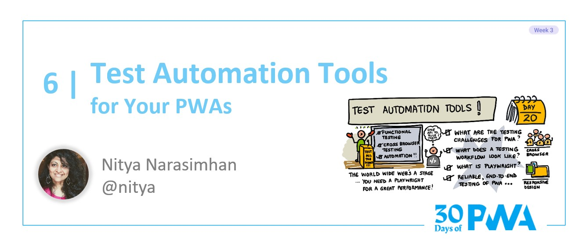

# 3.6: Test automation tools

## *Coming soon!*

### WHAT WE'LL COVER TODAY

| Section | Description |
| ------- | ----------- |
|**Test Challenges** | Cross-browser + functional testing, test automation - for PWA  |
|**Test Workflow** | Where, and how, can we integrate tests into PWA development process? |
|**Introduction**| Overview of Playwright Test, Tools & API |
|**Integration** | Using Playwright for reliable, end-to-end testing for PWA |
|**Exercise**| Create, debug, automate, and profile, tests for a sample PWA |
