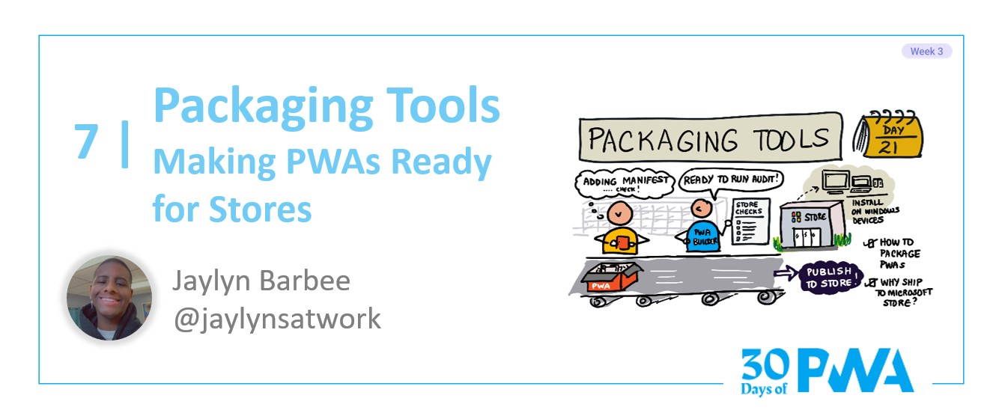

# 3.7: Packaging tools

**Author: Jaylyn Barbee [@jaylynsatwork](https://twitter.com/jaylynsatwork)**

Welcome to **Week 3 Day 7** of #30DaysOfPWA! Want to learn more about this project? Check out our [Kickoff](../kickoff.md) post to get more details on the content roadmap and contributors. Now, let's dive in!

**Author: Jaylyn Barbee [@jaylynsatwork](https://twitter.com/jaylynsatwork)**

Welcome to **Week 3 Day 7** of #30DaysOfPWA! Want to learn more about this project? Check out our [Kickoff](../kickoff.md) post to get more details on the content roadmap and contributors. Now, let's dive in!

### WHAT WE'LL COVER TODAY

| Section | Description |
| ------- | ----------- |
| **Introduction** | Introduction to packaging for the Windows Store |
| **The Process** | Overview of how to package for the actual process of using pwabuilder.com to package for the Windows Store |
| **Why the Microsoft Store?** |An explanation of why you would chose the Microsoft Store over any others |
