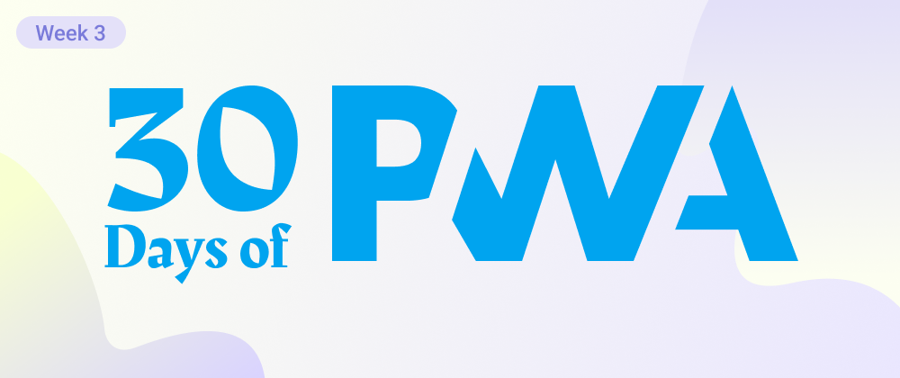

# Week 3. PWA Developer Tools

## WHAT WE'LL COVER IN WEEK 3

### 3.1 | &nbsp; [Get started tools](01.md)

* PWA starter
* PWA Builder

### 3.2 | &nbsp; [Authoring tools](02.md)

* PWA VS Code extensions
* Boilerplate project starter
* Workbox

### 3.3 | &nbsp; [Debugging tools 1](03.md)

* Why browser DevTools are useful?
* Testing on other devices
* Making sure the app is installable
* Reloading manifest changes
* Checking if your service worker is running
* Troubleshooting cache issues
* Testing offline support

### 3.4 | &nbsp; [Debugging tools 2](04.md)

* Simulating Push
* Debugging background sync and fetch
* ...

### 3.5 | &nbsp; [Auditing tools](05.md)

* PWA builder and VS Code extension
* Lighthouse
* WebHint
* Accessibility Insights

### 3.6 | &nbsp; [Test automation tools](06.md)

* Playwright
* GitHub actions
* WebDriver/EdgeDriver 

### 3.7 | &nbsp; [Packaging tools](07.md)

* PWA builder
