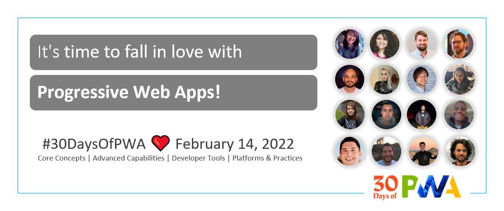

# Kickoff - Announcing "30 Days of PWA" Blog Series

**Author: Beth Pan | [@beth_panx](https://twitter.com/beth_panx)**

Welcome to our new learning series focused on the fascinating world of Progressive Web Apps (PWA)!

Starting February 14th, 2022, for 30 days, we will publish articles that aim to introduce developers to Progressive Web App. We will have content that covers 0-level to 200-level topics. Each post should take you 5-10 minutes to read and is followed by a sample snippet or exercise. You will need some basic web development knowledge to follow along. We hope that beginners will quickly pick up the content and that experts will also learn a few new things. 

## The Roadmap

The series of #30DaysOfPWA is structured into 4 top-level topics:
* `Core Concepts`: Learn the fundamental concepts and components of a PWA.
* `Advanced Capabilities`: Explore web capabilities APIs, status, and examples of use.
* `Developer Tools`: Learn about key authoring, debugging, auditing, testing and packaging tools for PWA.
* `Platforms & Practices`: Learn good practices and platform-specific support for PWA.

## The Schedule

Please be sure to bookmark this page or the homepage of this project (https://aka.ms/learn-pwa/30Days-blog) as the below list of topics will be updated as each blog post is published. 

> **Kickoff** – Announcing "30 Days of PWA" Blog Series (this post)

> **Week 1 (2/14-2/21)** `Core Concepts`

* Week 1 Day 1 - [Introduction to Progressive Web Apps](core-concepts/01.md)
* Week 1 Day 2 - [Building Blocks: Core Components of PWAs](core-concepts/02.md)
* Week 1 Day 3 - [HTTPS: Make PWAs Secure](core-concepts/03.md)
* Week 1 Day 4 - [Service Workers: Make PWAs Reliable, Work Offline](core-concepts/04.md)
* Week 1 Day 5 - [Web App Manifest: Make PWAs Installable](core-concepts/05.md)
* Week 1 Day 6 - [Web Capabilities: Drive Rich Platform Experiences](core-concepts/06.md)
* Week 1 Day 7 - [QuickStart: Build and Audit Your First PWA](core-concepts/07.md)

> **Week 2 (2/21-2/28)**`Advanced Capabilities`

* Week 2 Day 1 - [Introducing the Advanced Capabilities of Progressive Web Apps](advanced-capabilities/01.md)
* Week 2 Day 2 - [Creating Application Shortcuts](advanced-capabilities/02.md)
* Week 2 Day 3 - [Sharing Content from and with Your App](advanced-capabilities/03.md)
* Week 2 Day 4 - [Display Content in the Title Bar](advanced-capabilities/04.md)
* Week 2 Day 5 - [Caching Your App's Data](advanced-capabilities/05.md)
* Week 2 Day 6 - [Synchronizing App Data in the Background](advanced-capabilities/06.md)
* Week 2 Day 7 - [Notifying Your Users of Updates](advanced-capabilities/07.md)

> **Week 3 (3/1-3/7)**`Developer Tools`

* Week 3 Day 1 - [Getting Started Tools](dev-tools/01.md)
* Week 3 Day 2 - [Authoring Tools](dev-tools/02.md)
* Week 3 Day 3 - [Debugging Tools (Part 1)](dev-tools/03.md)
* Week 3 Day 4 - [Debugging Tools (Part 2)](dev-tools/04.md)
* Week 3 Day 5 - [Auditing Tools](dev-tools/05.md)
* Week 3 Day 6 - [Test Automation Tools](dev-tools/06.md)
* Week 3 Day 7 - [Packaging Tools](dev-tools/07.md)

> **Week 4 (3/8-3/14)**`Platforms & Practices`

* Week 4 Day 1 - [Installability for PWAs](platforms-practices/01.md)
* Week 4 Day 2 - [Best Practices for PWA Engagement](platforms-practices/02.md)
* Week 4 Day 3 - [Distributing Your PWA](platforms-practices/03.md)
* Week 4 Day 4 - [Best Practices for PWA Reliability](platforms-practices/04.md)
* Week 4 Day 5 - [PWAs and Maintainability](platforms-practices/05.md)
* Week 4 Day 6 - [PWA Maintainability Part 2: Web Component](platforms-practices/06.md)
* Week 4 Day 7 - [Best Practices for PWA UI/UX](platforms-practices/07.md)

> **Summary** - We conclude with a [wrap-up](summary.md) post summarizing learnings from this journey, and outlining resources and next steps you can take from here.

## Brought to you by:

This is a multi-team effort from folks across the Microsoft Edge, Windows, and Developer Relations teams. We welcome contributions from the broader community - learn [how you can contribute](https://github.com/microsoft/win-student-devs#contributing) to help us make this a better resource for the community.

 Here are the current contributors, in alphabetical order:

 * Aaron Gustafson | [@aarongustafson](https://twitter.com/AaronGustafson) - _Microsoft Edge_
 * Amrutha Srinivasan | [@amruthasrin​](https://twitter.com/amruthasrin) - _Microsoft Windows_
 * Beth Pan | [@beth_panx](https://twitter.com/beth_panx) - _Microsoft Windows_
 * Chait Pinnamaneni | [@noobtiger11](https://twitter.com/noobtiger11) - _Microsoft Edge_
 * Diego González​ | [@diekus](https://twitter.com/diekus) - _Microsoft Edge_
 * Jaylyn Barbee | [@jaylynsatwork](https://twitter.com/jaylynsatwork) - _Microsoft Windows_
 * Judah Himango | [@JudahGabriel](https://twitter.com/JudahGabriel) - _Microsoft Windows_
 * Justin Willis | [@JustinWillis96](https://twitter.com/Justinwillis96) - _Microsoft Windows_
 * Kenneth Rohde Christiansen​ | [@kennethrohde​](https://twitter.com/kennethrohde) - _Intel Web Platform Engineering_
 * Marcus Felling | [@MarcusFelling](https://twitter.com/MarcusFelling) - _Microsoft .NET_
 * Maxim Salnikov | [@webmaxru](https://twitter.com/webmaxru) - _Microsoft Norway Developer Relations_
 * Nikola Metulev | [@metulev](https://twitter.com/metulev) - _Microsoft Windows_
 * Nitya Narasimhan | [@nitya](https://twitter.com/nitya) - _Microsoft Cloud Advocacy / DevRel_
 * Patrick Brosset | [@patrickbrosset](https://twitter.com/patrickbrosset) - _Microsoft Edge_
 * Stephanie Stimac | [@seaotta](https://twitter.com/seaotta) - _Microsoft Edge_
 * Zachary Teutsch | [@devteutsch](https://twitter.com/devteutsch) - _Microsoft Windows_

---

## We Need Your Help!

We would love to make this a more useful resource for students and beginners of all backgrounds - and we need your help! Consider taking one or more of the following actions:

* 1️⃣ _Did you find this content useful?_
    - Give us a 🌟 on [GitHub](https://aka.ms/learn-PWA/30Days-github). 
    - Share a blog post describing your experience.
* 2️⃣ _Do you have feedback to help us improve it?_  
    - Join the 💬 Discussion on [GitHub](https://aka.ms/learn-pwa/30Days-ghd).
    - Leave Comments on [dev.to](https://aka.ms/learn-PWA/30Days-devto) (link goes live on 2/14). 
    - Leave Comments on [Tech Community](https://aka.ms/learn-PWA/30Days-tc) (link goes live on 2/14).
* 3️⃣ _Have something you built or wrote in context?_ 
    * Tag us 🏷 on Twitter with [#30DaysOfPWA](https://aka.ms/learn-PWA/tag-twitter). 
    * Join the [PWA community](https://aka.ms/learn-PWA/join-twitter) on Twitter.
    * Share your [feedback and suggestions](https://aka.ms/learn-pwa/30Days-survey) on anything and everything related to this series! We greatly appreciate your feedback as we reflect on lessons learned, what went well, and what we can do to improve this experience for future projects.
    * [Reach out to us](mailto:30DaysOfPWA-help@microsoft.com) with any questions or comments.