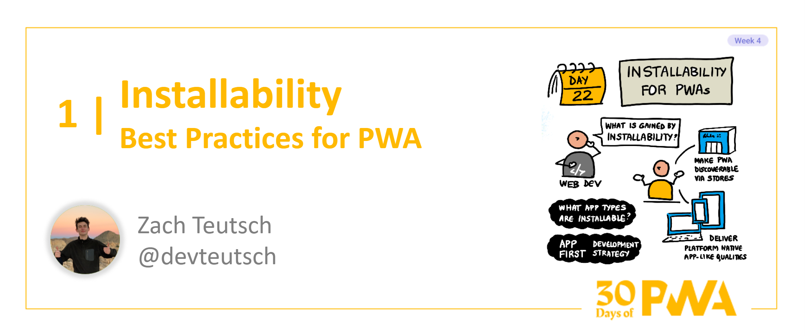

# 4.1: Installability for PWAs

**Author: Zach Teutsch [@devteutsch](https://twitter.com/devteutsch)**

Welcome to Week 4, Day 1 of the [30 Days of PWA](https://aka.ms/learn-pwa/30Days-blog) series! Now that we've seen how to start building PWAs and what basic and advanced capabilites they bring, it's time to dive into what a _good_ PWA really looks like it, and how we can start to build quality applications ourselves. Week 4 will be all about some of the best practices and technologies you can use to really polish up your PWA.

### A Quick Note
This article is about the best practices for installability and when adding installation makes sense for a web application. If you're looking for the basics on how to add installation to your PWA, check out the [Core Concepts article on Installation]() from Week 1.

## You Don't Install Websites, You Install Apps

One of the most important pieces of PWA installability is remembering that PWAs are **apps first**, and websites second. When a user installs an application to a device, they expect a certain standard of use and design that they've come to expect on whatever platform they use. PWAs are more than just installable websites, they are functional and integrated application experiences that _meet the expectations of the platform_.

## So What? Apps, Websites, Who Cares?

Seeing your PWA as an application instead of a website sets a different standard for the development of your product. It also forces the developer to think about whether or not their product even makes sense as a PWA. An app that is going to be installed needs to make sense within the context of the platform, and if it doesn't, it might just be better off as a website.

Here are some questions you can ask when planning your PWA's development:

* _**What is going to be gained by the user from installing this app?**_
 
* _**Does my app have to the potential to integrate with the operating system?**_

* _**Does my app have motivation for regular use and re-engagement?**_

* _**How will my app behave in offline conditions?**_

* _**Does the appearance and feel of my app match with comparable native experiences?**_

It may not be necessary to apply all these questions to your app, but it's a great starting place for thinking about what sorts of experiences should even be installed as PWAs in the first place. 

Imagine your app on somebody's Home Screen or Taskbar. Does it make sense there?

## Well, show us a good PWA, then.

There's a ton of great PWAs out there, but [Twitter](https://www.microsoft.com/store/productId/9WZDNCRFJ140) is a great example of a well-known platform that has created a really well-done PWA for their users. Twitter's PWA takes advantage of many of the available web capabilities to create an integrated app-like experience. 

Some of the things that I like about Twitter's PWA:

**Smooth, app-like user experience**

Twitter's PWA doesn't show a lot of the behaviors that many typical websites would:
* It uses the `standalone` [display mode]() to present the the window as an app. 
* The view never refreshes, the shell UI is always visible and only the main content area changes with user interaction. 
* There's very little latency on navigation. Fetched content (like the tweets themselves) may take a second to load, but the UI interactivity itself is nearly instant.

We'll learn more about best practices for PWA UI/UX on [Day 7]() of Platforms and practices week.

**Consistent offline behavior**

Even though Twitter relies pretty heavily on connectivity, it still maintains as much of the app interaction as possible when connection is lost (just like any native app would).

When connection is lost, the app still loads its view and the UI is still navigable. If there are any tweets stored locally, those will be displayed. If there aren't, the user will get a notice that doesn't interfere with the rest of the UI:

We already learned a little about offline behavior on [Day 5](https://microsoft.github.io/win-student-devs/#/30DaysOfPWA/core-concepts/05) of Week 1 and more is coming in the [reliability article]() later this week.

**OS integration and plenty of web capabilities**

Twitter also makes great use of available web capabilities to integrate with your device. Just to list some:

* Push notifications
* Sharing from Twitter
* Sharing to Twitter
* Badging
* Shortcuts

We already covered how to use all these capabilities and more in [Week 2: Advanced Capabilities.]() Go check them out!

**Published to the Microsoft Store**

Twitter takes advantage of one the best parts about PWAs: discoverability on the web _and_ in app stores.

The same PWA the can be installed from the browser can be distributed in app stores. You can learn more about packaging for the stores in the [PWABuilder article](link) and more info about best practices for distribution to different app stores is coming [later this week.]()

## Summary

At the end of the day, best practices for PWA installability are really just about best practices for PWAs in general. When you prompt a user to install your app to their machine, that app needs to live up to the expectations of applications on that platform. Luckily enough, we're going to spend all week building on what we've already learned about PWAs and seeing some best practices for making solid PWA experiences. If you're looking to get a head start, check out the [PWA Starter]() for a PWA template that's built with best practices in mind.

### **Exercise**

Think about some of your favorite web experiences that you use or have built yourself. 

Would any of these experiences make good PWAs? Would any of them not? 

What could these experiences gain by taking advantage of some of the capabilites that PWAs bring to the table?

### **Resources**

* **[Microsoft PWA Overview](https://docs.microsoft.com/en-us/microsoft-edge/progressive-web-apps-chromium/)**
* **[PWA Advanced Capabilities Week]()**
  

