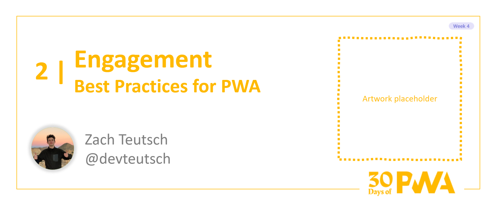

# 4.2: Best Practices for PWA Engagement

**Author: Zach Teutsch [@devteutsch](https://twitter.com/devteutsch)**



Welcome to Week 4, Day 2 of the [30 Days of PWA](https://aka.ms/learn-pwa/30Days-blog) series! Now that we've seen how to start building PWAs and what basic and advanced capabilites they bring, it's time to dive into what a _good_ PWA really looks like it, and how we can turn our PWAs into quality application experiences. Week 4 is all about some of the best practices and technologies you can use to really polish up your PWA.

### A Quick Note
This article is about the best practices for engagement with PWAs. If you're looking for the basics on push notifications and badging in PWAs, check out the [Notifying Your Users of Updates](../advanced-capabilities/07.md) article from Week 2.

## Today's Plan
As we briefly touched on in [Day 1](01.md), a carefully thought out engagement strategy can be one of the cornerstones of a great PWA. With the "one codebase" nature of PWA, it's also easy to keep your engagement strategy consistent across different devices and platforms. 

Today, we're going to take a look at how PWAs stack up in terms of engagement and see how we can build on what we already learned about push notifications to get started off on the right foot with engagement.

## Comparing PWA Engagement
You may not have taken the dive into making your first PWA, but others have! Engagement with PWAs has been a success story for several companies that have experimented with redesigning their web experiences as PWAs. [PWAstats.com](https://www.pwastats.com/) is a great resource for seeing how PWAs can improve many factors of your app, including engagement. Some cherry-picked figures related to engagement:

* **Starbucks doubled daily active users with their PWA**
* **Tinder's PWA saw engagement increase across the board**
* **Forbes saw a 2x increase in session lenth and 20% increase in impressesions through their PWA**

Granted, progressive web apps aren't a magic, one-size-fits all solution for engagement, but they do give you all the tools you need for building a re-engageable application.


## Improving Engagement with Actionable Push Notifications
We've seen some numbers. Now let's take a look at how we can take advantage of [PWA notification capabilities](https://docs.microsoft.com/en-us/microsoft-edge/progressive-web-apps-chromium/how-to/notifications-badges) to improve engagement on our app.

### Content Comes First
Before you even think about sending push notifications, make sure your PWA has enough engageable content and reusability to even justify sending a push notification in the first place. If there's nothing to do on your app, why prompt a user to visit?

### What Does "Actionable" Mean?
A great place to start with push notifications for your PWA is to make sure every notification has an action associated to it. When a user recieves a notification, there should be something that the user can **do** that is directly related to your push. This could mean:

* Some new content to read or engage with
* A message that the user can reply to
* A new feature for the user to try out

A quality notification will give the user something to do on your PWA, not just have them open the application for the sake of opening it.

## Let's See Some Code!

We can build on the snippets that we saw in the [Notifying Your Users of Updates](../advanced-capabilities/07.md) article to keep our notifications actionable in practice. If you haven't seen the notifications snippets from that post, go check them out and then come back to this.

Using the [Notification API](https://developer.mozilla.org/en-US/docs/Web/API/Notification/Notification), we can take advantage of the `data` property to associate our notification with any structured data that we want.

So, if we want to associate our notification with a specific location in our PWA, the notification payload we send could look something like this:

```javascript
{
    title: "Our Notification Title",
    body: "Our Notifcation Message",
    icon: "path/to/icon.png",
    data: {
        path: "<relative path for our notification>"
    }
}
```

Now, we can adjust the push listener in our service worker to make sure the displayed Notification captures our new `data` property:

```javascript
self.addEventListener('push', (event) => {
    const notificationData = JSON.parse(event.data.text());

    event.waitUntil(
        self.registration.showNotification(notificationData.title, {
            body: notificationData.message,
            icon: notificationData.icon,
            data: notificationData.data // This is the only change from week 2
        });
    );
});
```

Our data property is now associated with our notification, and we can use that property in the listener for the `notificationclick` event in our service worker:

```javascript
self.addEventListener('notificationclick', (event) => {
    // close the notification
    event.notification.close(); 
    // append our relative path to our origin
    var fullPath = self.location.origin + event.notification.data.path; 
    // open our PWA at that location
    clients.openWindow(fullPath); 
});
```

Using this strategy, we can easily associate our notification with specific content on our PWA, directing our users directly to the portion of our app that we want them to engage with.

_Note:_ This is a very basic implementation for our listener and skips out on some case handling for the sake of simplicity. You can see more detailed implementations in the [Push Notifications Demo project](https://github.com/MicrosoftEdge/pushnotifications-demo) or in the MDN specification for [`openWindow()`](https://developer.mozilla.org/en-US/docs/Web/API/Clients/openWindow).

## Further Notification Behavior with Actions

[Some browsers](https://developer.mozilla.org/en-US/docs/Web/API/notification/actions#browser_compatibility), including Edge and Chrome, have support for Notification `actions`, which allow you to add multiple options to a notification.

You can add actions to your Notification payload like so:
```javascript
{
    title: "Our Notification Title",
    body: "Our Notifcation Message",
    icon: "path/to/icon.png",
    actions: [
        {action: "firstAction", title: "First Action", icon: "action1/icon.png"},
        {action: "secondAction", title: "Second Action", icon: "action2/icon.png"}
    ]
}
```

We can update the notification we show to include our actions: 

```javascript
event.waitUntil(
    self.registration.showNotification(notificationData.title, {
        body: notificationData.message,
        icon: notificationData.icon,
        actions: notificationData.actions
    });
);
```

And then in our listener, we can handle different actions:

```javascript
self.addEventListener('notificationclick', (event) => {
    // close the notification
    event.notification.close(); 
    // get the action
    var action = event.notification.action;

    if(action === "firstAction") {
        // do something specific to first action
    } else if( action === "secondAction") {
        // do something specific to second action
    } else {
        // default if actions aren't supported or an action wasn't clicked
    }
    
});
```

With actions, we can make our notifications a bit more dynamic and interactive for our users. You could even use the `data` property to provide paths for every action, generalizing this solution and making it a bit more reliable in practice. To make it a bit easier on yourself, the [PWA Studio VSCode extension](https://marketplace.visualstudio.com/items?itemName=PWABuilder.pwa-studio) also has support for code snippets for working with notifications, with and without actions.

_Note:_ It's important to always provide default behavior. Actions aren't supported in some browsers and can behave differently in browsers that do support them.

## Wrapping Up
Today, we took a brief look at how engagement can work on PWAs and how to get started working with quality, actionable notifications for our applications. You can adapt the tricks we showed you today to help with your own engagement strategy for your PWAs, but don't forget that every application is going to be different: experiment and find what works for you!

## Resources
* [**Notification specification**](https://developer.mozilla.org/en-US/docs/Web/API/Notification/Notification)
* [**Re-engage users with badges, notifications, and push messages**](https://docs.microsoft.com/en-us/microsoft-edge/progressive-web-apps-chromium/how-to/notifications-badges) article on Microsoft Docs
* [**Push Notifications Demo Project**](https://github.com/MicrosoftEdge/pushnotifications-demo)
