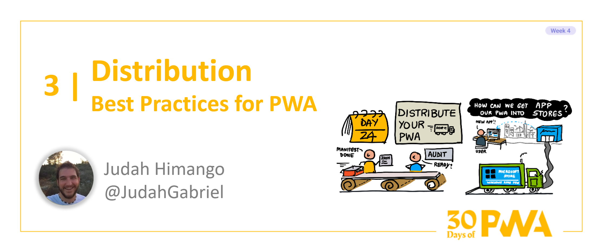

# 4.3: Distributing Your PWA

### What I'll cover today

| Section | Description |
| ------- | ----------- |
| **Why App Stores?** | Distributing your PWA through app stores brings more users to your app  |
| **Distribution model** | What publishing a PWA to app stores looks like |
| **Example** | A quick walk-through of publishing your PWA to an app store |

Welcome to **week 4 day 3** of [30 days of PWA](https://aka.ms/learn-pwa/30Days-blog). Today, you'll discover how to distribute your PWA to app stores and the benefits in doing so.

## Why App Stores?

When I talk about publishing PWAs to app stores, devs often ask, "Why? Isn't the point of PWAs that you don't need an app store?"

And they're right, you don't _need_ app stores. A great benefit of the web is there are no gatekeepers: you can publish your app without needing anyone's permission. Your app is truly your own, and you don't have to wait for app reviews to submit your app, add features to your app, or fix bugs. You don't have to share 30% of your app revenue with the app store.

But app stores have their benefits too. Since the mobile computing explosion of the early 2000s, **we've trained a generation of users to look for apps in app stores.** And since Progressive Web Apps are, well, _apps_, why not list your app in the places where users go looking for apps? Your PWA becomes more discoverable -- and your app gains more users -- when you publish to app stores. 

Your PWA will be easier to install. While users can add your PWA to homescreen or install from the browser, many non-technical users are unfamilar with these tasks. Publishing your PWA to app stores lets users find and install your app using their normal workflow: app store ➡ search ➡ install. 

You'll get better engagement from users as your app tile appears where users are looking: in their Start Menu and Taskbar (Windows), Dock (Mac), and home screen (Android and iOS).

Users will be more likely to trust your app. An additional level of safety and security comes with apps that have gone through app store review processes.

## Distribution model

Hopefully I've piqued your interest in getting your PWA published to app stores. 

To publish, you'll follow three steps:

1. Create an app package for the app store
2. Register for a developer account for the app store
3. Submit your app package for review

### 1. Create an app package

In an ideal world, you'd submit your PWA's URL to the app store(s), and they'd publish your app. 

But currently, app stores don't support PWAs natively. Instead, app stores require you to wrap your PWA in app packaging, making it look like a native app:

- An `.msix` package (Windows)
- An `.aab` package (Android)
- An `.app` archive (iOS and Mac)
- An `.apk` package (Oculus, Samsung, Amazon)

Fortunately, there are free developer tools that create these app packages for you. Microsoft's free and open source [PWABuilder](https://www.pwabuilder.com) is such a tool. With PWABuilder, you input your PWA's URL, and PWABuilder will generate app packages for your desired app stores.

### 2. Register for a developer account

Once you generate your app package, you'll need to create a developer account in order to submit your PWA for app store review:

- For Windows, register with [Microsoft Partner Center](https://partner.microsoft.com/)
- For Android, register with [Google Play Console](https://play.google.com/console/about/)
- For iOS and Mac, register with [Apple Developer](https://developer.apple.com/account/)
- For Oculus, register with [Oculus Developer Center](https://developer.oculus.com/documentation/web/pwa-submit-app/#upload-the-pwa-in-the-oculus-developer-center)
- For Samsung, register with [Samsung Developer Center](https://developer.samsung.com/)
- For Amazon, register with [Amazon Developer Portal](https://developer.amazon.com/apps-and-games)

While all these app stores support PWAs in some form, know that Microsoft, Android, and Amazon support PWAs the best:

- Windows has first-class support for Store PWAs through [Hosted App Model](https://blogs.windows.com/windowsdeveloper/2020/03/19/hosted-app-model/), where your PWA is hosted by Chromium-based Edge.
- Android has first-class support for Store PWAs through [Trusted Web Activity](https://developer.chrome.com/docs/android/trusted-web-activity/), where your PWA is powered by Chrome.
- Amazon's App Store has improved support for Store PWAs, allowing you to submit your URL directly to the store, which is then powered by a web view when run on Amazon devices.

The other app stores and platforms tend to have lesser support for PWAs, usually involving a native app wrapping a web view with some PWA functionality available. Consider, for example, that publishing a PWA on iOS won't have Push Notifications available, because iOS and mobile Safari don't currently support the web standard for push notifications. 

The gap is closing, however, as platforms evolve and continue to improve their support for web technology. 

In the future, we expect to see first-class support for PWAs in all the major app stores. Even as it stands today, your PWA will run on all platforms, and as long as you progressively enhance to use PWA features, your app will light up as platforms support more PWA functionality.

### 3. Submit your app package for review

Once you've registered with the app store's developer program, submit your app for review through the developer portal.

- [How to submit your PWA to Microsoft Store](https://blog.pwabuilder.com/docs/windows-platform/)
- [How to submit your PWA to Google Play](https://blog.pwabuilder.com/docs/android-platform/)
- [How to submit your PWA to iOS App Store](https://blog.pwabuilder.com/docs/ios-platform/)

Once you submit your app package, it's treated like any other app: app store reviewers will inspect your app and, once approved, your app will be published in the app stores of your choosing.

**Subsequent updates of your PWA don't need to be published through the Store**. Since your PWA loads its asssets dynamically, any features or bug fixes you push to your web server will _automatically be reflected in your app in the Store_. Typically, you'd only need to update your app store package if changing things like app icons, app name, description, screenshots, or other metadata about your app.

## Let's publish a PWA to an app store

Go to [PWABuilder.com](https://www.pwabuilder.com) and input the URL to your PWA. (Don't have one yet? You can use https://webboard.app to try it out.)

PWABuilder will analyze your PWA to ensure you have a manifest and a service worker:

Advance to the publish page and choose `Windows` -> `Test Package`:

(Why `Test Package`? This will let us test out our PWA on a Windows device before we publish to the Store.)

This will download a zip file containing your app package and instructions for testing it on your Windows device. If all looks good, you're ready to [publish to the Microsoft Store](https://blog.pwabuilder.com/docs/publish-a-new-app-to-the-microsoft-store/):

1. Login to your [Microsoft Partner Center account](https://partner.microsoft.com)
2. Copy your [publisher values](https://blog.pwabuilder.com/docs/finding-your-windows-publisher-info/)
3. In PWABuilder, click `Windows` -> `Store Package`, and paste in your publisher values.

Your download will contain a Store-ready app package, which you can now upload to Partner Center for review. 

Approval typically takes 24-48 hours, and once approved, you're in the app store. 😎

## Summary

Publishing your PWA to app stores can make your app more discoverable, bringing more users into your app.

To publish your PWA to app stores, create an app package using tooling like [PWABuilder](https://www.pwabuilder.com).

Once you've created your app package, submit the package to the app store's developer portal for review.

Happy packaging! 
