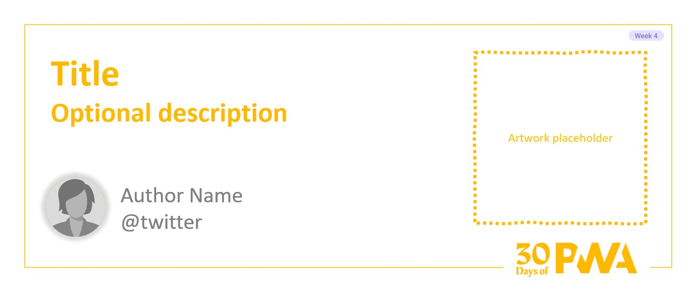

# 4.4: Best Practices for PWA Reliability

## *Coming soon!*

### WHAT WE'LL COVER TODAY

| Section | Description |
| ------- | ----------- |
| **Overview** | How do you maintain a reliable user experience when offline? What remains functional about your application and what doesn't? |
| **Motivation** | Most installable applications do not depend (fully) on an internet connection. How do we achieve something similar in a PWA?|
| **Example** | IndexedDB (idb) walkthrough. |
| **References** | Caching Your App's Data |
