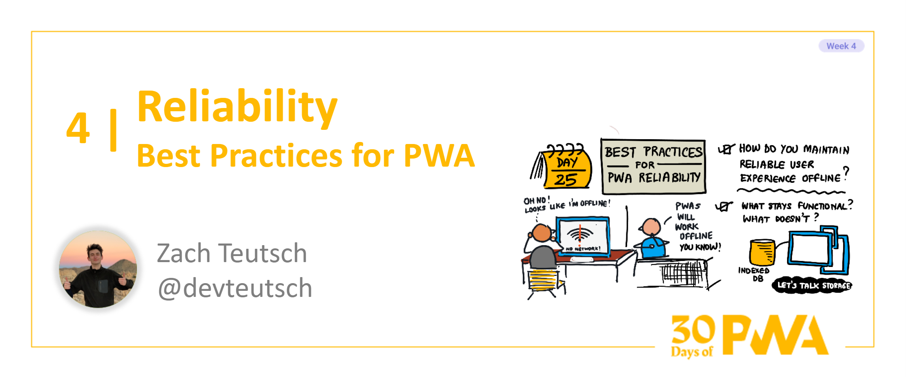

# 4.4: Best Practices for PWA Reliability

**Author: Zach Teutsch [@devteutsch](https://twitter.com/devteutsch)**

Welcome to Week 4, Day 4 of the [30 Days of PWA](https://aka.ms/learn-pwa/30Days-blog) series! Now that we've seen how to start building PWAs and what basic and advanced capabilites they bring, it's time to dive into what a _good_ PWA really looks like it, and how we can start to build quality applications ourselves. Week 4 is all about some of the best practices and technologies you can use to really polish up your PWA.



### A Quick Note
This article is about the best practices for reliability with PWAs. If you're looking for the basics on offline behavior and caching in PWAs, check out the [Make PWA Work Offline](../core-concepts/05.md) article from Week 1.

## What Does Reliability Look Like For PWA?
In general, reliability refers to whether or not your application can maintain a consistent user experience under different circumstances. Some of the issus that can follow under the umbrella of reliability:
* How fast your application loads on varying connection strengths
* How your application works in offline conditions
* How your application and services work as they scale up and increase in usage
* How your application runs on older and less powerful devices

For PWA, reliability issues related to your user's internet connection are particularly of interest, as more traditional web experiences were heavily dependent on the availability of a connection. 

Today, we're going to build on what we saw about caching in Week 1 to see how we can take advantage of PWA capabilities to make our apps work well regardless of the strength or availability of the user's interent connection.

## Speeding Up Your PWA With Caching Strategies
One of the ways you can speed up your PWA and increase reliability is by minimizing requests to the network and making use of cached responses whenever possible. There are many caching strategies that you can take advantage of, but today we're just going to take a look at two popular options: `cache-first` and `stale-while-revalidate`.

## Cache-First
In the [Make PWA Work Offline](../core-concepts/05.md) article from Week 1, we saw a little bit about how a cache-first works. A cache-first strategy is exaclty what it sounds like: on a `fetch` event, our service worker will check the cache for the response first, and go to the network _only_ if the cache fails.

We saw this service worker snippet:
```javascript
self.addEventListener('fetch', event => {
    event.respondWith((async () => {
        const cache = await caches.open(CACHE_NAME);

        // Try the cache first.
        const cachedResponse = await cache.match(event.request);
        if (cachedResponse !== undefined) {
            
            return cachedResponse;
        } else {
            // Nothing in cache, let's go to the network.
        }
    }
}
```

Cache-first is a great strategy for quickly minimizing network requests, but it can be a bit naive and limiting if applied too generally to your application.

For static, long-term assets, cache-first works great. For quickly changing resources, however, a cache-first strategy can prevent data from getting much-needed updates and your user experience can suffer as a result.

Cache-first is a great starting point for improving performance reliability, but let's take a look at something a little more flexible.

## Stale-While-Revalidate
The `stale-while-revalidate` builds on cache-first to give us the best of both worlds: loading speed and freshness.

Like cache-first, this strategy will check the cache for the needed response and will return a match. However, instead of stopping there, we'll take the request to the network anyway, and update the cache in the background with the response. If there's a cache miss, we go straight to the network.

Let's update our service worker snippet to reflect this:
```javascript
self.addEventListener('fetch', event => {
    event.respondWith((async () => {
        const cache = await caches.open(CACHE_NAME);

        // Try the cache first like last time.
        const cachedResponse = await cache.match(event.request);
        if (cachedResponse !== undefined) {
            // Now, we fetch a new response and cache it in the background
            fetch(event.request).then( response => {
                cache.put(event.request, response.clone());
            });
            // We don't await the above line, so we return our cachedResponse right away
            return cachedResponse;
        } else {
            // Go to the network otherwise
        }
    }
}
```

With this approach, we get the speed benefit of loading a cached response right away, but balance it by keeping our cache relatively up-to-date. Next time we make that request, we will get the updated response instead of the same cached response over and over again.

## Maintaining Data Offline with IndexedDB
Caching works great for assets, but what about storing structured local data for our? We can use [IndexedDB](https://developer.mozilla.org/en-US/docs/Web/API/IndexedDB_API) to handle our local data storage to keep our user experience as intact as possible in offline circumstances. IndexedDB allows for asychronous storage of large quantities of structured data that would exceed the capabilites of our cache or LocalStorage. 

The API for IndexedDB can be a bit low-level for normal usage, so we'll be taking a look at simple wrapper called LocalForage.

## Using LocalForage to Manage Data
We can use a hypothetical example to see how we might use [LocalForage](https://localforage.github.io/localForage/) in an application.

Let's pretend we are working on a simple email client, and we want to store the X most recent emails so that if our PWA loses connection, our user could still read their latest emails.

_Note_: IndexedDB can be used from inside your application and your service worker, choose whatever (or both) works best for your use case.

First, we could create an instance (the same as a database) of localforage and name that instance:

```javascript
// our DB name
const databaseName = "EmailDB"
// create an instance with our name
var emailDatabase = localforage.createInstance({name: databaseName});
```

Now, let's add our data to it using a key-value pair:

```javascript
// Let's get our recent emails as an array
var emails = GetRecentEmails();
// and add that to our database
emailDatabase.setItem("recent-emails", emails);
```

Later, we can fetch our emails using the key and do something with the value:

```javascript
// Asynchronously fetch our emails and then populate our inbox
emailDatabase.getItem("recent-emails").then( emails => {
    PopulateInbox(emails);
});
```
And lastly, we can remove data just as easily:
```javascript
// remove based on key
emailDatabase.removeItem("recent-emails");
```

Super easy, right? LocalForage keeps its API to just a handful of features for ease of use, and you can learn more about it's capabilities [here.](https://localforage.github.io/localForage/) It's a great option for getting started with IndexedDB and for storing data for simple use cases.

If you need something more flexible for your PWA, there's also [idb](https://github.com/jakearchibald/idb), which is another great IndexedDB wrapper that packs  more of a punch when it comes to functionality. However, it is somewhat more involved when it comes to managing your database and its transactions, so get ready for more complexity.

## Wrapping Up
That's it for Best Practices for PWA Reliability! There's plenty more to do as far as making your PWA more reliable, but basic caching strategies and IndexedDB are great launching points for creating reliable offline web experiences. Only thing left to do now is to get out there and get caching!

## Resources
* [Making PWA Work Offline](../core-concepts/05.md)
* [Offline Cookbook](https://web.dev/offline-cookbook/)
* [MDN IndexedDB documentation](https://developer.mozilla.org/en-US/docs/Web/API/IndexedDB_API)
* [LocalForage](https://localforage.github.io/localForage/)
* [idb](https://github.com/jakearchibald/idb)
