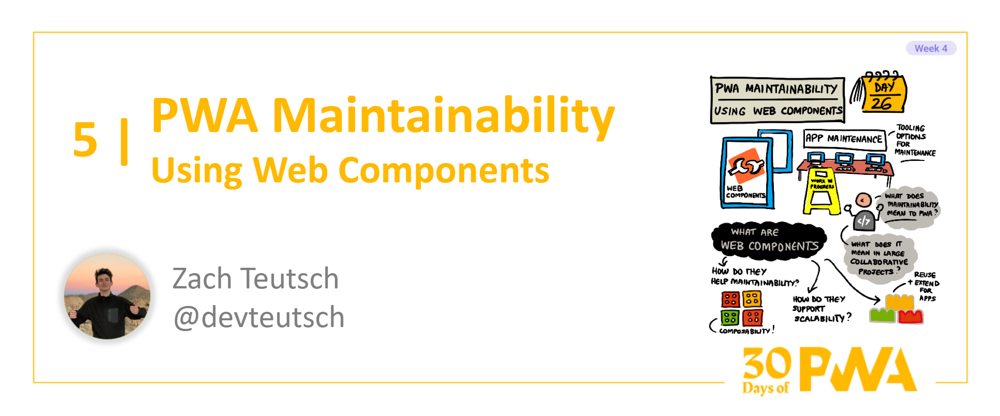

# 4.5: PWA Maintainability: Using Web Components

**Author: Zach Teutsch [@devteutsch](https://twitter.com/devteutsch)**

Welcome to Week 4, Day 5 of the [30 Days of PWA](https://aka.ms/learn-pwa/30Days-blog) series! Now that we've seen how to start building PWAs and what basic and advanced capabilites they bring, it's time to dive into what a _good_ PWA really looks like it, and how we can start to build quality applications ourselves. Week 4 is all about some of the best practices and technologies you can use to really polish up your PWA.



## Where Do We Start With Maintainability?
Keeping our PWA maintainable, or any application for that matter, can be a serious undertaking with tons of unique challenges. The web capabilities that make PWAs possible allow for more capable and complicated web experiences, but it comes with a price. How do we keep our increasingly complex PWA projects clean and extensible?

Out of the many options available to us, today we'll be looking at one technology we can leverage in our projects: **web components!**

## Web Components?
Web components are set of web technologies that allow you to create custom standalone components (like your very own `<custom-button>`, for example) that work anywhere on the web. They come with a whole suite of development advantages, but are especially valuable from a maintainability perspective. 

Let's take a look at what makes web components so awesome.

## Encapsulation with Shadow DOM

When we create a web component, all of our behavior, html, and styling is contained to that component. We don't have to worry about it interfering with other aspects of our project when we include our component in our application. This a huge bonus for maintainability: it allows us to segment our code and avoid overly-verbose spaghetti code in our project files. Additionally, for larger PWAs that may have multiple developers working at once, web commponents allow for concurrent contribution by keeping unrelated components separated from each other.

Web components make this possible using [**Shadow DOM**](https://developer.mozilla.org/en-US/docs/Web/Web_Components/Using_shadow_DOM#high-level_view), which allows our component to live in a "hidden" portion of our larger DOM tree. We can prevent clashing with the rest of our DOM by isolating the portion related to the web component. 

## Web Standard
Web Components are a **Web Standard**, which means they are considered a fundamental model for component behavior on the Web. This means we can rely on the web components we build to work just about everywhere:


Another benefit to this is that web component frameworks are generally small and fuly interoperable. This means that you can use web components within larger modern frameworks (like React or Angular) and they will still work as expected. You can even ditch the frameworks all together and build web components in vanilla Javascript.

As far as maintainability goes for our PWAs, this is great. We know our components will work in different browsers and frameworks, and we don't have to write extra code to keep our project functional. When we go to update or extend one of our components, we can work freely without worrying about compatability issues.

## Building Web Components with FAST
There are lots of framework options for building web components, but today we'll be using [the FAST framework](https://www.fast.design/docs/introduction) to see a beginner example.

Let's say we are building a naive `<movie-review>` element that will live in an `MovieReview.ts` file.

First, we can start with an element with a few attributes:

```typescript
import { FASTElement, customElement, attr } from '@microsoft/fast-element';

@customElement('movie-review')
export class MovieReview extends FASTElement {
    @attr movieName: string = "No Movie Listed";
    @attr rating: string = "0";
}
```

Next, we can provide an HTML template so we can display our attributes:

```typescript
import { FASTElement, customElement, attr, html } from '@microsoft/fast-element';

// our html template for our component
const template = html<MovieReview>`
    <div class="reviewDiv">
        <div class="nameDiv">${x => x.movieName}</div>
        <div class="ratingDiv">${x=> x.rating} stars!<div>
    </div>
`

// that we can pass into our customElement
@customElement({
    name: 'movie-review',
    template
})
export class MovieReview extends FASTElement {
    @attr movieName: string = "No Movie Listed";
    @attr rating: string = "0";
}
```

We could then use our element like so:
```html
<movie-review moviename="Fast and Furious: Tokyo Drift" rating="5">
```

This is just going to give us some boring black text. Let's see how we can add styling:

```typescript
import { FASTElement, customElement, attr, html, css } from '@microsoft/fast-element';

const styles = css`
    .reviewDiv {
        border: 1px solid black;
        display: inline-block;
        padding: 10px;
    }

    .nameDiv { 
        font-size: 24; 
        font-weight: bold;
        font-style: italic;
    }

    .ratingDiv { 
        color: blue; 
    }
`
```

And we can pass those styles in just like our template:

```typescript
@customElement({
    name: 'movie-review',
    template,
    styles
})
export class MovieReview extends FASTElement {
    @attr movieName: string = "No Movie Listed";
    @attr rating: string = "0";
}
```

Our _beautiful_ component would then look something like this:


We now have a reuseable `<movie-review>` component. As you can see, this example is fairly naive, but you can start to imagine the possibilites. Let's say we had a more in-depth `<movie-review>` component that we could use inside a related `<movie-review-list>` component. We could then change the appearance and functionality of our movie reviews separate from the list that displays them, allowing us extend and update our `<movie-review>` component regarldess of the environment it lives in. Encapsulated and maintainable!

If you want more depth on building quality components and adding functionality, or if you want to leverage the dozens of pre-built components FAST offers, check out the [FAST documentation](https://www.fast.design/docs/introduction).

FAST isn't the only way to build web components: check out this [blog post](https://webcomponents.dev/blog/all-the-ways-to-make-a-web-component/) for a comprehensive list of options.

## Wrapping Up
Today, we learned how we can write maintainable web code and power up our PWAs with web components. We just barely scratched the surface of web components and the FAST framework, and there's a ton more to dive into if you want to really make use of web components in our PWAs. Check out the resources for more learning!

## Resources

* **[FAST documentation](https://www.fast.design/docs/introduction)**
* **[MDN documentation on Web Components](https://developer.mozilla.org/en-US/docs/Web/Web_Components)**
* **[Building PWAs with Web Components](https://medium.com/pwabuilder/building-pwas-with-web-components-33f986bf8e4c)** article by Justin Willis
