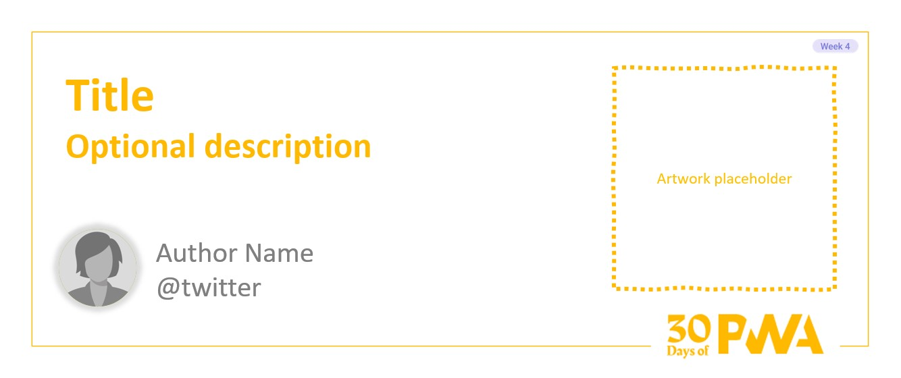

# 4.5: PWAs and Maintainability

## *Coming soon!*

### WHAT WE'LL COVER TODAY

| Section | Description |
| ------- | ----------- |
| **Overview** | What does maintainability look like in larger (and possibly collaborative) web projects? What are some tooling options for maintainable codebases?|
| **Motivation** | Keeping your PWA extensible and maintainable as modern web-tech allows for increasingly complex web applications. |
| **Example** | Example of setting up a maintainable code base in VS Code. |
| **References** | Web Components |
