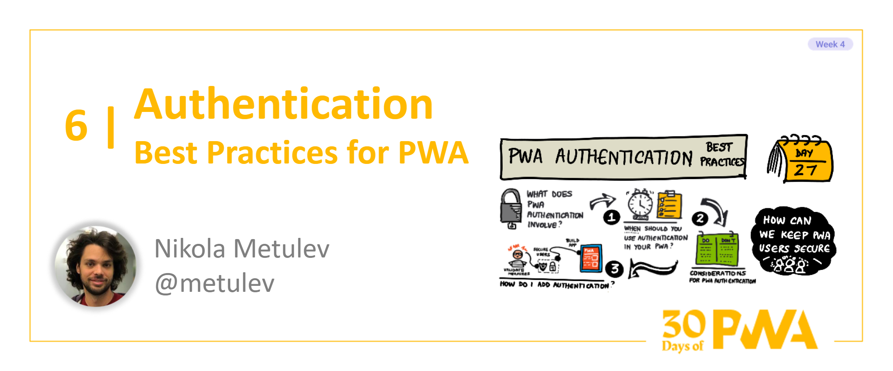

# 4.6: Best Practices for PWA Authentication

**Author: Nikola Metulev [@nmetulev](https://twitter.com/nmetulev)**

Welcome to Week 4, Day 6 of the [30 Days of PWA](https://aka.ms/learn-pwa/30Days-blog) series! Now that we've seen how to start building PWAs and what basic and advanced capabilities they bring, it's time to dive into what a _good_ PWA really looks like it, and how we can start to build quality applications ourselves. Week 4 is all about some of the best practices and technologies you can use to really polish up your PWA.




Sooner or later, your app scenarios will require your users to be authenticated, whether it is to access and modify data, to roam data across devices, to build personalized or shared experiences, or many (many) more reasons that have a dependency on the ability for your users to sign in. In this article, we'll cover considerations that you will go through when deciding how to authenticate users and what are some of the best practices and available APIs that can help keep your users secure when authenticating.

## Authenticating users

Verifying someone's identity through a password is one of the oldest authentication methods used heavily across the web. A majority of sites today require users to create and remember passwords and many users are very familiar with the concept. For developers, passwords might seem like the easiest choice when adding authentication. 


However, implementing an authentication experience that provides good security and good user experience with a traditional username and password approach is easier said than done. Passwords are often weak, forgotten, stolen, and very frequently reused. There are a ton of best practices that you could apply to avoid many of the common issues with passwords, such as only storing password hashes, properly encrypting network traffic, implementing strict password requirements, and more. However, even if you do everything right, you can not avoid the human in the process and it only takes a leaked reused password to cause a problem. 

There are really two main approaches to providing a secure and simple sign in experience for your users. The simplest is to integrate federated login with an identity provider your users will trust. The other approach is to implement  multi-factor and/or passwordless authentication. Let's look at how you could get started with both options.

## Federated authentication

Using an existing identity provider like Microsoft, Google, Facebook and others, can improve security and help avoid many of the issues with implementing your own username and password based authentication. Users will only need to remember a single password, and federated identity providers have systems in place to mitigate bad actors, enable single sign on, and add additional ways to verify users identity. 


Federated login is probably the easiest and fastest approach to get to a signed in user without requiring much work from you as the developer, while also keeping your users secure. 

While this model isn’t perfect, it grants some quick wins:

- Users don’t have to remember new passwords and don't have to create new accounts.
- Users are encouraged towards multi-factor authentication. (In fact, some work accounts require it.)
- The sign-in providers tend to have more security around suspicious activity, e.g. signing in from an unknown location, invalid password cooldowns, etc.
- You don't have to maintain usernames or passwords

### Adding Federated login to your PWA

The process to integrate with the various identity providers differs slightly, but the concept is usually the same. Most use [OAuth2](https://oauth.net/2/) to authenticate users and ask for consent for your application to sign them in and access their data. You are then given a token that your app can use to identify the users and access their information. Let's look at two examples of how you can quickly do this in your app.

#### `<pwa-auth>`

In most cases, to implement federated authentication in your app, you will use an authentication library. One of the easiest and quickest way to integrate with multiple identity providers at once is to use the `<pwa-auth>` web component. It builds on top of the identity providers' auth libraries and lazy loads them when they are needed, while providing a consistent interface across all providers.

First things first - to authenticate users with any identity provider, you will need to register you app with said provider. The process is usually straightforward, and the output is an app-id/client-id you can use with their library or `<pwa-auth>`. You can learn more about how to register to each of the providers supported by `<pwa-auth>` [here](https://github.com/pwa-builder/pwa-auth#creating-keys).

Once you have the app ids you want to use, you are ready to authenticate users. Let's import the component and use it in our app.

```html
<script type="module" src="https://cdn.jsdelivr.net/npm/@pwabuilder/pwaauth/dist/pwa-auth.js"></script>

<!-- To create a key, see https://github.com/pwa-builder/pwa-auth#creating-keys -->
<pwa-auth
   microsoftkey="..."
   googlekey="..."
   facebookkey="...">
</pwa-auth>
```

Run your app and notice that now you have a beautiful new *Sign In* button to sign in with your chosen provider


Once your user is signed in, you will have access to the JWT token to use to either identify the user on the front end, or make API calls to your backend. Let's get the signed in user info:

```js
const pwaAuth = document.querySelector("pwa-auth");
pwaAuth.addEventListener("signin-completed", ev => {
    const signIn = ev.detail;
    if (signIn.error) {
        console.error("Sign in failed", signIn.error);
    } else {
        console.log("Email: ", signIn.email);
        console.log("Name: ", signIn.name);
        console.log("Picture: ", signIn.imageUrl);
        console.log("Provider (MS, Google, FB): ", signIn.provider);
        console.log("Raw data from provider: ", signIn.providerData);
    }
});
```

Check this out in action [here](https://pwa-auth-basic.glitch.me/).

#### Managed identity through your hosting service

Alternatively, if your app is hosted on one of the many popular serverless deployment platforms such as Azure Static Web Apps, Vercel, and Netlify, you may be able to leverage their managed identity solution for easily authenticating users on the client and at the API layer.

As an example, Azure Static Web Apps exposes several built in providers for signing in with Microsoft, Twitter, Github and more while giving you access to the user details information through a very simple API (without needing to register an app with a provider or use any additional libraries). 

For an example, to login a user to GitHub, you simply redirect your users to

```html
<a href="/.auth/login/github">Login</a>
```

Once they've signed in, they will be redirected back to your app and you can use a simple api call to get the signed in information

```js
async function getUserInfo() {
  const response = await fetch('/.auth/me');
  const payload = await response.json();
  const { clientPrincipal } = payload;
  return clientPrincipal;
}
```

Even better, any Azure API functions part of your app will also have access to the same information. 

If you are using any of the more popular hosting services out there, I encourage you to check what options they offer for authenticating users - it might end up the easiest way to get started. 😊
### Credential Management and Web Authentication APIs

Finally, as you go through the journey of authenticating users in your apps, whether you are using your own password based authentication or federated authentication, there are built in APIs that can help simplify authentication for your users by allowing you to implement  passwordless authentication, two-factor authentication, and or biometric authentication. 

The [Credential Management API](https://developer.mozilla.org/en-US/docs/Web/API/Credential_Management_API) allows you to interact with the browser's built in password system. Through this APIs, you can store and retrieve different types of credentials, both traditional (password based) and federated credentials. This gives users capabilities such as seeing the federated account they used to sign on to a site, or resuming a session without the explicit sign-in flow of an expired session. (fun fact - the `<pwa-auth>` web component leverages these APIs out of the box to make the sign in experience for your user as straightforward as possible).

The [Web Authentication API](https://developer.mozilla.org/en-US/docs/Web/API/Web_Authentication_API) (also known as WebAuthn) on the other hand enables strong authentication with public key cryptography instead of a password. It's a powerful API that enables passwordless authentication and it even integrate directly with your devices biometric based authentication like Windows Hello and Apple's Touch ID.


It generates a private/public keypair that is used instead of a password for that website. The private key is stored securely on the user's device and the public key is shared with the server that can later use to authenticate the user and verify their identity.

Both of these sets of APIs can alleviate a lot of the pain points developers and users face when authenticating users. You might not use these APIs when you are just getting started, but you should be aware of their existence and leverage them in your apps whenever possible.

## Wrapping up
I hope this article gave you an idea of some of the considerations when it comes to authenticating users in your apps. This is just the tip of the iceberg, but hopefully this and the resources below give you a place to get started. Happy Coding!

## Resources

* [Authenticating users with `<pwa-auth>`](https://github.com/pwa-builder/pwa-auth)
* [Authentication and authorization for Azure Static Web Apps](https://docs.microsoft.com/azure/static-web-apps/authentication-authorization?tabs=invitations)
* [Credential Management API](https://developer.mozilla.org/en-US/docs/Web/API/Credential_Management_API)
* [Web Authentication API](https://developer.mozilla.org/en-US/docs/Web/API/Web_Authentication_API)
