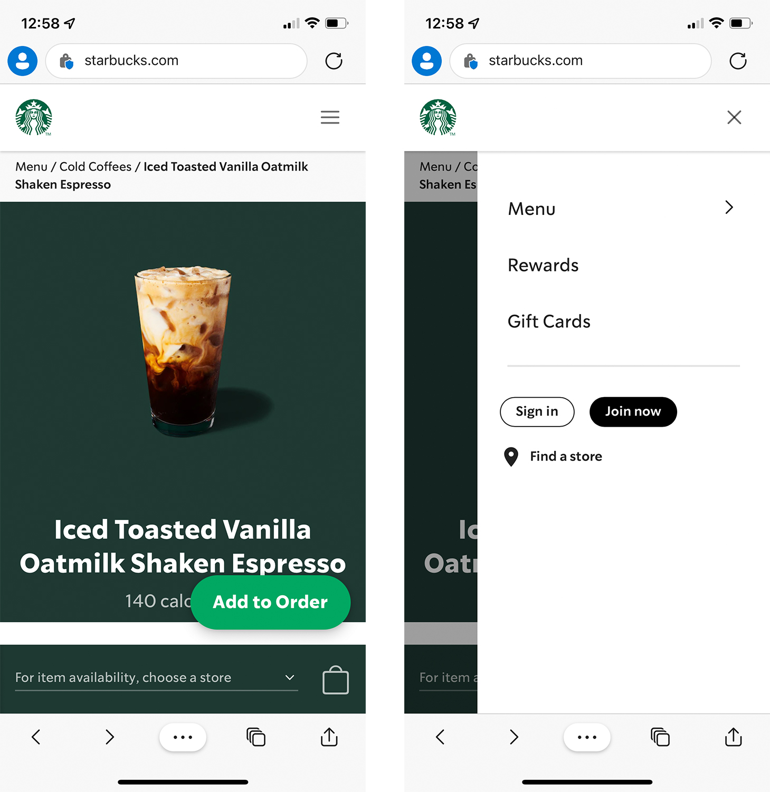
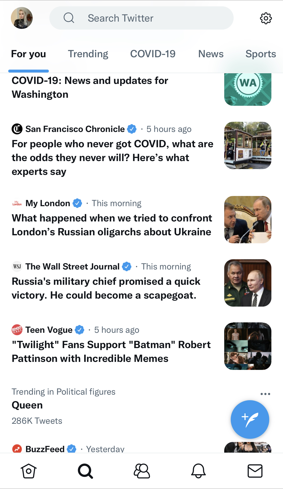

# 4.7: Best Practices for PWA UI/UX

Welcome to day 29 of the [30 Days of PWA](<https://aka.ms/learn-pwa/30Days-blog>) series! Today’s blog post will walk through some of the best practices to keep in mind when thinking about your PWA’s user experience and interface.  

## Responsive considerations 
When designing your PWA there are a few things to think about beyond just ensuring the user interface adapts to whatever device someone is on, whether that’s on mobile, a tablet or a desktop. In a previous article we looked at [display modes](../advanced-capabilities/04.md) and how you can make your PWA feel more like an app. These display modes are important to consider when you’re thinking about the responsiveness of your PWA. 

When a user is on mobile or a tablet, how much of the browser UI do you want to be shown, if any? Does your decision affect the UI of the PWA? For example, if you want your PWA to be displayed in fullscreen mode, ensure there’s a way to navigate back from the current page because there’s no browser back button provided in this mode.

How do you want your desktop version to display if it’s in standalone mode outside of the browser? Do you want it to feel as app-like as possible? Consider implementing [Window Controls Overlay](../advanced-capabilities/04.md) to customize the title bar of your PWA. 

Regardless of the display mode you choose, consider what each one means for the way your PWA displays on mobile, tablet and desktop an assess what implications that has for your UI. 

## Keep content focused and up to date 
Progressive web apps are inherently about delivering experiences in more performant ways and that experience isn’t just about technical performance but about how quickly users can find what they need. The Starbucks PWA is a great example of focused experience that has been optimized for mobile ordering. The main menu gives us three main options: “Menu”, “Rewards” and “Gift Cards”. 

The rest of the site content is deprioritized and placed at the bottom. It’s still accessible but out of the way of the main task users are coming to the site for: to order coffee. 

Identify what key tasks and content your users are coming to your app for and optimize for those scenarios to streamline their task. Focus on reducing any clutter in the UI particularly with mobile versions due to the reduced screen size. For example, the Twitter app on desktop has two sidebars. On the mobile version, the navigation moves to the bottom and the “What’s Happening” sidebar becomes integrated into the search tab with the main focus of the app being the timeline.  

Additionally consider how to prompt your users to install the latest version of your PWA when there’s been a change, especially if it’s going to affect what they’re seeing in the app. Make it stand out from the rest of the UI so that users notice the call to update immediately so that they can start their journey in your app with the most recent version and no interruption to update in the middle of using it. 

## Keep users engaged in offline mode
The great thing about PWAs is their ability to retain some functionality (or all depending on the PWA’s features) when they're [offline](../core-concepts/05.md) without an internet connection. Depending on some of the feature functionality though, key parts of your PWA may not work offline so you need to think about what your users are going to see when that page goes offline. 

Having a typical “page offline” or “no connection” message won’t keep your users engaged and in the app, and it doesn’t take advantage of the offline capabilities of PWAs. Think about what the experience will be offline. What content can still be served and interacted with when offline, and if there isn’t core content that can be, what can you put in its place that isn’t an error message? 

If you're curious about some offline strategies, check out the [post on reliability](04.md) from earlier this week.

## Make interactions feel seamless
Performance and speed are critical when thinking about the user experience of any website. If you’re on a website and click something and the navigation takes you to a screen that is loading slowly, it can be frustrating especially without any indication the page is loading. Provide transition states such as showing [skeleton UI](https://aka.ms/learn-pwa/30days-4.7/docs.microsoft.com/fluent-ui/web-components/components/skeleton) when content is loading. This provides a preview of the UI while it waits for the actual UI to load. It also indicates that something is happening and provides a better experience than just a loader or progress bar. The switch from skeleton UI to actual UI is smoother and sets your users up for what to expect on the page. 

Seamlessness and perceived performance aren’t just about the UI of your PWA though, certain tasks that users need to complete can be sped up with certain features. For example, in a checkout task flow, make things like autofill and web payments available so that users can quickly fill out details. This reduces friction and gets them to the end of their task more quickly. Experiences like this leave a good impression and will bring users back to your PWA. 

## Keep design platform-specific-like
Finally, your PWA experience should feel like a platform-specific app so implementing features like Window Controls Overlay can help deliver that experience. You can also use things like Fluent components for Windows based PWAs. Keeping the experience platform-specific-like ensures that users have a familiar experience to what they’d expect on their device.

## Resources
- [Fluent design](https://aka.ms/learn-pwa/30days-4.7/microsoft.com/design/fluent)
- [Making PWA Feel Like an App](../advanced-capabilities/04.md)
