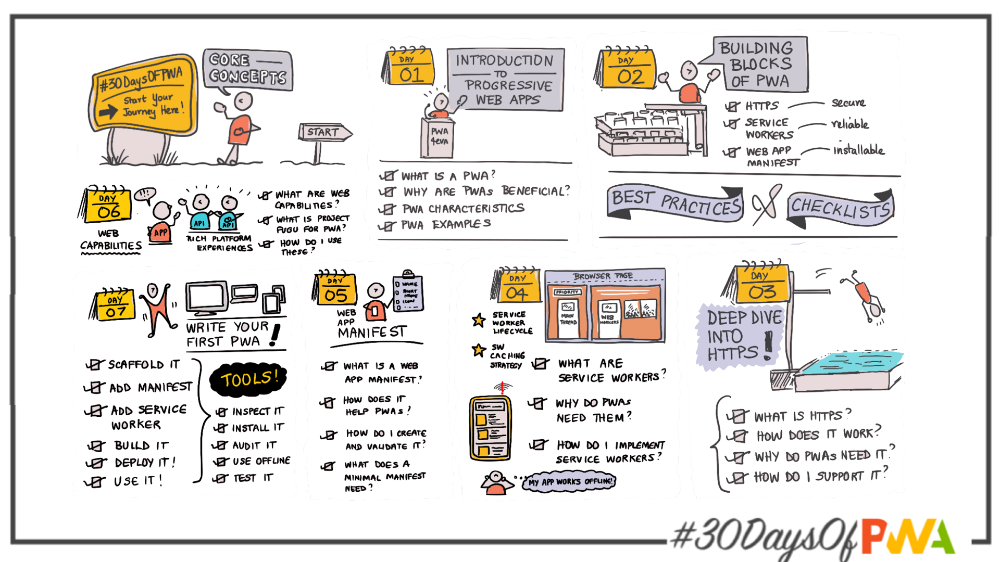

# Day 30: Wrap-up!

Welcome to day 30 of the [30 Days of PWA](https://aka.ms/learn-pwa/30Days-blog) series! You made it!! Let's look back at our journey over the past month, review key concepts and learnings, and talk about next steps to continue your self-study.

---

### Week 1: Core Concepts

| |
|:--:|
|   |
| `**Summarize week 1 topics and learnings here**.`  |
| `**List relevant resources for self-study here**.`  |

---

### Week 2: Advanced Capabilities
---

### Week 3: Developer Tools
---

### Week 4: Platforms and Practices
---

 
