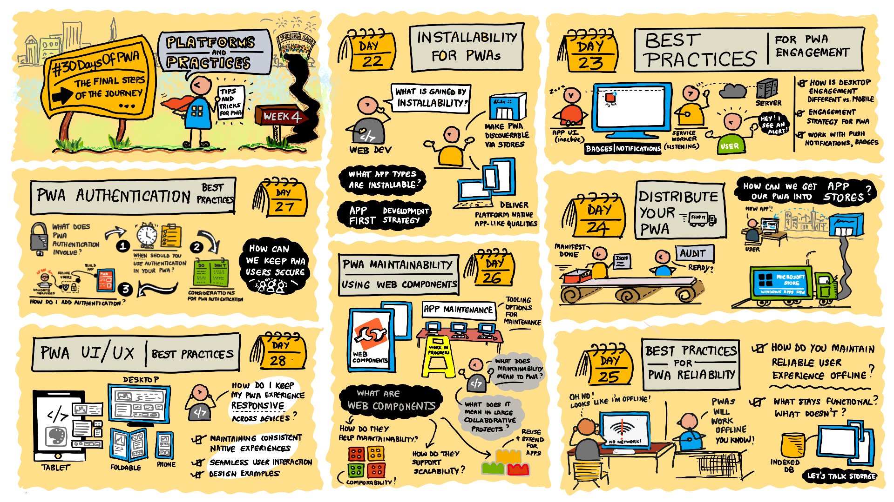

# Day 30: Wrap-up

**Author: Beth Pan | [@beth_panx](https://twitter.com/beth_panx)**

Welcome to day 30 of the [30 Days of PWA](https://aka.ms/learn-pwa/30Days-blog) series. You made it! Let's look back at our journey over the past month, review key concepts and learnings, and talk about next steps to continue your self-study.

## Recap & Resources

### Week 1: Core Concepts

We started our 30-day journey by learning [what is a Progressive Web App (PWA)](./core-concepts/01.md). Following the introduction, we talked about [fundamental building blocks of a PWA](./core-concepts/02.md): HTTPS, service workers, and web app manifest. We took a deeper dive into each block to learn how to make a PWA [installable](./core-concepts/03.md), [reliable](./core-concepts/04.md), [work offline](./core-concepts/05.md), and [capable](./core-concepts/06.md). Finally, we summarized this week's learning by [taking an existing application and iteratively enhancing it for Progressive Web App functionality](./core-concepts/07.md).

**Resources:**

- [Overview of Progressive Web Apps (PWAs)](https://aka.ms/learn-PWA/30Days-1.1/docs.microsoft.com/microsoft-edge/progressive-web-apps-chromium)
- [Understanding Progressive Enhancement](https://aka.ms/learn-PWA/30Days-1.1/alistapart.com/article/understandingprogressiveenhancement)
- [Sample PWAs](https://aka.ms/learn-PWA/30Days-1.1/docs.microsoft.com/microsoft-edge/progressive-web-apps-chromium/demo-pwas)
- [DevTools Tips](https://aka.ms/learn-PWA/30Days-1.1/devtoolstips.org) and [Source](https://aka.ms/learn-PWA/30Days-1.1/github.com/captainbrosset/devtools-tips)
- [HTTPS](https://aka.ms/learn-PWA/30Days-1.2/developer.mozilla.org/en-US/docs/Glossary/https)
- [Service Workers](https://aka.ms/learn-PWA/30Days-1.2/docs.microsoft.com/microsoft-edge/progressive-web-apps-chromium/how-to/service-workers)
- [Web App Manifest](https://aka.ms/learn-PWA/30Days-1.2/docs.microsoft.com/microsoft-edge/progressive-web-apps-chromium/how-to/web-app-manifests)

### Week 2: Advanced Capabilities

Week 2 of #30DaysOfPWA is all about new exciting capabilities available to modern Progressive Web Apps. Many advanced features and APIs have been brought to the web platform over the last couple of years as part of the "Project Fugu" effort, enabling a whole new class of applications to be built on top of the web. In this week, we learn about [PWA and Web Standards](./advanced-capabilities/01.md), [creating app shortcuts](./advanced-capabilities/02.md), [sharing content](./advanced-capabilities/03.md), [displaying content](./advanced-capabilities/04.md), [caching data](./advanced-capabilities/05.md), [background sync](./advanced-capabilities/06.md), and [notifications](./advanced-capabilities/07.md).

**Resources:**

- [Fugu API Tracker](https://aka.ms/learn-PWA/30Days-2.1/fugu-tracker.web.app)
- [Microsoft Edge Developer Docs: Define app shortcuts](https://aka.ms/learn-PWA/30Days-2.2/docs.microsoft.com/microsoft-edge/progressive-web-apps-chromium/how-to/shortcuts)
- [Microsoft Edge Developer Docs: Share content with other apps](https://aka.ms/learn-PWA/30Days-2.3/docs.microsoft.com/microsoft-edge/progressive-web-apps-chromium/how-to/share)
- [Breaking Out of the Box](https://aka.ms/learn-PWA/30Days-2.4/alistapart.com/article/breaking-out-of-the-box)
- [Microsoft Edge Developer Docs: Use Service Workers to manage network requests and push notifications](https://aka.ms/learn-PWA/30Days-2.5/docs.microsoft.com/microsoft-edge/progressive-web-apps-chromium/how-to/service-workers)
- [Microsoft Edge Developer Docs: Synchronize and update a PWA in the background](https://aka.ms/learn-PWA/30Days-2.6/docs.microsoft.com/microsoft-edge/progressive-web-apps-chromium/how-to/background-syncs)
- [Microsoft Edge Developer Docs: Re-engage users with badges, notifications, and push messages](https://aka.ms/learn-PWA/30Days-2.7/docs.microsoft.com/microsoft-edge/progressive-web-apps-chromium/how-to/notifications-badges)

### Week 3: Developer Tools

Now that we are familiar with Progressive Web Apps and available advanced capabilities, let's look at the tools that help us [build](./dev-tools/01.md), [debug](./dev-tools/03.md), [audit](./dev-tools/05.md), [test](./dev-tools/06.md), and [package](./dev-tools/07.md) PWAs in week 3.

**Resources:**

- [PWABuilder Project](https://aka.ms/learn-PWA/30Days-3.1/github.com/pwa-builder/PWABuilder)
- [PWA Studio](https://aka.ms/learn-PWA/30Days-3.1/pwa-studio)
- [PWA Starter](https://aka.ms/learn-PWA/30Days-3.1/github.com/pwa-builder/pwa-starter)
- [PWABuilder.com](https://aka.ms/learn-PWA/30Days-3.2/www.pwabuilder.com)
- [Device Emulation tool](https://aka.ms/learn-PWA/device-emulation)
- [Application tool to review Web App Manifest](https://aka.ms/learn-PWA/debug-PWA)
- [Sources tool to debug JavaScript code](https://aka.ms/learn-PWA/sources-tool)
- [Cache Storage tool](https://aka.ms/learn-PWA/cache-storage)
- [Evaluate runtime performance (Microsoft Edge performance tool)](https://aka.ms/learn-PWA/30Days-3.5/docs.microsoft.com/microsoft-edge/devtools-guide-chromium/evaluate-performance)
- [Evaluate loading performance (Microsoft Edge performance tool)](https://aka.ms/learn-PWA/30Days-3.5/docs.microsoft.com/microsoft-edge/devtools-guide-chromium/speed/get-started)
- [Playwright](https://aka.ms/learn-PWA/30Days-3.6/playwright.dev)
- [Use Playwright to automate and test in Microsoft Edge](https://aka.ms/learn-PWA/30Days-3.6/docs.microsoft.com/microsoft-edge/playwright)

### Week 4: Platforms and Practices

To close the series of #30DaysOfPWA, we present you with best practices of building great Progressive Web Apps. We answer the following questions to help you make design, development, and distribution decisions for your PWAs: [What types of apps should be installable?](./platforms-practices/01.md) [How do you set an engagement strategy?](./platforms-practices/02.md) [How can you get maximum discoverability by distributing to app stores?](./platforms-practices/03.md) [Which caching strategy should you choose to have the best user experience while offline?](./platforms-practices/04.md) [Why use web components for PWA maintainability?](./platforms-practices/05.md) [What about authentication?](./platforms-practices/06.md) And finally, [what does it mean to have great UI/UX for your PWAs?](./platforms-practices/07.md)

**Resources:**

- [FAST docs](https://aka.ms/learn-pwa/30days-4.5/fast.design/docs/introduction)

## Share your feedback

This project is a labor of love. ❤️ It's not the primary day job for many of our planners and contributors. A huge thank you to all for helping make this a reality. As we reflect on lessons learned, what went well, and what we can improve on for future projects, we especially appreciate your feedback. Please take a few minutes to [share your feedback and suggestions](https://aka.ms/learn-pwa/30Days-survey) as they will help make future projects like this possible!

## Closing thoughts

You have made it to the end of #30DaysOfPWA! Congratulations and a huge thank you for reading along. If you liked the series, give us a 🌟 on our [GitHub repository](https://github.com/microsoft/win-student-devs). Tag us on Twitter with #30DaysOfPWA because we would love to hear your learnings. That's it! We wish to see you soon in the next learning journey.
